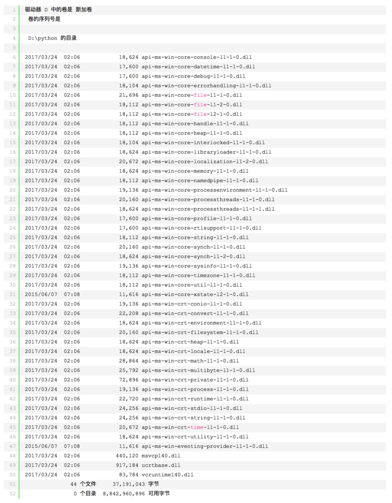

前一段时间使用C#调用Python脚本的方案解决某些业务问题，所以在程序内部带了一个免安装的python环境。
这套方案虽然在一段时间内风平浪静，但是这两天问题集中爆发，主要有两个问题：
1）内置的python环境是64位的，无法在32位系统上运行
2）在某些64位机器上也无法运行，报错“计算机中丢失api-ms-win-crt-runtime-l1-1-0.dll”

针对第二个问题，在网上找到很多解决方案，都是说什么系统更新，安装运行时之类的，但是我们的用法比较特殊，不可能让每个用户去做系统更新，所有准备了两条路：
1）降底python版本，据说3.4.*系列没有这个问题
2）在Python文件夹内放置依赖库

苦找一下午之后终于找到这篇[博客](https://www.cnblogs.com/zhongtang/p/7448823.html)，照葫芦画瓢竟然成功了，感激涕零。。

处理方案：
1.拷贝依赖库，拷贝位置规则如下：
a、64位操作系统，32位程序，选择syswow64下dll
b、64位操作系统，64位程序，选择system32下dll
c、32位操作系统，32位程序，选择system32下dll

2.拷贝内容：拷贝所有api-ms开头的dll ，以及msvcp140.dll，vcruntime140.dll，ucrtbase.dll到程序目录。我这里的python环境内置了vcruntime140.dll，而且拷过去之后发现与python内置的完全一致。

至此，成功解决api-runtime确实错误，无需安装vc2015 runtime ，也就无需升级sp1。感谢[黯然销魂掌2015](http://www.cnblogs.com/zhongtang/)！！！

