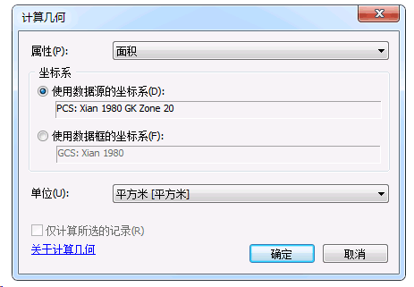
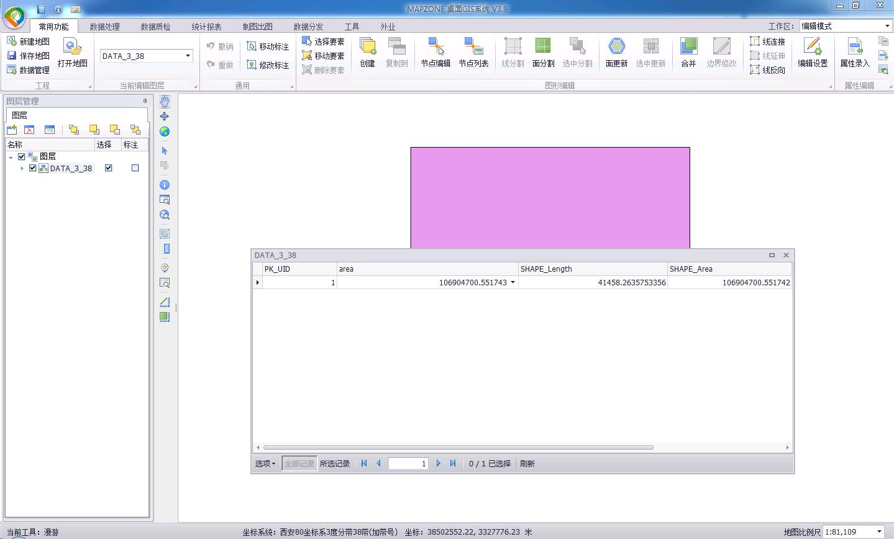

近几年总会有用户反馈说我们软件计算出来的面积和ArcGIS(ArcMap)不一样，问原因是什么。对于这个问题已经解释的嘴都快磨破了，所以想在这里详细说一下原因，如果哪里说的不正确，请指正。

### 我们所说的面积计算
我们说的面积计算，也是常用的，基本上是在高斯投影下的计算出来的面积。高斯投影的主要特点：
1）有3度分带、6度分带之说，具体的可以看一下下面的图片：

2）高斯投影是有变形的，越接近中央经线变形越小，越远离中央经线，变形越大

#### ArcGIS计算出来的面积一定就是准确的吗
为了验证这个问题，我创建了一个西安80经纬度的数据，并在114度右侧画了一个长度是0.1度的正方形：

位置示意如下(略夸张)：

可见这个正方形应该在3度分带38带内，而且很靠近中央经线。虽然在6度分带20带内，但是在20带的边缘。

我将这个正方形分别投影到3度分带38带、3度分带37带、6度分带20带：

通过属性表的计算几何功能，计算每个图形的面积：

PS:计算几何无法计算经纬度数据面积：

通过计算几何可以得到下面的结果(area字段值)：
3度分带38带：

3度分带37带：

6度分带20带：

由此看出面积大小关系是：
3度分带38带(106904700.551742) < 6度分带20带(107118282.196343) < 3度分带37带(107133029.229033)

这个结果的原因是什么，可以看下面的示意图(略夸张)：
3度分带38带：

6度分带20带：

3度分带37带：

3度分带38带是图形最接近中央经线(114度)的，也就是变形最小的。6度分带20带下的图形离中央经线(117度)小于3度，变形已经比较大了。3度分带37带下的图形离中央经线(111度)大于3度，变形比较大而且比6度分带20带的图形变形大。

所以说，ArcGIS的面积计算结果，是和数据的空间参考有关系的。面积计算比较准确的应该是在3度分带下，而且在其所在的分带内计算，使用6度分带、跨带计算都会变形比较大，进而导致面积计算不准确，如果拿这样的结果和MAPZONE面积计算结果进行对比，我们是拒绝的。

### MAPZONE的面积计算逻辑

根据上面的分析，MAPZONE的面积计算逻辑就很清晰了，就是将图形投影3度分带其所在的带号内进行面积计算，以保证相对准确。而且如果有跨越两个带的图形，MAPZONE会使用两个分带的边界线对图形进行分割，分割出来的部分在各自的分带内进行面积计算，最后再累加成整个的图形面积。

### 面积计算还能再精确些吗
所谓的精确，就是指图形变形小，比较接近实际的图形面积。据我所知，有下面两种办法：
1)将高斯投影的中央经线、中央纬线移到图形的中心点，以保证变形最小。
之前有一个北京地方坐标系，就是将中央经线、中央纬线移到北京正中心，以保证测量的准确性，其proj4定义如下：`+proj=tmerc +lat_0=39.865766 +lon_0=116.35025181 +k=1 +x_0=500000 +y_0=300000 +ellps=krass +units=m +no_defs`。其中`+lon_0`、`+lat_0`为重新定义的中央经线和中央纬线。
2）使用球面面积计算方法
这种计算方法的正确性还没有验证过，目前已知PostGIS提供的[ST_Area](http://postgis.net/docs/ST_Area.html)函数可以计算球面面积。

### One More Thing
如果仔细看高斯投影的分带示意图，可以看到有部分3度分带和6度分带的中央经线是重合的：

例如3度分带的39带和6度分带的20带，在ArcGIS中查看不加带号坐标系的参数定义：

可以看出这两个坐标系的定义参数，除了名称(SRID)之外，其它参数是完全一致的，所以中央经线重合的不加带号的3度、6度分带，完全可以看做是同一种坐标系，没有必要进行严格区分。

### 后记
因为这个面积的问题，我们的移动端产品计算面积加上了如下设置：

可能有的人就是觉得ArcGIS计算才是对的吧。。

