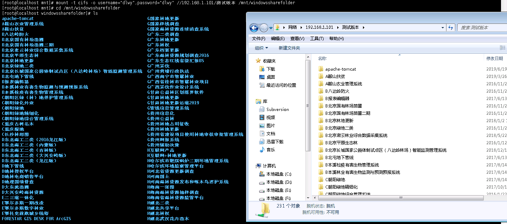

CentOS可以使用mount命令挂载Windows共享文件夹，下面是示例：

#### 创建本机挂载文件夹
```bash
mkdir /mnt/windowssharefolder
```

#### 安装cifs
```bash
yum install cifs-utils -y
```

#### 挂载Windows共享文件夹
```bash
mount -t cifs -o username="dlwy",password="dlwy" //192.168.1.101/测试版本 /mnt/windowssharefolder
```


#### 取消挂载
```bash
umount /mnt/windowssharefolder
```

#### One More Thing
如果有的共享文件夹挂载时提示`Host is down`，可以参考[这个解决方案](https://serverfault.com/questions/414074/mount-cifs-host-is-down)，添加`-o vers=2.0`之类的。