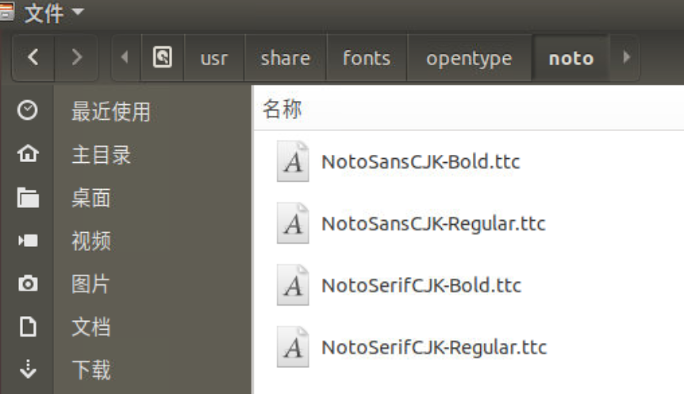
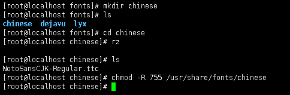
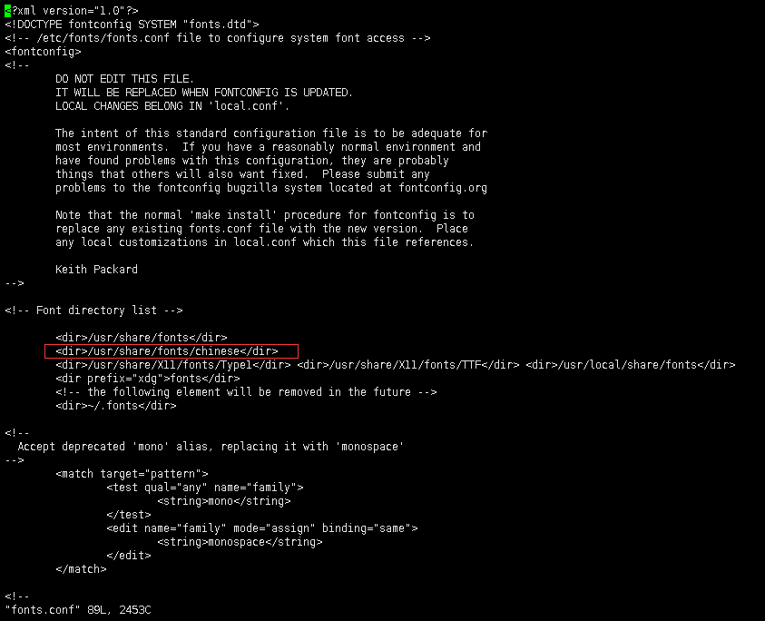
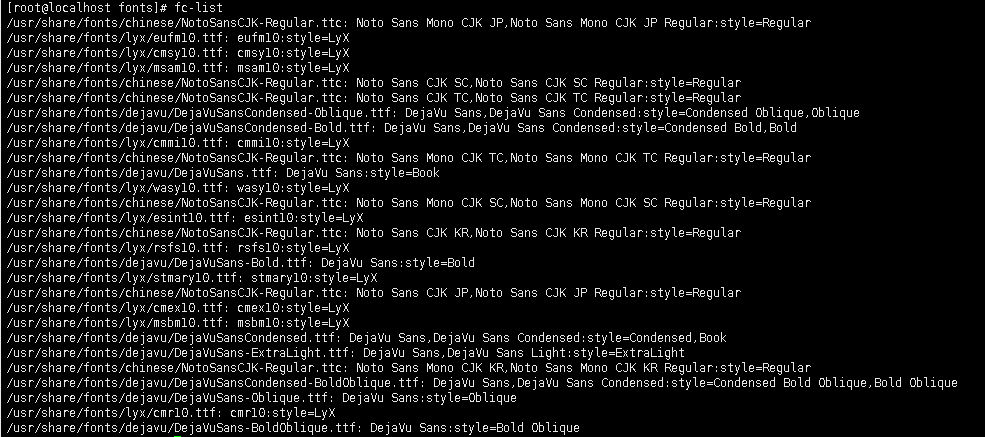

在测试服务器(ubuntu)上配好的图，转移到现场服务器(CentOS)上，发现标注不见了。


考虑了半天，感觉应该是现场服务器上没有Ubuntu上的字体，所以搜了一下如何获取Ubuntu上的字体，并安装到CentOS系统上，参考博客看[这里](https://blog.csdn.net/wlwlwlwl015/article/details/51482065)。

在Ubuntu系统上的`/usr/share/fonts/opentype/noto`文件夹内找到配置标注使用的字体`Noto Sans CJK SC Regular`的字体文件。


在现场服务器上使用`fc-list`查看已安装的字体，如果`fc-list`命令找不到，使用命令`yum install fontconfig`进行安装。

进入`/usr/share/fonts`目录下，建立一个自定义文件夹，并将字体文件上传到该文件夹上，然后给该文件夹修改权限：


接下来需要安装ttmkfdir来搜索目录中所有的字体信息，并汇总生成fonts.scale文件:
```bash
yum install ttmkfdir
```

然后执行命令：
```bash
ttmkfdir -e /usr/share/X11/fonts/encodings/encodings.dir
```

然后编辑字体配置文件：
```bash
vi /etc/fonts/fonts.conf
```



然后更新字体缓存：
```bash
fc-cache
```

再次查看字体文件，已经可以看到`Noto Sans CJK SC Regular`字体了：
