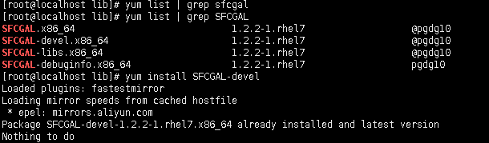
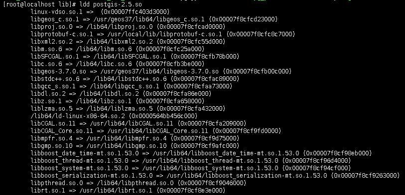

最近准备在生产环境(CentOS系统)上试用矢量瓦片，所有都部署妥当之后请求矢量瓦片报错，Missing  libprotobuf-c。使用yum安装，包括源码编译protobuf-c之后，还是报这个错，后来看了PostGIS的源码，判断是由于CentOS里使用yum安装的PostGIS版本，编译时没有protobuf-c环境，所以如果需要用ST_AsMVT函数，需要配置好protobuf-c之后，重新编译PostGIS才可以。

#### 首先编译protobuf和protobuf-c
从Git上下载[protobuf](https://github.com/protocolbuffers/protobuf)和[protobuf-c](https://github.com/protobuf-c/protobuf-c)代码，并依次编译。

这两个编译比较简单，略过。。

#### 配置PostGIS
下载2.5.1版本PostGIS源码，然后使用`./autogen.sh`脚本初始化。

初始化完成之后，使用`./configure`检查编译环境，我这里报了几个错，依次处理就可以了。

指向了旧版本Postgresql上：

Postgresql版本是通过pg_config命令获取的，所以只需要查找到10版本的pg_config命令位置，做为configure参数传入即可。

安装各个组件的devel开发版本，包括`postgresql10-devel`、`geos37-devel`、`proj-devel`。

configure顺利完成：

可以看到PROTOBUFC的检查状态是yes，就可以使用make进行编译了。

#### 编译、部署PostGIS
果不其然，编译是报错找不到SFCGAL头文件之类的，在网上查了半天，才知道这个组件包必须使用大写，否则yum查不到。。

然后就可以正常编译了，编译完成之后使用make install进行部署。

#### 使用编译好的PostGIS库
这次虽然没有报Missing libprotobuf-c，但是报表无法加载`libprotobuf-c.so.1`，使用ldd查看postgis-2.5.so确实没有找到。

使用find查找，可以找到：

在网上查了半天，发现了[这篇贴子](https://www.jianshu.com/p/e08dbc60a3b2)，即编辑`/etc/ld.so.conf`文件，加入libprotobuf-c.so.1所在位置路径，刷新缓存之后，再编译就正常了。

最后查看postgis-2.5.so的引用关系：

引用正常，使用ST_AsMVT就可以正常使用了。