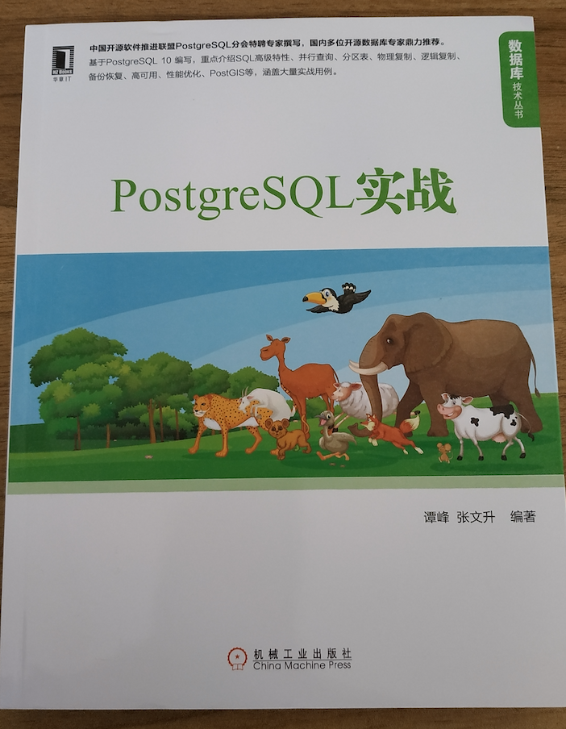
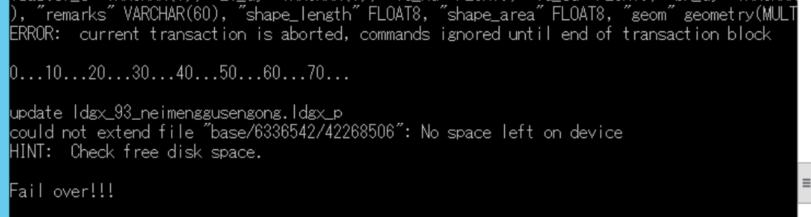
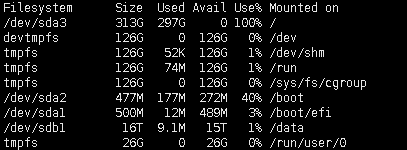
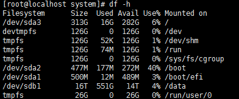

今天是2018年最后一个工作日，准备记录一下在CentOS系统下变更Postgresql数据存储位置的方法。

2018年1月，当时懵懵懂懂的体验了Postgresql的安装，到现在对这个数据库算是基本了解了，也感受到了pg数据库和PostGIS插件的强大，希望2019年把pg大法发扬光大！


昨天发现服务器磁盘空间满了，提示`No space left on device`导致无法导入数据。


使用`df -h`查看磁盘空间：

由于之前默认安装，所以pg数据库的数据都在主磁盘目录下。发现有一个16T的磁盘，所以准备把pg数据库的数据转到/data目录下。

之前在ubuntu系统做过pg数据库数据迁移，即修改`/etc/postgresql/版本/main/postgresql.conf`配置文件，将`data_directory`变量内容改成新的数据路径，重启数据库即可。

但是我发现在CentOS系统下，这个`postgresql.conf`文件就在数据目录下，将数据目录移走之后，配置文件也移走了，那pg数据库怎么知道新的`postgresql.conf`在哪里呢，一脸懵逼。。

在网上用`data_directory`为关键词找了半天，最后发现CentOS下数据目录没有用这个变量，可以参考[这篇博客](https://blog.csdn.net/wk1134314305/article/details/79054248)。

也就是说CentOS系统下在服务配置文件里，记录了PGDATA数据目录，服务启动时会到这个目录下进行加载，所以需要修改的是这个文件。

再顺一遍处理过程：

#### 1.关闭数据库服务
```bash
service postgresql-10 stop
```

#### 2.将原数据库Data拷贝到新的目录下
```bash
cp -rf /var/lib/postgresql/10/ /data/pgsql
```

#### 3.为新目录设置postgres用户权限
```bash
sudo chown -R postgres:postgres /data/pgsql/10
sudo chmod 700 /data/pgsql/10
```

#### 4.修改数据库服务配置文件
```bash
vi /usr/lib/systemd/system/postgresql-10.service
```
修改如下部分：
```config
# Location of database directory
Environment=PGDATA=/data/pgsql/10/data/
```
修改之后，使用如下命令使其生效：
```bash
systemctl daemon-reload
```

#### 5.重启数据库
```bash
service postgresql-10 start
```

#### 6.删除原数据目录
做这一步需要慎重，由于我是第一次处理，而且数据比较重要，所以又拷贝了一份数据目录做为备份，然后使用如下命令删除原数据目录：
```bash
rm -rf /var/lib/postgresql
```

#### 7.验证数据库是否正常
使用数据库工具连接数据库、通过服务等方式对数据库做验证，验证结果一切正常。

最后，使用`df -h`看一下数据目录迁移之后磁盘情况：


致此，CentOS系统下pg数据库的数据目录迁移工作顺利完成！
最后祝2019年工作顺利！
