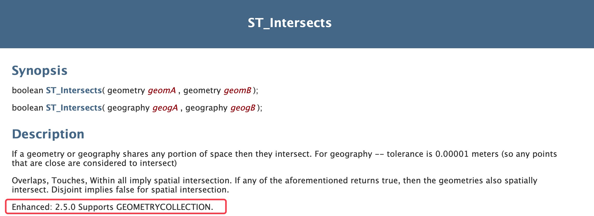

昨天`yum update`的惊魂未定，同事又反馈过来一个问题：
```bash
sql执行错误：error: Relate Operation called with a LWGEOMCOLLECTION type.  This is unsupported.
```

到网上搜了一下，这个错误是由于使用ST_Intersects方法，不支持对GeometryCollection类型的支持导致的，详情看[这里](https://postgis.net/docs/ST_Intersects.html)。

但是这里提示说PostGIS 2.5.0版本以后可以支持GeometryCollection类型，所以升级PostGIS插件版本是一种选择。


但是由于这是一个大版本升级，考虑稳定性的情况下，看看还有没有其它的解决方案。

带有GeometryCollection类型的数据，是通过ST_Intersection求交操作得到的，所以避免不了结果集中存在点线面的集合，所以像ST_CollectionHomogenize、ST_CollectionExtract等函数无法处理这样的数据。

再就是求交查询时排除几何类型是ST_GeometryCollection的记录，但是这样会导致结果和地图上看到的不一致，所以这条路也走不通。

基于昨天升级PostGIS小版本号积累的经验，又在其它的数据库上进行了PostGIS由2.4升级2.5的实验，所以决定在夜深人静的时候升级生产服务器上的PostGIS大版本。

#### 首先，停止PostgreSQL数据库服务


#### 然后，卸载PostGIS 2.4版本


#### 然后，安装PostGIS 2.5版本


#### 重启PostgreSQL数据库服务


#### 执行插件升级SQL语句
接下来在各个空间数据库内，执行PostGIS插件更新语句：
```sql
alter extension postgis update
```

#### 正确性验证
通过一些简单的功能验证，证明新版插件可以正常运行，至此，PostGIS插件大版本升级结束。