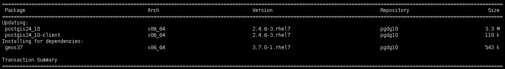
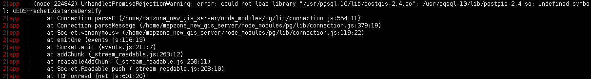
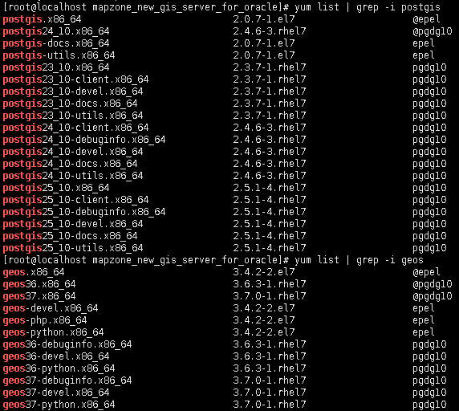
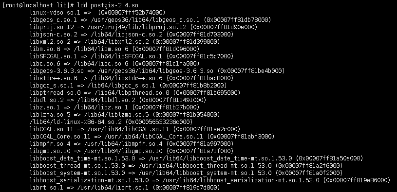
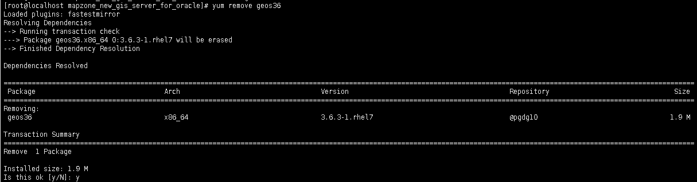
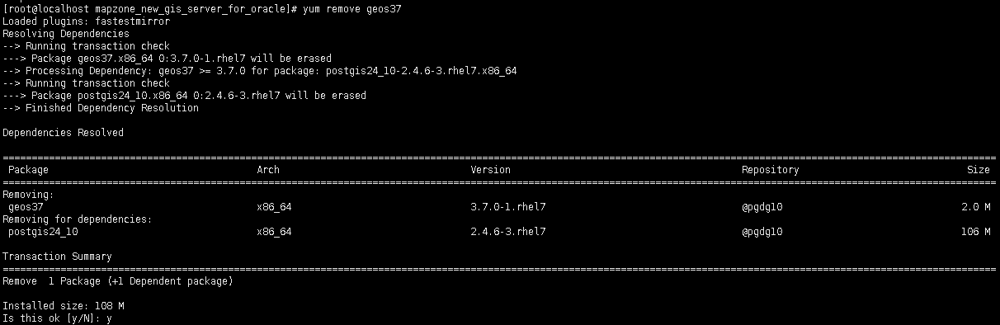
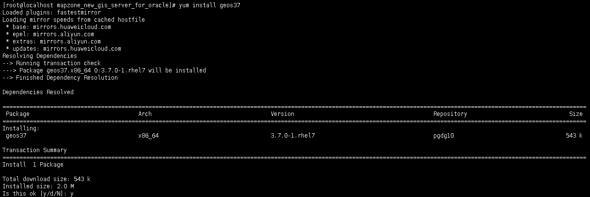
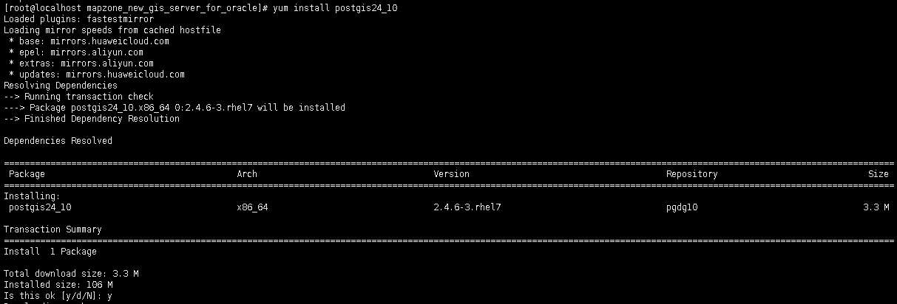
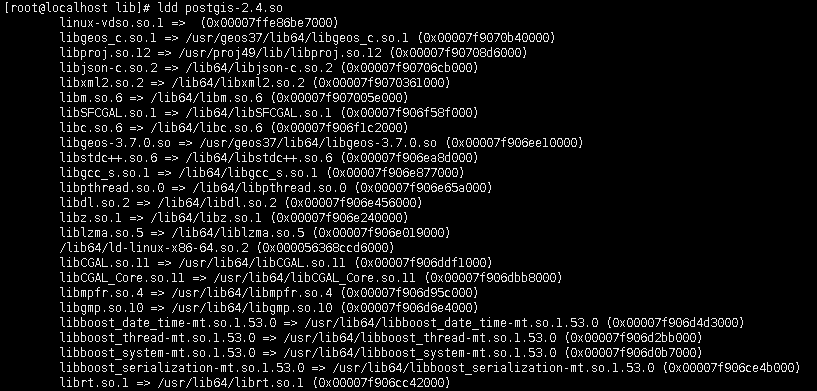

今天手欠，在现场服务器上`yum update`了一下，发现三个更新：

更新强迫症患者没过脑的yes了一下，然后整个PostGIS插件失效：

因为是生产服务器，马上有人反馈功能报错，顿时慌的一批。。马上上网搜解决方案。

由于是yum的更新，首先想到的是能否进行回滚，所以查了一下PostGIS和GEOS的版本：

PostGIS的版本肯定无法回滚了，GEOS的3.6版本和3.7版本在本机上都有安装，这条路也走不通了。

用ldd命令查看postgis-2.4.so依赖关系：

没有依赖缺失。

那就拿`GEOSFrechetDistanceDensify`关键字看看能不能搜到结果。

其间也在尝试重启数据库服务、更新插件等，都没有效果，直到看到有人说`GEOSFrechetDistanceDensify`是GEOS3.7版本新增加的函数，那就说明PostGIS插件本来应该依赖GEOS3.7版本，但是即引用的是GEOS3.6版本，导致这个函数找不到了。

所以解决方案是卸载GEOS3.6版本，让PostGIS引用GEOS3.7版本即可。

#### 首先卸载GEOS3.6版本

#### 然后卸载GEOS3.7版本

这里发现，由于卸载了GEOS3.7版本，导致依赖GEOS3.7的PostGIS也被卸载了。

#### 重新安装GEOS3.7和PostGIS

#### 再次查看postgis-2.4.so的依赖关系

可以看到，都引用到了GEOS3.7版本上。

#### 升级PostGIS插件
执行SQL：`alter extension postgis update`更新插件，然后验证PostGIS插件可以正常使用了，问题解决。

