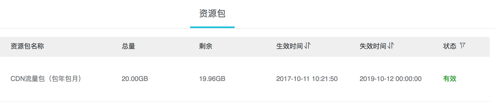
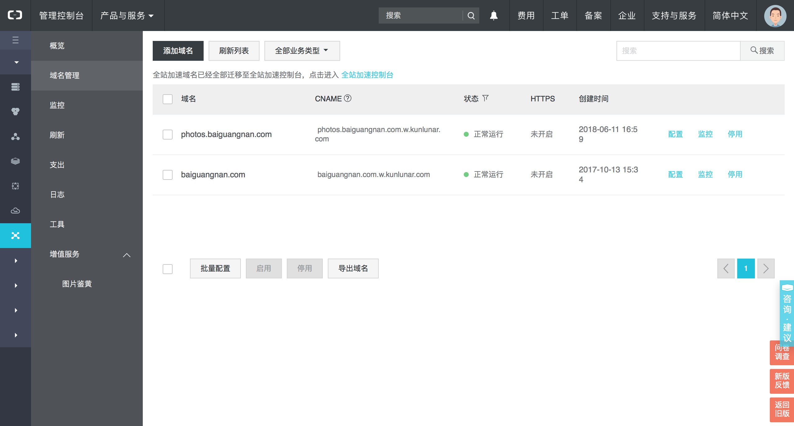
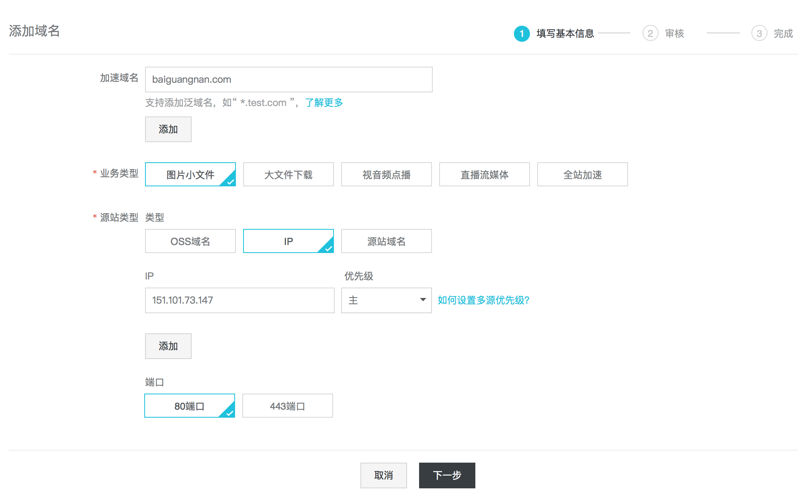
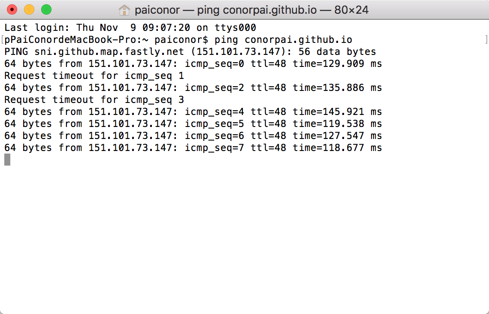
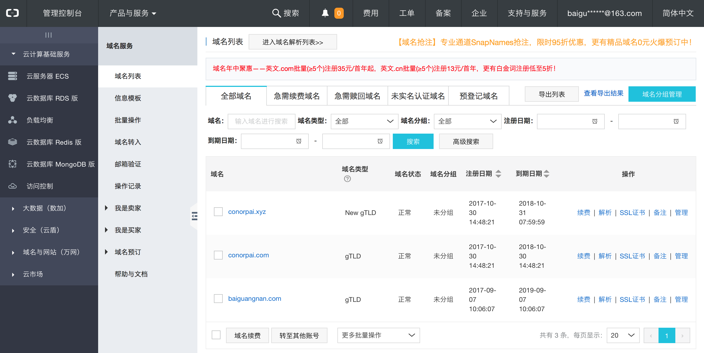
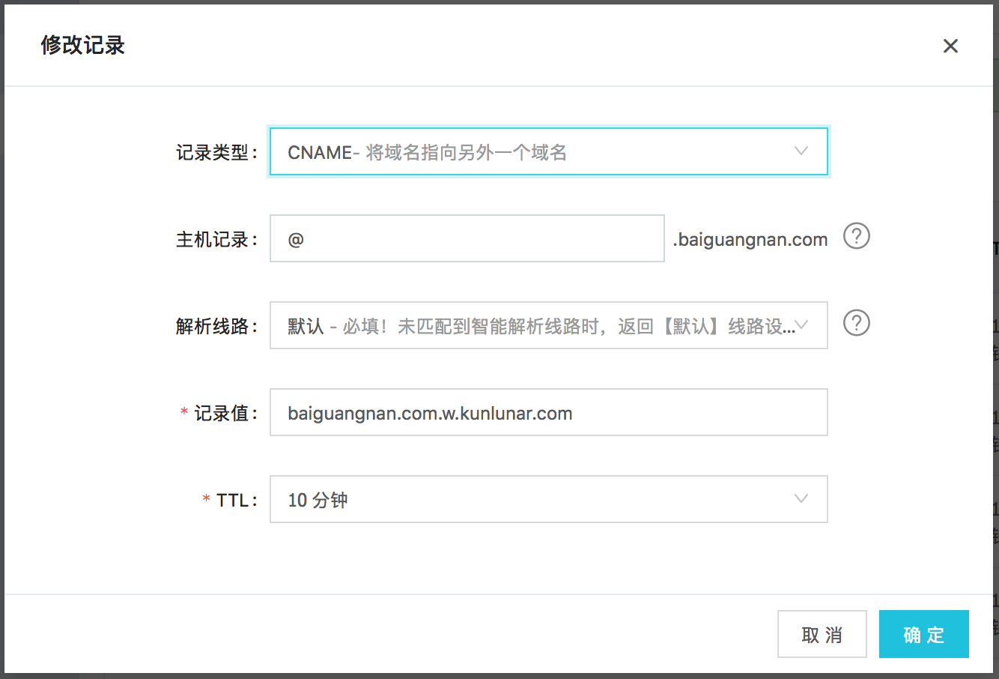
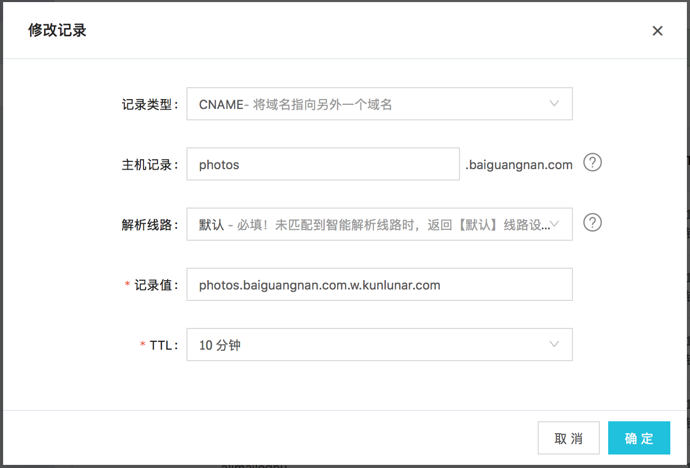
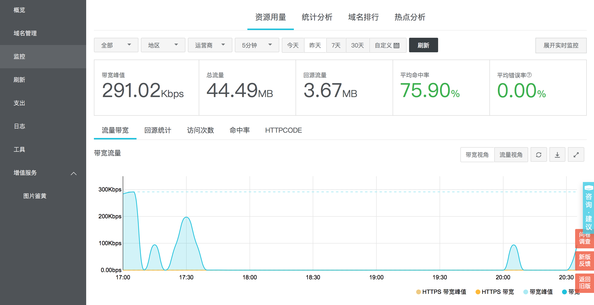
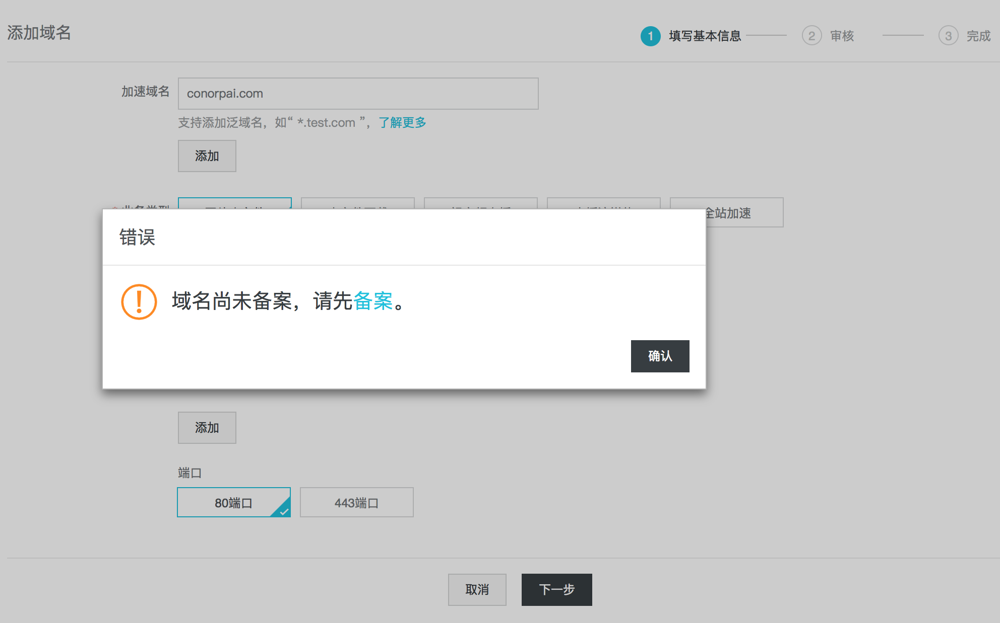

[个人网站](http://photos.baiguangnan.com)和[博客](http://baiguangnan.com)搭建已经快一年了，最大的一块心病就是图片加载太慢了。。

想当初刚买到阿里云服务器兴冲冲的部署写好的个人网站，首次在浏览器上打开花了一分多钟才刷出图片来，心情真是down到谷底。当时以为是哪里没配置好，最后才发现买的阿里云服务器网络带宽是1M，下载图片太慢了。

2017年10月阿里云搞活动，给我发了个通知，CDN服务2年包月20G才9毛钱，当时还不知道CDN是什么，就是觉得便宜，买着玩吧。

后来用七牛云比较多，再加上网上的了解，知道CDN可以解决我的个人网站和博客图片加载速度慢的问题，就试了一下。官方配置文档在[这里](https://help.aliyun.com/document_detail/27112.html?spm=a2c4g.11186623.6.553.mMaNIz)

首先进入[CDN控制台](http://cdn.console.aliyun.com)，在域名管理页面中添加域名。

因为博客使用的是Github Pages：[http://conorpai.github.io](http://conorpai.github.io)，所以IP需要添加Github Pages的IP，使用ping命令获取其IP。

添加域名完成之后，会分配CNAME，拷贝待用。

进入域名管理控制台：

修改baiguangnan.com的解析，将@.baiguangnan.com的记录类型由之前的A换成CNAME，并在记录值中添加之前拷贝的CNAME。

修改时可能会遇到一些冲突，我是把冲突的删掉了，暂时还不清楚后果是什么。。

同理，修改photos.baiguangnan.com的DNS解析：

保存之后就可以感受CDN加速的效果了(可能有一些延迟)。

因为之前申请了其它域名，但是只有baiguangnan.com做了备案，没有备案的域名不能使用CDN加速。。

可以做一下对比：
未加速：[http://conorpai.com](http://conorpai.com)
CDN加速：[http://photos.baiguangnan.com](http://photos.baiguangnan.com)