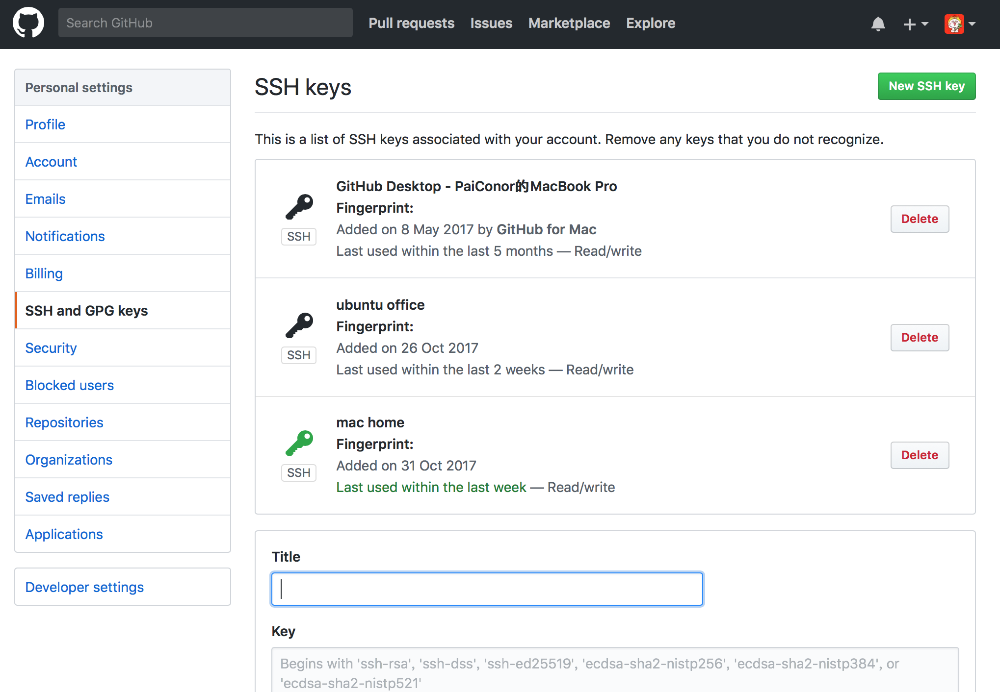
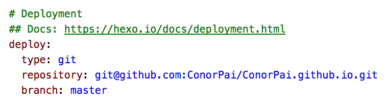
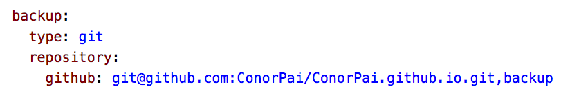

## 1.基础环境配置

**1.1 申请GitHub帐号**
到GitHub[官网](https://github.com/)注册个人帐号。

**1.2 配置node.js**
1)到Node.js[官网](https://nodejs.org/)下载相应平台的最新版本安装，或者使用系统软件包管理器(`Homebrew`、`apt-get`等)进行安装(MacOS上的小坑：使用brew和安装包同时安装Node.js会冲突，目前我的电脑上无法全局安装模块，还没来得及找解决方案)。

2)配置淘宝数据源，加快npm模块安装速度。
``` bash
$ npm config set registry https://registry.npm.taobao.org
```
**1.3 配置git**
1)安装git。
2)全局配置。
``` bash
$ git config --global user.email baiguangnan@163.com
$ git config --global user.name ConorPai
```

**1.4 安装Hexo**
``` bash
$ npm install -g hexo
```

## 2.配置Hexo目录

**2.1 命令行进入博客文件存放目录**
``` bash
$ mkdir myblog
$ cd myblog
```
**2.2 初始化**
``` bash
$ hexo init
```
**2.3 安装依赖模块**
``` bash
$ npm install
```
**2.4 创建新的文章**
``` bash
$ hexo new "MyNewPost"
```
**2.5 生成博客页面**
``` bash
$ hexo clean 		#清理之前的缓存
$ hexo g		#生成博客页面
$ hexo s		#发布本地服务，访问http://localhost:4000/即可查看
```
**2.6 修改博客主题**
目前本博客使用的是[yilia](https://github.com/litten/hexo-theme-yilia)主题，配置方式如下：
1）下载主题
``` bash
$ git clone https://github.com/litten/hexo-theme-yilia.git themes/yilia
```
2）配置主题
修改`themes/yilia/_config.yml`中的各项内容，具体配置可以参考[yilia作者博客主题配置](https://github.com/litten/BlogBackup/blob/master/_config.yml)及[本博主题配置](https://github.com/ConorPai/ConorPai.github.io/blob/backup/themes/yilia/_config.yml)。
3）应用主题
修改`_config.yml`中的`theme: landscape`改为`theme: yilia`。
4）清理并重新生成
``` bash
$ hexo clean
$ hexo g
```
## 3.编写博客
TODO
## 4.发布到Github Pages
**4.1 生成本机密钥**
1)生成密钥，密码设置为空。
``` bash
$ ssh-keygen -t rsa -C baiguangnan@163.com
```
2)在用户目录下找到.ssh/id_rsa.pub文件，用打开文本的方式打开，拷贝其中的内容到GitHub个人设置->SSH and GPG keys->New SSH key中。

3)验证是否成功
``` bash
$ ssh -T git@github.com #注意：邮箱地址不用改
```
**4.2 申请Github Pages**
新建一个`你的用户名.github.io`的仓库，比如说我的github用户名是ConorPai，则新建的仓库名称为`ConorPai.github.io`。
**4.3 将页面上传至Github**
1)hexo配置
修改`_config.yml`中有关deploy的部分：

注意：冒号后边有空格，不加空格上传会出错。
2)上传页面
``` bash
$ hexo d
```
3)上传之后就可以通过`http://你的用户名.github.io`进行访问了。
## 5.绑定域名
TODO
## 6.博客内容多端同步
如果需要在多个设备上写博客，就需要将博客源文件进行同步处理，这里推荐使用[hexo-git-backup](https://github.com/coneycode/hexo-git-backup)模块，可以将博客源文件上传至Github Pages的分支下。
**6.1 安装hexo-git-backup模块**
``` bash
$ npm install hexo-git-backup --save
```
**6.2 配置备份位置**
在`_config.yml`中增加如下配置：

其中git位置后的backup为分支名称。
**6.3 备份**
``` bash
$ hexo b
```
**6.4 续写博客**
使用该方案目前无法实现从github上更新，所以如果本地的源文件是旧的，需要全部删除从Github的分支上重新下载源文件，使用`npm install`安装依赖模块之后即可正常编写博客。