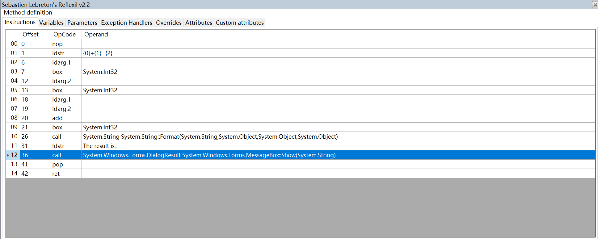

对于反编译的了解，我之前还停留在将工作成果混淆防止反编译看到源码的阶段，今天看到了一篇文章，不但可以反编译C#成果，而且可以修改其中的部分代码并保存成新的成果来使用，所以打算试一下。

使用的工具是ILSpy加上Reflexil插件，下载地址：
[https://github.com/icsharpcode/ILSpy/releases](https://github.com/icsharpcode/ILSpy/releases)
[https://github.com/sailro/Reflexil/releases](https://github.com/sailro/Reflexil/releases)，下载reflexil.for.ILSpy.2.2.AIO.bin.zip，AIO的意思是All In One。

下载后解压到同一个目录下，打开ILSpy软件，在View菜单中可以看到Reflexil v2.2菜单即可。


建新一个简单的WinForm工程，简单的写几行代码，点击按钮弹出提示框，接下来要做的是修改提示框标题。

代码如下：
```csharp
using System;
using System.Collections.Generic;
using System.ComponentModel;
using System.Data;
using System.Drawing;
using System.Linq;
using System.Text;
using System.Windows.Forms;

namespace TestDecompile
{
    public partial class Form1 : Form
    {
        public Form1()
        {
            InitializeComponent();
        }

        private void ShowMessage(int x, int y)
        {
            MessageBox.Show(string.Format("{0}+{1}={2}", x, y, x + y));
        }

        private void button1_Click(object sender, EventArgs e)
        {
            ShowMessage(3, 4);
        }
    }
}
```

使用ILSpy打开exe，即可看到程序源码。


对于简单的程序，可以将程序源码导出后重新编译，但是对于复杂的程序这样会比较麻烦，所以考虑直接修改exe。


点击View-Reflexil v2.2菜单，打开Reflexil界面，并且定位到要修改的ShowMessage函数。


第一种方法是比较简单的方法，在Reflexil界面右键，点击Replace all with code，弹出如下界面：

在ShowMessage中添加代码，然后点击左下角的Compile按钮，确认没有问题之后点击Ok按钮。

修改完成之后，在程序的根节点上右键Save as，即可将修改结果保存成新的exe，默认在原文件名的基础上增加Patched字符。

修改之后的效果：


这种方式确实很方便，对于我们也很友好，但是在某些情况下修改代码之后编译失败，那就需要修改IL代码，即Reflexil界面中显示的那一堆。。


关于IL相关的知识可以去网上再了解一下，在这里就不再重复了，接下来介绍如何通过修改IL代码实现一样的效果。
在IL代码中，索引是11的那一行，可以看出是调用了MessageBox的Show方法，之前的代码是在构建Show的参数，消息字符串，所以需要在Show之前传入第二个参数，并修改Show的实现方法。
首先，创建消息标题字符串：


创建完成之后默认是添加在最后一行，拖动到Show方法之前即可：

右键点击Show方法，点击Edit菜单：

弹出对话框中点击Show方法后边的下拉按钮，在弹出列表中选择两个字符串参数的方法，选中之后Update即可。

修改完成效果：

重复之前保存exe方法，效果与之前一致。

如果想避免自己的成果被反编译和破解，最好使用混淆方法，目前我们的成果做了混淆，会导致ILSpy报错，效果如下：


下一篇将会介绍如何使用ILSpy和Reflexil对一个复杂软件进行破解。
