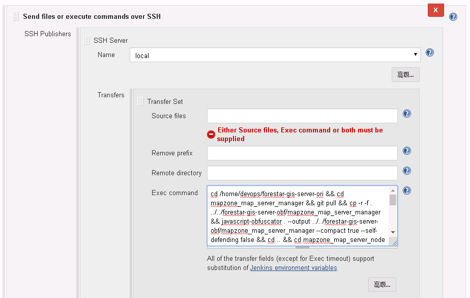

最近使用Docker进行服务部署大大增加了部署的方便性，但是代码更新、代码混淆、Docker镜像构建、上传镜像至仓库、定时编译等一系列操作还是很磨人的。鉴于程序员的懒惰特性，所以引入了Jenkins做持续集成。

#### 部署Jenkins
1.首先下载Jenkins镜像：
```bash
docker pull jenkins/jenkins
```


2.启动Jenkins
```bash
docker run --name devops-jenkins --user=root -p 28080:8080 -p 50000:50000 -v /opt/data/jenkins_home:/var/jenkins_home -d jenkins/jenkins
```

由于8080端口比较容易被占用，所以这里使用28080做为Jenkins的端口。

#### 配置Jenkins
启动完成之后，稍等一会儿就可以通过`http://localhost:18080`访问Jenkins了。

1.配置Jenkins之前，需要解锁Jenkins：


2.通过页面提示的文件位置，或者查看docker日志，找到密钥，填入即可。


3.接下来安装插件，可以使用推荐安装，也可以自定义安装：


4.配置管理员用户名、密码：


5.配置完成：


#### 通过Jenkins构建服务镜像
由于Jenkins使用的是Docker部署，所以Docker容器内部构建服务镜像，我使用`Publish Over SSH`插件进行构建，这个是目前的方案，如果后面有更好的方案，再更新。

1.在插件管理器中搜索`Publish Over SSH`，并进行安装：


2.配置SSH
在[系统管理]-[系统设置]中找到Publish Over SSH区域，在上面增加本机访问用户名、密码(或SSH密钥)：

配置之后可以验证是否能够连通：


3.创建Jenkins任务

我创建的是`构建一个自由网格的软件项目`，在构建中增加一个`Send files or execute commands over SSH`步骤，即通过SSH执行一个命令。



这里的命令就是在本机使用的shell命令，用`&&`连接。
大致分为以下几个过程：
1)进入代码目录
2）使用git更新代码
3）代码混淆
4）通过Dockerfile构建服务镜像
5）上传服务镜像至仓库

如果命令执行时间过长，需要修改超时时间：


如果需要定时构建，在构建触发器中设置定时构建：


这里：
1）日程表中的内容，可以到网上搜一下具体的含义；
2）jenkins的Docker时间不是本地时间，修改的方法后面再研究(可能需要在启动容器的时候，传入环境变量)

#### 构建服务镜像
通过手动启动，或者定时启动构建任务，即可进行服务镜像构建：

