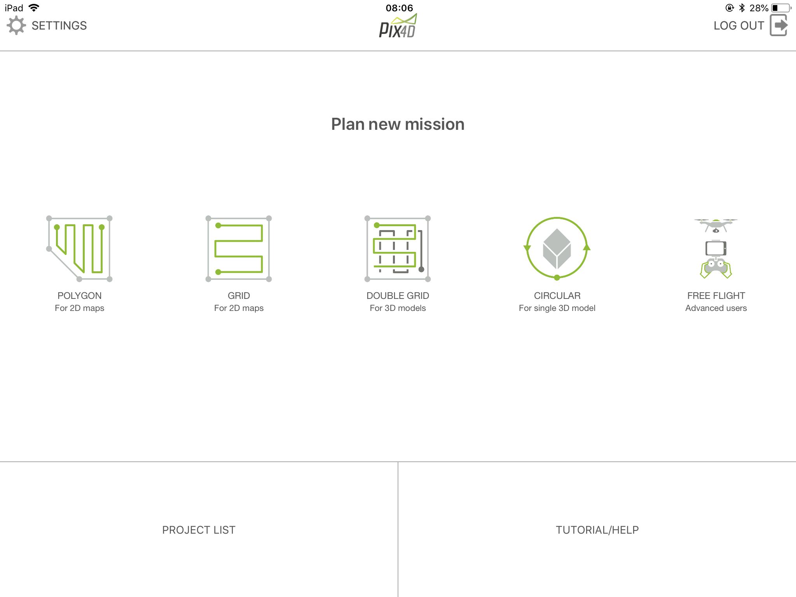
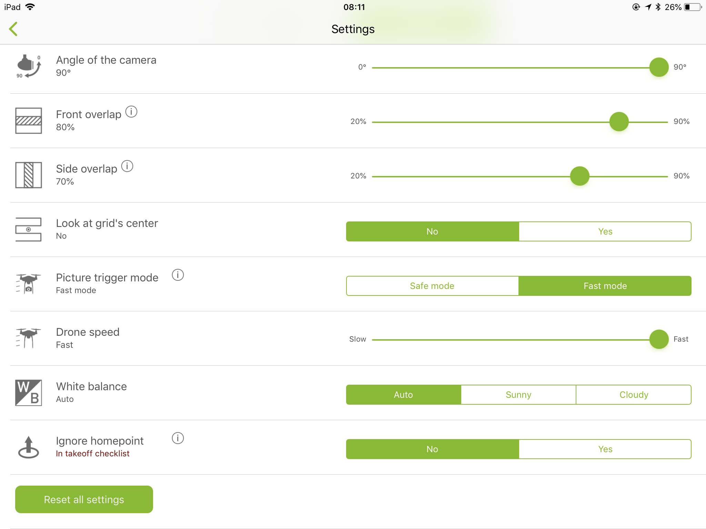
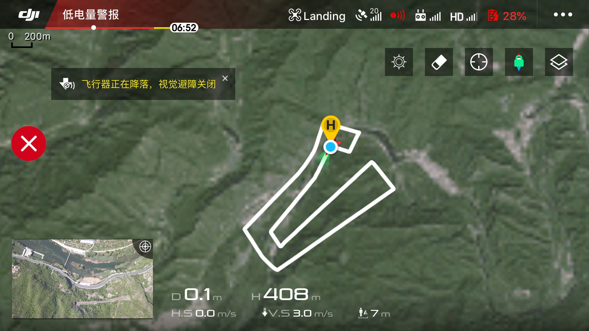

最近小试牛刀，实验用大疆无人机拍摄照片拼接正射影像图，在这里记录一下心得。

####基本作业流程
1.内业：了解作业区域实地情况
2.内业：设计飞行航线
3.内业：无人机准备
4.外业：飞行前准备
5.外业：照片拍摄
6.内业：照片拼接成正射影像图
7.内业：正射影像图校正

####1.内业：了解作业区域实地情况
使用一些地图资源，初步了解作业区域实地情况，比如地势地貌、植被分布、是否在限飞区域等，这些信息对接下来的航线设计有叁考作用。如果在限飞区域，需要申请限飞区解禁。

####2.内业：设计飞行航线
飞行航线设计与实施，除了手动控制以外，还有以下几种软件可以进行辅助：
#####2.1 [DJI GS Pro地面站](https://www.dji.com/cn/ground-station-pro)
这款软件是大疆官方提供的地面站软件，用于航线设计和实施等操作，基础功能免费，高级功能收费。而且该软件目前只有iPad版本，我手头上的御Pro由于遥控器限制，用起来比较麻烦，但是其它型号建议使用这款官方软件。

#####2.2 [Altizure](https://www.altizure.cn/mobile)
非官方软件，如果对无人机操控比较熟练，可以试用。

#####2.3 Pix4D Capture
最开始知道Pix4D是知道其桌面版软件Pix4Dmapper可以进行正射影像拼接，进行发现了其移动端软件，也具有航线设计功能，如果对无人机操控比较熟练，可以试用。

####3.内业：无人机准备
主要是电池充电，准备存储卡，并对无人机、遥控器、控制软件进行升级，控制软件连接无人机测试，控制软件参数设计，学习大疆飞行教程，了解安全须知，也可以进行模拟飞行，熟悉对无人机的操控。

####4.外业：飞行前准备
无人机飞行前校准是安全飞行的重要一步，控制软件中需要进行校准的会给出提示，但每次飞行前都要进行指南针校准。
无人机飞起来到设计高度，最好环绕一周看一下周围有没有可能发生碰撞的山或树，以免飞行过程中炸机。

####5.外业：照片拍摄
如果使用了软件辅助，则可以自动拍摄。我使用的是手动操作。拍摄过程中注意一下无人机电量，以免炸机。

下一篇继续介绍正射影像图拼接和校正。