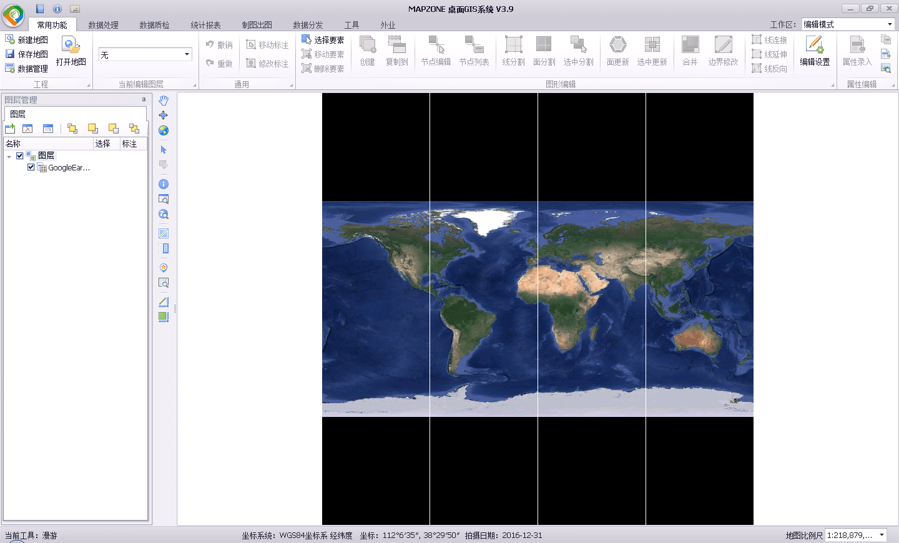
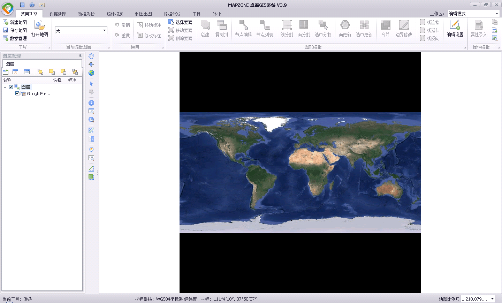

最近发现瓦片地图有白边，看起来比较难受(效果如下)，所以想办法处理一下。


##### 查找原因
最开始以为是坐标转换时出现的精度损失，因为瓦片都是地图坐标(double)，需要转成屏幕逻辑坐标(float)，如果出现精度损失就会出现两个瓦片接不上的问题。

但是通过调试发现这个过程逻辑坐标都是正常的，在缝隙处两个瓦片的坐标是相接的。

所以怀疑在逻辑坐标(float)向屏幕像素坐标(int)转换时出问题了，但是这个过程是GDI+绘制的，所以考虑需要通过设置选项来控制的。

##### 解决方案
在网上搜到了[这篇资料](http://webserver2.tecgraf.puc-rio.br/~scuri/gdiplus/drawimage_scale_problem.html)，测试可以解决。主要是以下几行代码：
```c
ImageAttributes imAtt;
imAtt.SetWrapMode(WrapModeTileFlipXY);
graphics->SetInterpolationMode(InterpolationModeNearestNeighbor);
graphics->SetPixelOffsetMode(PixelOffsetModeHalf);
graphics->DrawImage(&image, zoomRect, 0, 0, image.GetWidth(), image.GetHeight(), UnitPixel, &imAtt);
```
改正后效果：
