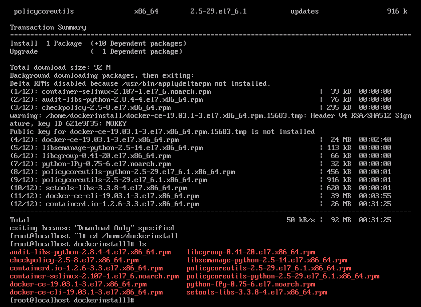
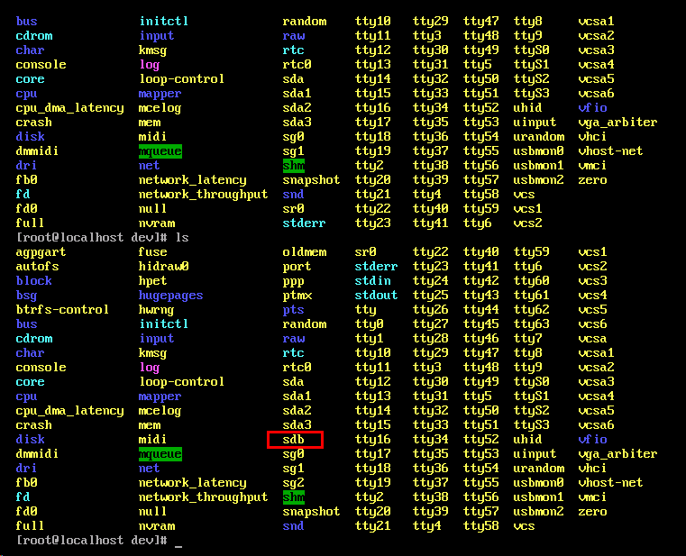
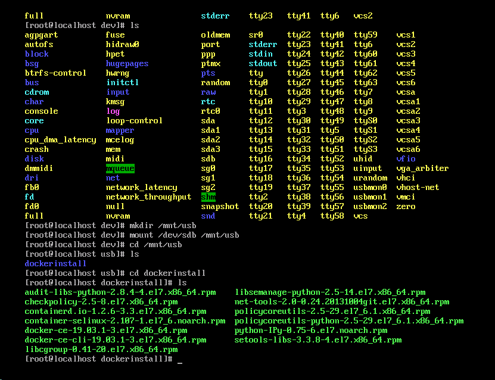
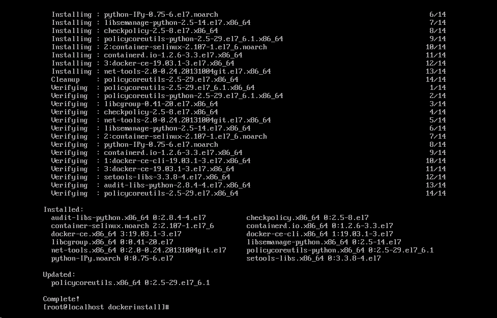
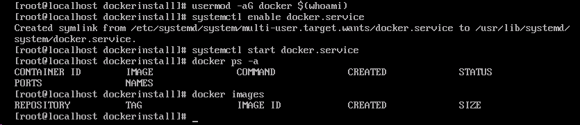
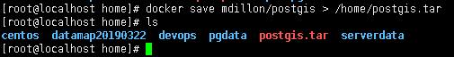
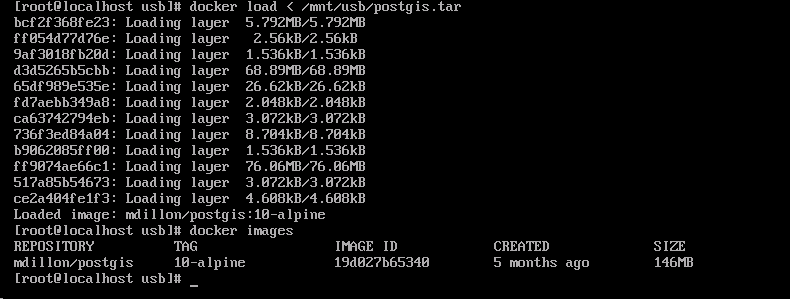
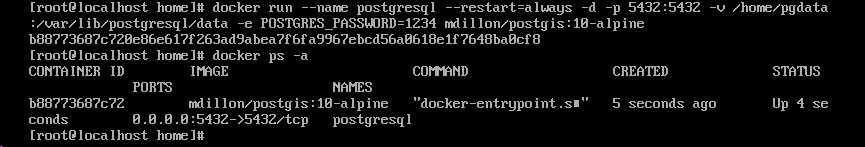
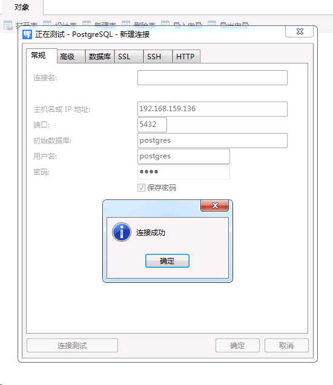

在Docker的实际应用过程中，避免不了需要将Docker部署到离线环境下，为了解决这个问题，我做了离线部署实验，现在将部署流程介绍一下。

### 实验准备

准备两台虚拟机，一台可以联网，一台无法联网，可以联网的虚拟机是为了Docker部署做准备。

### Docker环境部署

##### 使用联网机器下载Docker部署包

1.在可以连网的机器上，安装yum扩展：

```bash
yum install -y yum-utils
```

2.添加docker-ce的yum来源

```bash
yum-config-manager --add-repo https://download.docker.com/linux/centos/docker-ce.repo
```

3.创建文件夹保存Docker部署包

```bash
mkdir /home/dockerinstall
```

4.将Docker及其依赖包下载至部署包文件夹中

```bash
yum install --downloadonly --downloaddir=/home/dockerinstall docker-ce
```

这里需要找一台干净的虚拟机，否则有些部署过的包会下载不下来，导致在离线机上部署会导致安装失败。
提取Docker部署包的过程，可以只做一次，后面反复部署的时候可以使用这个成果进行离线部署。



5.将离线部署包拷贝到U盘中

##### 离线机上部署Docker

1.U盘挂载

在网上找了好多方法都无法正确识别U盘，我用的方法是肉眼看-_-!!!，看插上U盘之后Dev目录下多了什么文件，就把这个文件挂载起来看一下是不是。



2.离线安装Docker

进入离线部署包目录下，使用`yum localinstall *`安装所有部署包。


3.启动Docker服务

```bash
usermod -aG docker $(whoami)
systemctl enable docker.service
systemctl start docker.service
```


### Docker镜像迁移(以PostGIS镜像为例)

这里使用的是Docker save和load的方式，通过镜像本地文件进行迁移。

##### Docker镜像导出
```bash
docker save mdillon/postgis > /home/postgis.tar
```


##### Docker镜像导入
```bash
docker load < /mnt/usb/postgis.tar
```


#### 测试验证

1.启动PostGIS容器
```bash
docker run --name postgresql --restart=always -d -p 5432:5432 -v /home/pgdata:/var/lib/postgresql/data -e POSTGRES_PASSWORD=1234 mdillon/postgis:10-alpine
```


2.打开5432端口
```bash
firewall-cmd --permanent --add-port=5432/tcp
firewall-cmd --reload
```

3.连接测试
