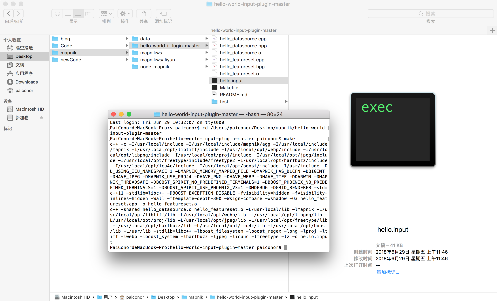

如果想使用Mapnik接入我们的数据源出图，以及自定义一些数据展示，避免不了要做数据源插件开发，所以今天简单试了一下Mapnik插件开发，并在node-mapnik中加载使用的流程。

#### 部署C++依赖环境

Mapnik插件需要使用`C++`语言开发，所以需要部署`C++`依赖环境。在MacOS上部署很方便，只需要使用`brew install mapnik`即可，在Ubuntu上稍微复杂，需要使用源码编译，具体参考Mapnik的[部署文档](https://github.com/mapnik/mapnik/blob/master/INSTALL.md)。

因为我的机器上基础环境都有，所以只需要部署boost和mapnik即可。

##### 部署boost
部署boost被坑了，mapnik最新版本(github下载的源码是3.1.0版本)无法使用boost最新版本(1.67.0)，可以使用boost 1.66.0版本。

下载boost 1.66.0源码后，编译和部署参考网上的教程即可：
```bash
cd boost_1_66_0

./bootstrap.sh --with-icu --with-libraries=all

./b2 threading=multi

./b2 install
```

##### 部署mapnik
根据Mapnik的部署文档下载Mapnik的源码，并编译安装。后来验证使用这种方法编译的Mapnik版本是3.1.0，3.1.0相对于3.0.*有一些变化，会导致后边的Demo跑不过(没错，又被坑了!!!)，所以这里安装的是3.0.20版本。

下载源码及其它依赖：
```bash
git clone -b v3.0.20 https://github.com/mapnik/mapnik.git
cd mapnik
git submodule update --init
```

验证依赖环境，如果有未通过项则需要处理后才能正确编译：
```bash
./configure
```

可以根据本机配置选择并行编译还是普通编译(make)：
```bash
JOBS=4 make
```

将编译结果进行部署：
```bash
make install
```

验证部署是否成功：
```bash
mapnik-config -v
```
如果显示Mapnik版本，证明Mapnik部署已完成。

#### 插件开发和编译
这里使用Mapnik提供的[数据源插件开发Demo](https://github.com/mapnik/hello-world-input-plugin)来做验证。

使用make命令编译，编译完成后会在目录下生成hello.input文件。


在Ubuntu环境下编译报错`can not be used when making a shared object; recompile with -fPIC`，在makefile文件中加入`CXXFLAGS += -fPIC`即可


#### node-mapnik中使用自定义插件
在node-mapnik中使用mapnik的register_datasource方法注册插件：
```javascript
mapnik.register_datasource('/Users/paiconor/Desktop/mapnik/hello-world-input-plugin-master/hello.input');
```

针对该数据源配置一个XML：
```xml
<?xml version="1.0" encoding="utf-8"?>
<Map srs="+proj=longlat +ellps=WGS84 +datum=WGS84 +no_defs" background-color="white">
    <Style name="style">
        <Rule>
            <PointSymbolizer />
            <TextSymbolizer face-name="DejaVu Sans Book" size="10" dx="5" dy="5">[key]</TextSymbolizer>
        </Rule>
    </Style>
    <Layer name="test" srs="+proj=longlat +ellps=WGS84 +datum=WGS84 +no_defs">
        <StyleName>style</StyleName>
        <Datasource>
            <Parameter name="type">hello</Parameter>
        </Datasource>
    </Layer>
</Map>
```

写测试代码加载该XML并输出图片：
```javascript
var mapnik = require('mapnik');
var fs = require('fs');

// register fonts and datasource plugins
mapnik.register_default_fonts();
mapnik.register_default_input_plugins();
mapnik.register_datasource('/Users/paiconor/Desktop/mapnik/hello-world-input-plugin-master/hello.input');

var map = new mapnik.Map(256, 256);
map.load('testplugin.xml', function(err,map) {
    if (err) throw err;
    map.zoomAll();
    var im = new mapnik.Image(256, 256);
    map.render(im, function(err,im) {
      if (err) throw err;
      im.encode('png', function(err,buffer) {
          if (err) throw err;
          fs.writeFile('map.png',buffer, function(err) {
              if (err) throw err;
              console.log('saved map image to map.png');
          });
      });
    });
});
```

运行后生成map.png，证明自定义数据源插件测试成功。
