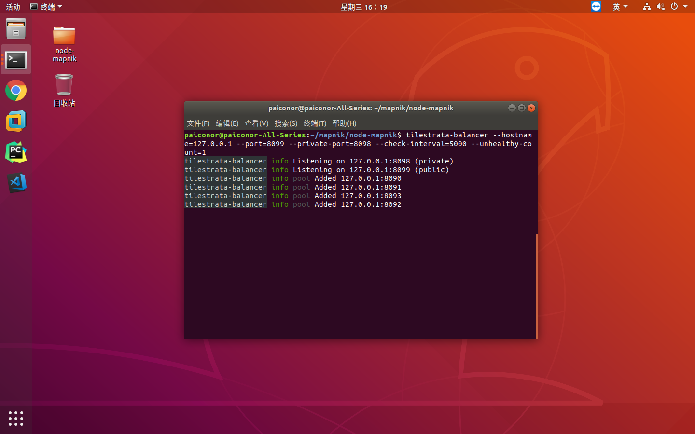
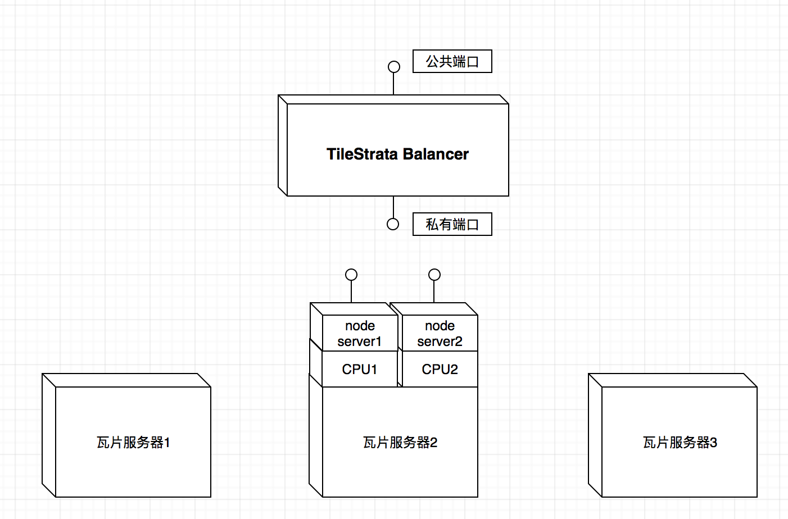

使用集群部署和负载均衡可以提高大量用户并发访问下瓦片服务绘制效率，接下来将要介绍使用node.js的cluster模块和tilestrata的tilestrata-balancer模块做集群部署和负载均衡。

本篇文章是在[上一篇](http://www.baiguangnan.com/2018/06/25/nodemapniktest/)的基础上进行扩展，如果有不清楚的可以了解一下。

##### 1.使用node.js的cluster模块创建单机集群
因为node.js是单线程模式，所以无法有效的利用多核CPU优势，但node.js的cluster模块可以启动多个node.js程序，并实现负载均衡(这里没有用到cluster的负载均衡)。

首先，将瓦片服务代码中端口部分，由写死改成通过传入参数获取。即修改app.js中最后一行：
```javascript
strata.listen(8099);
```
改为：
```javascript
var port = process.env['port'];
strata.listen(port);
```

然后创建单机集群处理代码cluster.js，具体代码如下：
```javascript
var cluster = require('cluster');
var cpus = require('os').cpus();

cluster.setupMaster({
  exec: './app.js'
});

for(var i = 0; i < cpus.length; i++){
  var port = 8090 + i;
  cluster.fork({port : port});
}
```

使用命令`node cluster.js`即可启动集群模式，在本机实验可以创建4个node.js进程。

##### 2.使用tilestrata-balancer模块做瓦片服务访问负载均衡处理

首先，安装tilestrata-balancer模块：
```bash
sudo npm install -g tilestrata-balancer
```

然后修改app.js代码，修改strata的初始化方式：
```javascript
var strata = tilestrata({
  balancer: {
    host: '127.0.0.1:8098'
  }
});
```

这里负载均衡服务器host可以是其它服务器，这里写的是本机IP。这里的端口号是tilestrata-balancer的私有端口号，用于瓦片服务集群和负载均衡服务器通信使用。

修改完成之后，使用命令启动tilestrata-balancer负载均衡：
```bash
tilestrata-balancer --hostname=127.0.0.1 --port=8099 --private-port=8098 --check-interval=5000 --unhealthy-count=1
```

这里的port参数是对外端口号，用于外部访问瓦片服务；private-port是私有端口号，用于瓦片服务集群和负载均衡服务器通信使用。

然后使用命令`node cluster.js`启动node.js单机集群，就可以看到负载均衡命令行显示有瓦片服务注册进来。


至此，单机集群负载均衡就做好了，前端访问还是使用8099端口。而且只要在app.js中指定好负载均衡服务器的IP，就可以把瓦片服务部署到多个服务器上，进一步加快访问效率。

最后上图总结：


此篇博文参考[think8848的博客](http://www.cnblogs.com/think8848/p/6357727.html)，特此感谢！