[Mapnik](http://mapnik.org)是一个开放源代码的地图学工具集，提供基于客户端与服务器端的地图渲染使用，以`C++`撰写。Mapnik的原始开发者，Artem Pavlenko将目标明确设置为通过使用子像素反锯齿功能来创建美丽的地图。Mapnik现在也有Cairo渲染后端。Mapnik使用`Boost C++ Libraries`来处理如存储器管理、访问文件系统、正规表达式与解析XML等的一般软件工作。地图的外观可以使用XML文件来定义，也可以通过`C++`、`Python`与`Node.js`等编程语言来建构。

本文将要介绍在Ubuntu服务器上部署node-mapnik，通过配置好的XML发布地图服务，并使用Openlayers显示该地图服务。

```
说明：下面介绍的各个步骤可以实现上述目标，但不一定是最简、最优流程，可能存在多余的过程，就如其它教程里要求编译mapnik、boost之类的，经验证不需要这步操作。
```

#### 1.安装Node.js
如果没有安装Node.js，需要安装Node.js LTS版本(目前是8.11.3，最新版安装node-mapnik好像出问题了)。如果没有安装过可以使用命令进行安装：
```bash
apt-get install nodejs
apt-get install npm
```
安装之后验证版本：
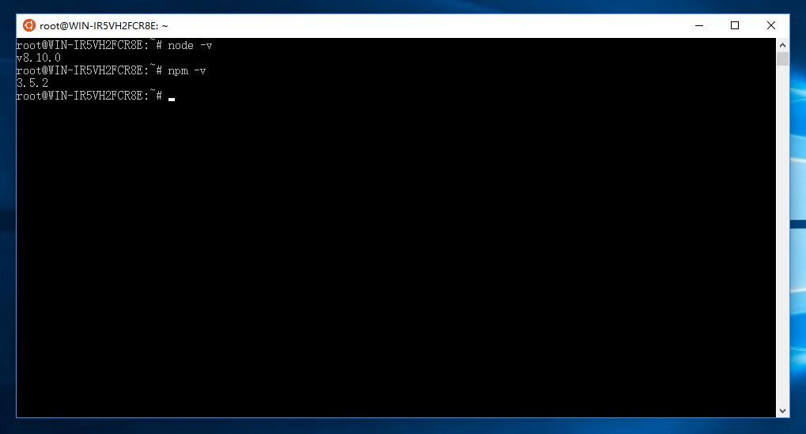
由于npm访问国外网站过慢，可以切换成淘宝npm镜像：
```bash
npm config set registry https://registry.npm.taobao.org
```
Node.js版本和npm版都不是最新的，需要进行更新，这里使用`n`模块进行升级：
```bash
npm install -g n
```

安装完成之后就可以通过命令安装latest、stable、lts和指定版本等，这里安装lts版本：
```bash
n lts
```
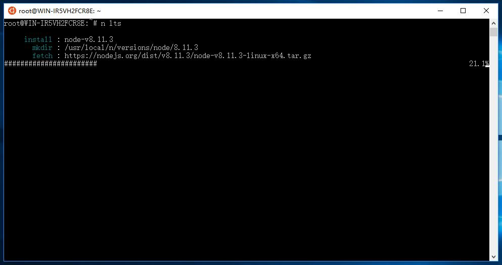

安装完成之后发现node.js和npm版本没有发生变化，需要将原来的node删除，并创建一个软链接到n目录下的node，所在位置如下：
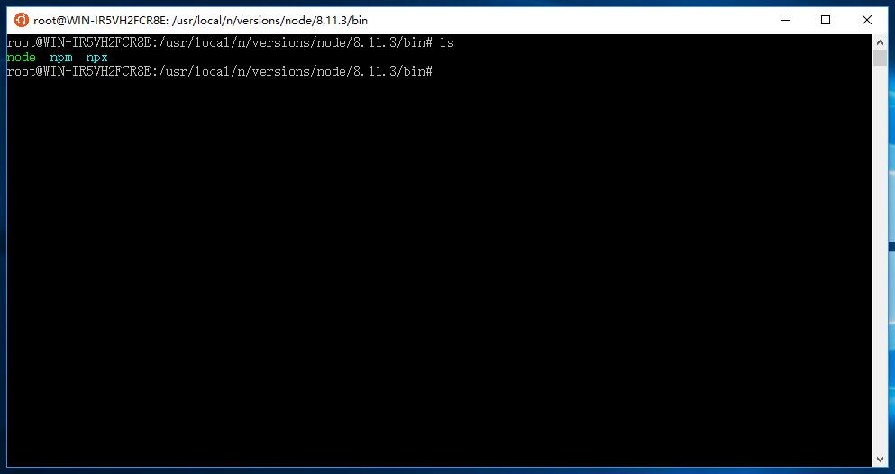
```bash
rm /usr/bin/node
ln -s /usr/local/n/versions/node/8.11.3/bin/node /usr/bin/node
rm /usr/bin/npm
ln -s /usr/local/n/versions/node/8.11.3/bin/npm /usr/bin/npm
```
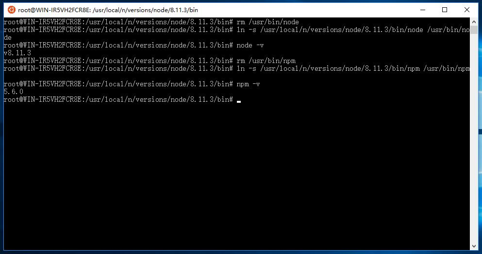
npm升级到最新版本
```bash
npm i -g npm
```
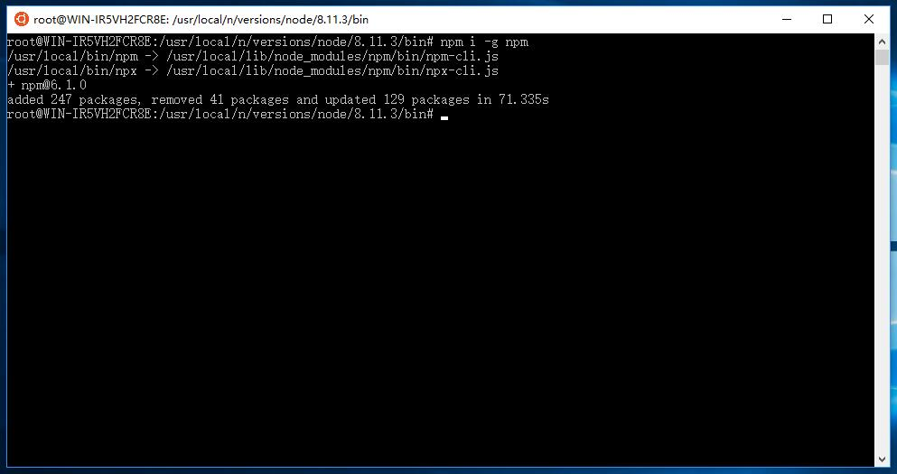

#### 2.安装node-mapnik
全局安装node-gyp和node-pre-gyp：
```bash
npm install -g node-gyp
npm install -g node-pre-gyp
```
node-mapnik模块我没有全局安装，安装到当前目录下。首先创建文件夹并进入：
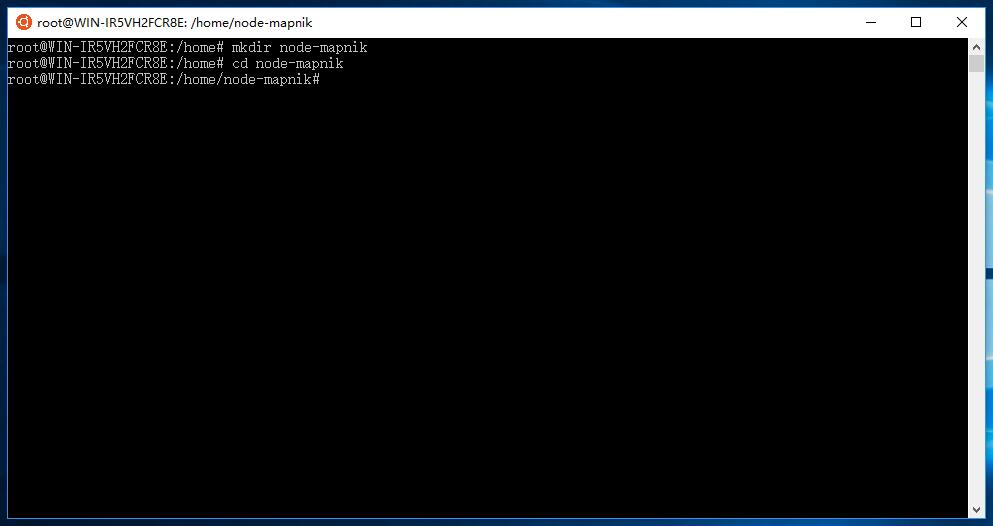
安装node-mapnik模块：
```bash
npm install mapnik
```
如果出现安装失败的情况，有的是因为一些资源下载失败，尝试科学上网、不断重试直到安装成功。
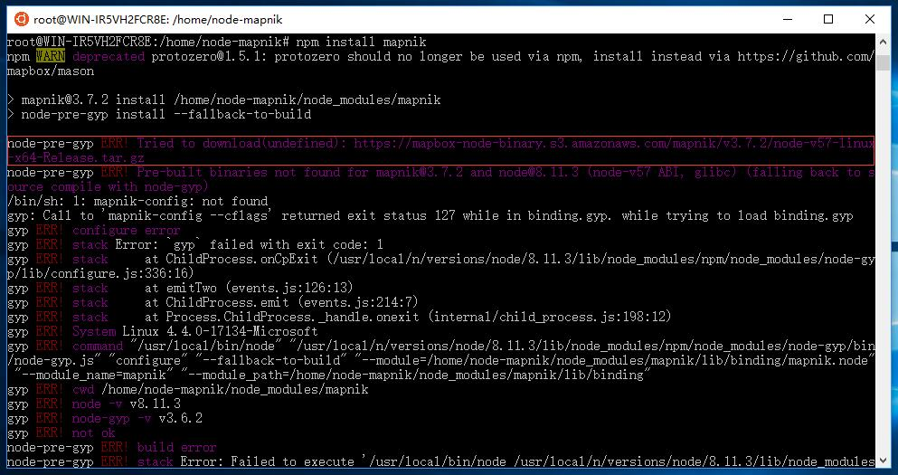
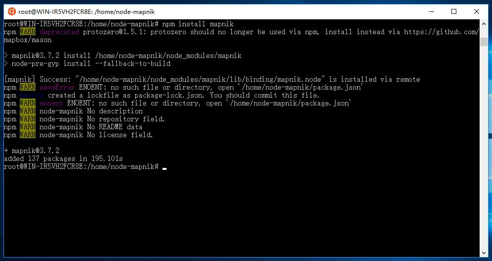

安装成功后，我们验证一下模块是否可用，我们使用[node-mapnik github](https://github.com/mapnik/node-mapnik)上的示例代码进行测试：
```javascript
var mapnik = require('mapnik');
new mapnik.Image.open('input.jpg').save('output.png');
```
使用vim创建test.js测试脚本，并写入上述代码，并保存：
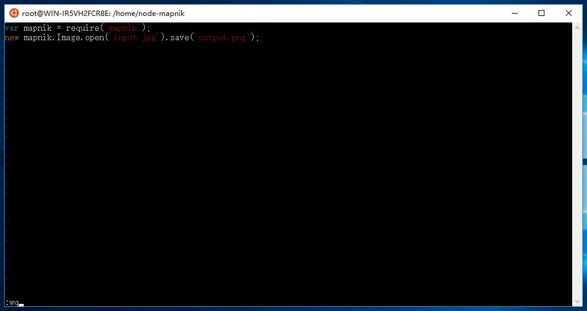
拷入input.jpg(可以使用xshell的rz，我用的是Windows10的Ubuntu子系统，直接把input.jpg拷贝到`C:\Users\PaiConor\AppData\Local\Packages\CanonicalGroupLimited.Ubuntu18.04onWindows_79rhkp1fndgsc\LocalState\rootfs\home\node-mapnik`目录下就可以了)，启动测试脚本，如果生成了output.png，则mapnik模块安装成功。
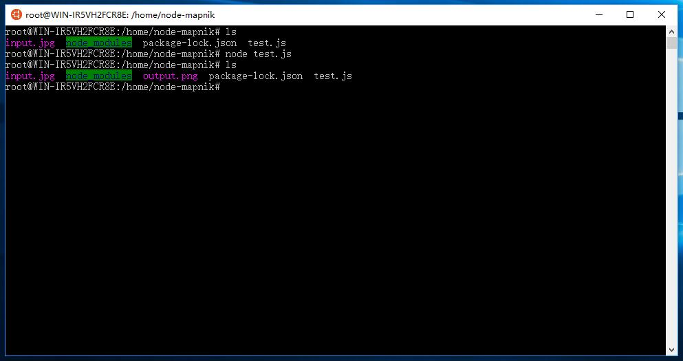

#### 3.配置Mapnik配图样式XML
根据Mapnik的XML配置格式，配了一个简单的地图：
```xml
<Map background-color="rgb(255,255,255)" srs="+proj=merc +a=6378137 +b=6378137 +lat_ts=0.0 +lon_0=0.0 +x_0=0.0 +y_0=0.0 +k=1.0 +units=m +nadgrids=@null +wktext +no_defs +over">

  <Style name="My Style">
    <Rule>
      <PolygonSymbolizer fill="#f2eff9" />
      <LineSymbolizer stroke="rgb(255,0,0)" stroke-width="1" />
    </Rule>
  </Style>

  <Layer name="world" srs="+proj=longlat +ellps=GRS80 +no_defs">
    <StyleName>My Style</StyleName>
    <Datasource>
      <Parameter name="file">shapefile/aaa</Parameter>
      <Parameter name="type">shape</Parameter>
    </Datasource>
  </Layer>

</Map>
```
这里的shapefile数据是国家2000经纬度坐标系的，最开始地图也是这个空间参考，但是需要前端访问时对应到这个空间参考上，有些麻烦，所以直接修改地图空间参考为比较流行的Web墨卡托投影坐标系了，图层进行动态投影显示。

配好之后可以使用下面的脚本生成图片，验证配图效果：
```javascript
var mapnik = require('mapnik');
var fs = require('fs');

// register fonts and datasource plugins
mapnik.register_default_fonts();
mapnik.register_default_input_plugins();

var map = new mapnik.Map(4096, 4096);
map.load('../data/style.xml', function(err,map) {
    if (err) throw err;
    map.zoomAll();
    var im = new mapnik.Image(4096, 4096);
    map.render(im, function(err,im) {
      if (err) throw err;
      im.encode('png', function(err,buffer) {
          if (err) throw err;
          fs.writeFile('map.png',buffer, function(err) {
              if (err) throw err;
              console.log('saved map image to map.png');
          });
      });
    });
});
```

#### 4.发布地图服务
Mapnik搞定的是地图渲染，但是发布瓦片服务，还需要使用[TileStrata](https://github.com/naturalatlas/tilestrata)来进行。

安装TileStrata及其插件：
```bash
npm install tilestrata

npm install tilestrata-disk

npm install tilestrata-mapnik
```

安装完成后创建瓦片服务脚本app.js，并输入以下内容：
```javascript
var tilestrata = require('tilestrata');
var disk = require('tilestrata-disk');
var mapnik = require('tilestrata-mapnik');

var strata = tilestrata();

//layer名称不能为空
strata.layer('map')
  .route('tile.png')    					//route方法中不能使用正则表达式
  .use(disk.cache({dir: './tilecache'}))    //设置瓦片缓存在当前目录的tilecache之目录中
  .use(mapnik({
    pathname: '../data/test.xml'
  }));

strata.listen(8099);
```

启动脚本：
```bash
node app.js
```

如果会计算某一级别行列号可以通过`http://127.0.0.1:8099/map/{z}/{x}/{y}/tile.png`模式验证瓦片服务是否发布成功，也可以通过下面的方法，使用Openlayers加载瓦片服务进行验证。

#### 5.使用[Openlayers](http://openlayers.org)访问瓦片服务
到Openlayers官网上下载了新版本编译成果，创建前端目录，将ol.js拷贝到js子文件夹下，将ol.css拷贝到css子文件夹下，并创建index.html，内容如下：
```html
<!Doctype html>
<html xmlns=http://www.w3.org/1999/xhtml>
<head>
    <meta http-equiv=Content-Type content="text/html;charset=utf-8">
    <meta http-equiv=X-UA-Compatible content="IE=edge,chrome=1">
    <meta content=always name=referrer>
    <title>Mapnik地图服务示例</title>
    <link href="./css/ol.css" rel="stylesheet" type="text/css" />
    <script type="text/javascript" src="./js/ol.js" charset="utf-8"></script>
</head>
<body>
<div id="map" style="width: 100%"></div>
<script>

    var tileStrataMapLayer = new ol.layer.Tile({
        opacity: 0.6,
        source: new ol.source.XYZ({
            url: 'http://127.0.0.1:8099/map/{z}/{x}/{y}/tile.png'
        })
    });

    new ol.Map({
        layers: [
            new ol.layer.Tile({
                source: new ol.source.OSM()
            }),
            tileStrataMapLayer,
        ],

        view: new ol.View({
            center: [106.81, 31.55],
            projection: 'EPSG:4326',
            zoom: 14
        }),

        target: 'map'
    });
</script>
</body>
</html>
```
这里使用Openlayers加载了Mapnik瓦片服务，并叠加了一个OSM图层，用于对比叠加效果，最终效果如下：
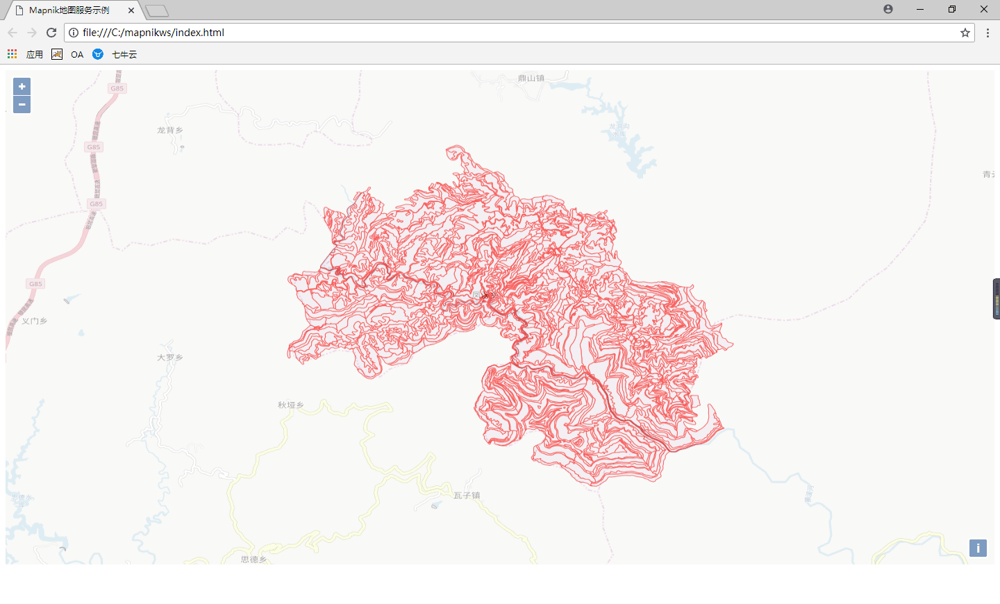


以上介绍的只是做了简单的地图发布，离最终高并发地图服务还有一段距离，需要继续研究和探索。

此篇博文参考[think8848的博客](http://www.cnblogs.com/think8848/p/6262696.html)，特此感谢！