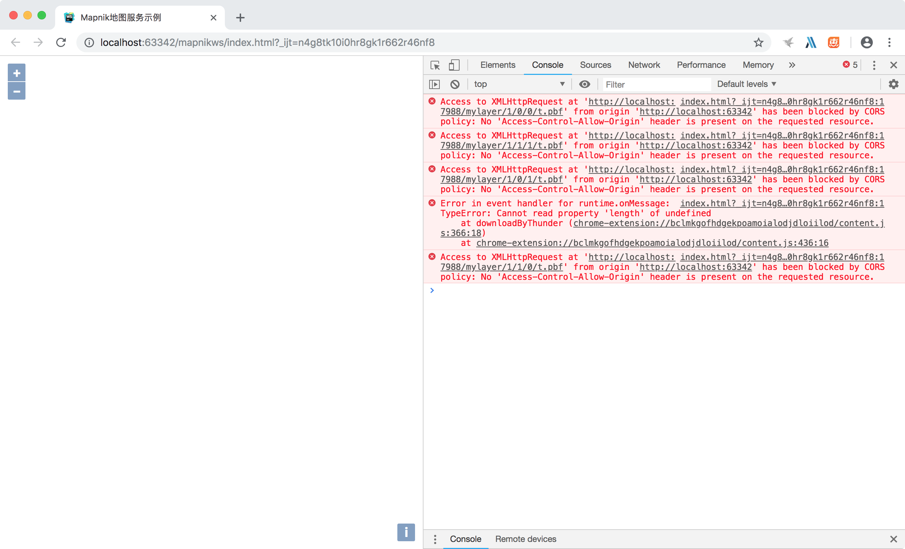
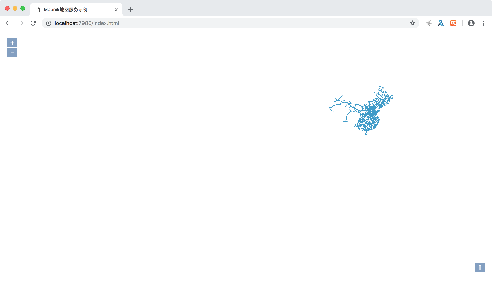
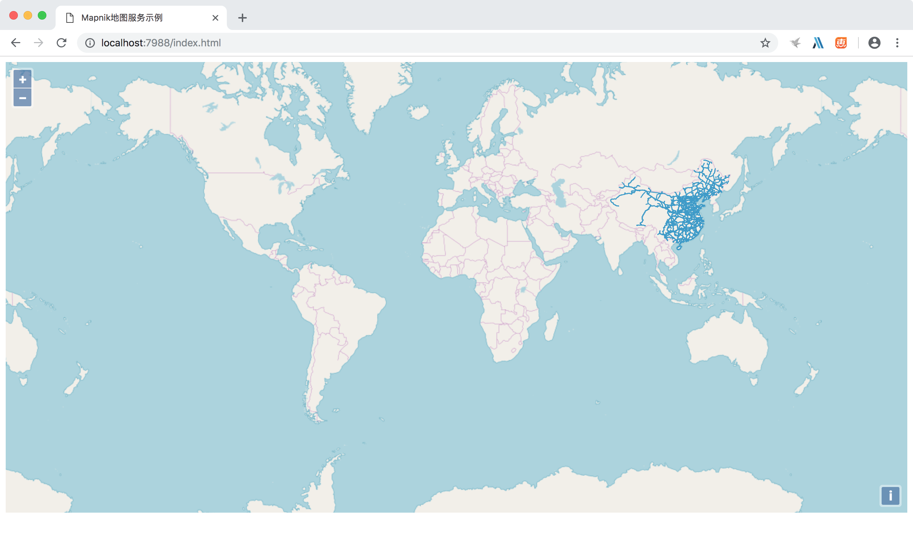
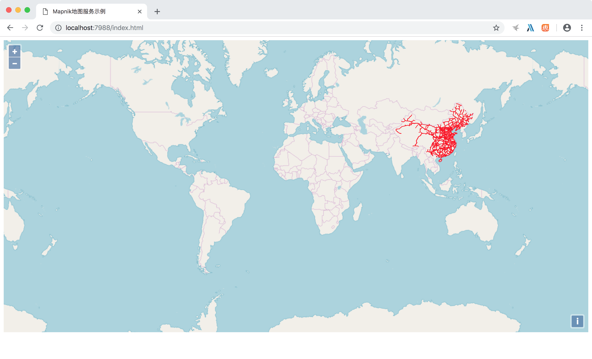
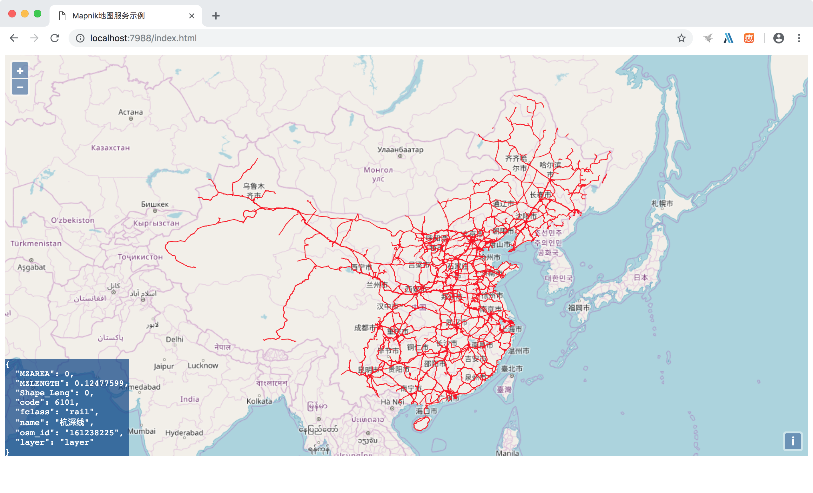
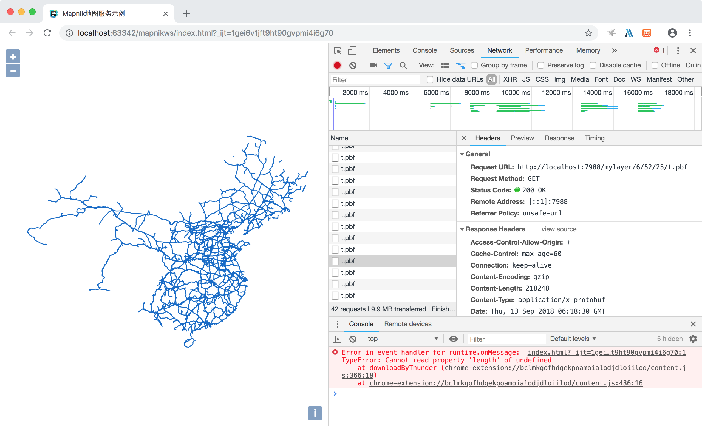

随着对[TileStrata](https://github.com/naturalatlas/tilestrata)的深入了解，也想尝试一下[矢量瓦片的相关插件](https://github.com/naturalatlas/tilestrata-vtile)，但网上相关的资料好像不多，接下来就把我的试用过程记录下来，分享给大家。

首先了解一下该插件提供的官方示例：
```javascript
var vtile = require('tilestrata-vtile');
var vtileraster = require('tilestrata-vtile-raster');

var common = {
    xml: '/path/to/map.xml',
    tileSize: 256,
    metatile: 1,
    bufferSize: 128
};

server.layer('mylayer')
    .route('t.pbf').use(vtile(common))
    .route('t.png').use(vtileraster(common, {
        tilesource: ['mylayer', 't.pbf']
    }))
    .route('i.json').use(vtileraster(common, {
        tilesource: ['mylayer', 't.pbf'],
        interactivity: true
    }));
```

这个示例发布了三种类型的服务，一种是基于protobuf(pbf)格式的矢量瓦片，一种是png瓦片，一种是geojson格式的矢量瓦片，这里主要试用pbf类型。

安装好tilestrata、tilestrata-vtile和node-mapnik模块，补足完整示例代码：
```javascript
var tilestrata = require('tilestrata');
var vtile = require('tilestrata-vtile');
var server = tilestrata();
var common = {
    xml: '/Users/paiconor/Desktop/server/dir/VectorTiles/8dd716c9-369c-4edd-9f20-a7aea283f5d0/thumbnail/mapnik.xml',
    tileSize: 256,
    metatile: 1,
    bufferSize: 128
};

server.layer('mylayer').route('t.pbf').use(vtile(common));
server.listen(7988);
```

在WebStorm中，按照Openlayers[加载矢量瓦片示例](http://openlayers.org/en/latest/examples/mapbox-vector-tiles.html)，简化前端代码如下(Openlayers版本用的是4系列)：
```html
<!Doctype html>
<html xmlns=http://www.w3.org/1999/xhtml>
<head>
    <meta http-equiv=Content-Type content="text/html;charset=utf-8">
    <meta http-equiv=X-UA-Compatible content="IE=edge,chrome=1">
    <meta content=always name=referrer>
    <title>Mapnik地图服务示例</title>

    <!--Let browser know website is optimized for mobile-->
    <meta name="viewport" content="width=device-width, user-scalable=no, initial-scale=1.0"/>

    <link href="ol.css" rel="stylesheet" type="text/css" />
    <script type="text/javascript" src="ol.js" charset="utf-8"></script>
</head>
<body>
<main class="bodymain">
    <div id="map" class="map"></div>
</main>
<script>
    var map = new ol.Map({
        target: 'map',
        view: new ol.View({
            center: [0, 0],
            zoom: 2
        }),
        layers: [new ol.layer.VectorTile({
            source: new ol.source.VectorTile({
                format: new ol.format.MVT(),
                url: 'http://localhost:7988/mylayer/{z}/{x}/{y}/t.pbf'
            })
        })]
    });
</script>
</body>
</html>
```
用这种方式出现了个问题，就是提示跨域，原因是WebStorm启动的前端服务端口是63342，而矢量瓦片端口是7988。


因为对前端不熟悉，所以选择在服务端解决这个问题。之前看资料时发现TileStrata支持做为Express的中间件(目前不支持Koa)，所以这次尝试一下。

安装express模块和express-static模块，将代码修改为如下：
```javascript
const express = require('express');
const app = new express();

var tilestrata = require('tilestrata');
var vtile = require('tilestrata-vtile');
var server = tilestrata();
var common = {
    xml: '/Users/paiconor/Desktop/server/dir/VectorTiles/8dd716c9-369c-4edd-9f20-a7aea283f5d0/thumbnail/mapnik.xml',
    tileSize: 256,
    metatile: 1,
    bufferSize: 128
};

server.layer('mylayer').route('t.pbf').use(vtile(common));

//添加为Express中间件
app.use(tilestrata.middleware({
    server: server,
    prefix: '/maps'
}));

//添加静态目录中间件
app.use(require('express-static')(__dirname + '/public'));

//启动服务器
app.listen(7988);
```

将之前的前端文件拷贝到public目录下，就可以在浏览器中访问了(这里注意一下，因为将TileStrata做为Express路由，加入了maps地址，所以矢量瓦片加载地址由之前的`http://localhost:7988/mylayer/{z}/{x}/{y}/t.pbf`变为`http://localhost:7988/maps/mylayer/{z}/{x}/{y}/t.pbf`)：


配置OSM底图：


在前端修改渲染：
```javascript
    var map = new ol.Map({
        target: 'map',
        view: new ol.View({
            center: [0, 0],
            zoom: 2
        }),
        layers: [
            new ol.layer.Tile({
                title: "OSM",
                source: new ol.source.OSM({
                    attributions: []
                })
            }),
            new ol.layer.VectorTile({
            source: new ol.source.VectorTile({
                format: new ol.format.MVT(),
                url: 'http://localhost:7988/maps/mylayer/{z}/{x}/{y}/t.pbf'
            }),
            style: function(feature, resolution) {
                return new ol.style.Style({
                    stroke: new ol.style.Stroke({
                        color: 'rgba(255, 0, 0)',
                        width: 1
                    })
                })
            }
        })]
    });
```


根据Openlayers[显示矢量瓦片信息示例](http://openlayers.org/en/latest/examples/vector-tile-info.html)，加入如下代码：
```javascript
    map.on('singleclick', showInfo);

    var info = document.getElementById('info');
    function showInfo(event) {
        var features = map.getFeaturesAtPixel(event.pixel);
        if (!features) {
            info.innerText = '';
            info.style.opacity = 0;
            return;
        }
        var properties = features[0].getProperties();
        info.innerText = JSON.stringify(properties, null, 2);
        info.style.opacity = 1;
    }
```
点击地图即可显示所点要素的属性：


修改渲染，分类显示：
```javascript
    var map = new ol.Map({
        target: 'map',
        view: new ol.View({
            center: [0, 0],
            zoom: 2
        }),
        layers: [
            new ol.layer.Tile({
                title: "OSM",
                source: new ol.source.OSM({
                    attributions: []
                })
            }),
            new ol.layer.VectorTile({
            source: new ol.source.VectorTile({
                format: new ol.format.MVT(),
                url: 'http://localhost:7988/maps/mylayer/{z}/{x}/{y}/t.pbf'
            }),
            style: function(feature, resolution) {
                var properties = feature.getProperties();
                if (properties['name'] == "") {
                    return new ol.style.Style({
                        stroke: new ol.style.Stroke({
                            color: 'rgba(255, 0, 0)',
                            width: 1
                        })
                    })
                }
                else {
                    return new ol.style.Style({
                        stroke: new ol.style.Stroke({
                            color: 'rgba(0, 255, 0)',
                            width: 1
                        })
                    })
                }
            }
        })]
    });
```


### 2018年9月13日更新---------------------------

上边提到的跨域问题，除了使用Express之外，还有另外一种解决方案：
首先，安装tilestrata-headers组件
```bash
npm install tilestrata-headers
```

在代码中加入模块引用：
```javascript
var headers = require('tilestrata-headers');
```

完整代码如下：
```javascript
var tilestrata = require('tilestrata');
var vtile = require('tilestrata-vtile');
var headers = require('tilestrata-headers');

var server = tilestrata();
var common = {
    xml: '/Users/paiconor/Desktop/server/dir/VectorTiles/8dd716c9-369c-4edd-9f20-a7aea283f5d0/thumbnail/mapnik.xml',
    tileSize: 256,
    metatile: 1,
    bufferSize: 128
};

server.layer('mylayer')
    .route('t.pbf')
    .use(headers({
        'Access-Control-Allow-Origin': '*'
    }))
    .use(vtile(common));

server.listen(7988)
```
这样WebStorm发布出来的网页就不会提示跨域问题了。
