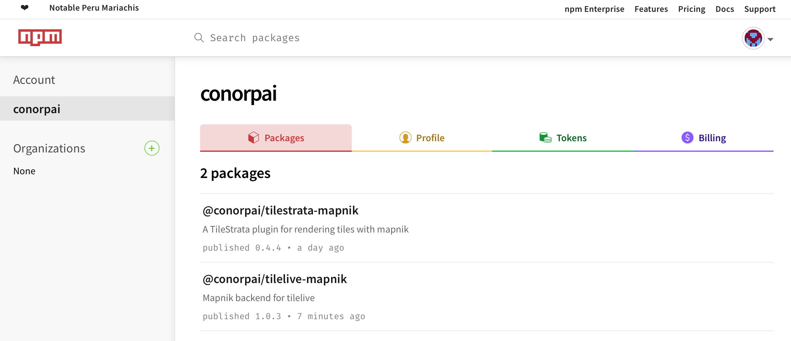
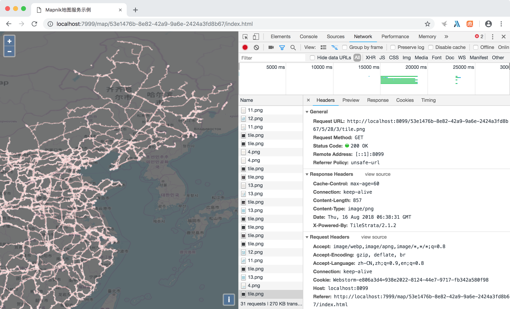

最近在用Node.js写后台服务，并使用了tilestrata发布地图服务，但是发现一个问题，瓦片分级方案只支持墨卡托投影分级方案。如果想使用经纬度分级方案，没有直接的方法，只能按墨卡托分级方案切，在前端openlayers再做动态投影，但是这样做有效率问题，所以想尝试解决一下。

#### 1.修改tilelive-mapnik源码，解决分级方案写死问题

查看并调试node_modules中的模块代码，发现在`tilelive-mapnik/lib/render.js`最前面有这样几行代码：
```javascript
var EARTH_RADIUS = 6378137;
var EARTH_DIAMETER = EARTH_RADIUS * 2;
var EARTH_CIRCUMFERENCE = EARTH_DIAMETER * Math.PI;
var MAX_RES = EARTH_CIRCUMFERENCE / 256;
var ORIGIN_SHIFT = EARTH_CIRCUMFERENCE/2;

function calculateMetatile(options) {
    
    //...
    
    //当前级别分辨率
    var resolution = MAX_RES / total;

    //...
    
    //当前级别、行列号所代表的矩形范围
    var minx = (x * 256) * resolution - ORIGIN_SHIFT;
    var miny = -((y + metaHeight) * 256) * resolution + ORIGIN_SHIFT;
    var maxx = ((x + metaWidth) * 256) * resolution - ORIGIN_SHIFT;
    var maxy = -((y * 256) * resolution - ORIGIN_SHIFT);
    
    //...
}
```

这个代码代表里面的分级方案是写死的，如果修改的话，只需要把`MAX_RES(首级分辨率)`、`ORIGIN_SHIFT(原点)`按参数计算即可。

在Github上Fork了[tilelive-mapnik](https://github.com/mapbox/tilelive-mapnik)，由于[tilestrata-mapnik](https://github.com/naturalatlas/tilestrata-mapnik)引用了tilelive-mapnik，所以也fork了一份儿。

改后的效果是，构造tilestrata-mapnik时，在options中加入FristDPI(首级分辨率)、OriX(源点X坐标)和OriY(源点Y坐标)，就可以传到tilelive-mapnik的render.js中使用，render.js修改代码如下：
```javascript
if (options.OriX != undefined && options.OriY != undefined && options.FirstDPI != undefined) {
    var resolution = options.FirstDPI / total;
    var minx = (x * 256) * resolution + options.OriX;
    var miny = -((y + metaHeight) * 256) * resolution + options.OriY;
    var maxx = ((x + metaWidth) * 256) * resolution + options.OriX;
    var maxy = -((y * 256) * resolution - options.OriY);
}
else {
    var resolution = MAX_RES / total;
    var minx = (x * 256) * resolution - ORIGIN_SHIFT;
    var miny = -((y + metaHeight) * 256) * resolution + ORIGIN_SHIFT;
    var maxx = ((x + metaWidth) * 256) * resolution - ORIGIN_SHIFT;
    var maxy = -((y * 256) * resolution - ORIGIN_SHIFT);
}
```

经纬度分级方案的FirstDPI是1.40625(全球经度360°，除以一张瓦片256像素，就得到一个像素代表的度数)，源点X为-180，源点Y为90，即左上角点。

使用代码如下：
```javascript
var tilestrata = require('tilestrata');
var disk = require('tilestrata-disk');
var mapnik = require('@conorpai/tilestrata-mapnik');
var strata = tilestrata();
strata.listen(8099);

//创建瓦片服务
exports.createTileServer = function (uuid, xml, cache) {
    var mn = mapnik({
        pathname: xml,
        OriX: -180,
        OriY: 90,
        FirstDPI: 1.40625
    });
    mn.init(undefined, function () {});
    var layer = strata.layer(uuid)
        .route('tile.png')
        .use(mn);

    if (cache != undefined) {
        layer.use(disk.cache({dir: cache}));
    }
};
```

接下来的工作就是将修改后的代码上传到NPM中。

#### 2.将修改结果上传至NPM

首先到[NPM官网](https://www.npmjs.com)注册自己的帐号。

然后修改tilelive-mapnik中package.json中的信息，包括name、version、一些github中的地址等。

如果之前做过registry切换的，需要切回官方版本。
```bash
npm config set registry http://registry.npmjs.org/
```

使用`npm adduser`和`npm login`在本机登陆帐号，可以使用`npm who am i`进行验证。

命令行进入代码目录，然后就可以使用`npm publish`命令进行发布了。

发布时遇到的问题：

```bash
npm ERR! publish Failed PUT 402
npm ERR! code E402
npm ERR! You must sign up for private packages : @wandiparis/troposphere
```
遇到这个问题的解决方案是[这里](https://github.com/semantic-release/semantic-release/issues/512)。

发布成功之后就可以到NPM官网上查看了


修改tilestrata的package.json，修改对tilelive-mapnik的引用，改为引用@conorpai/tilelive-mapnik，并上传到NPM中。

最后上一张按经纬度分级方案切图的效果图：
