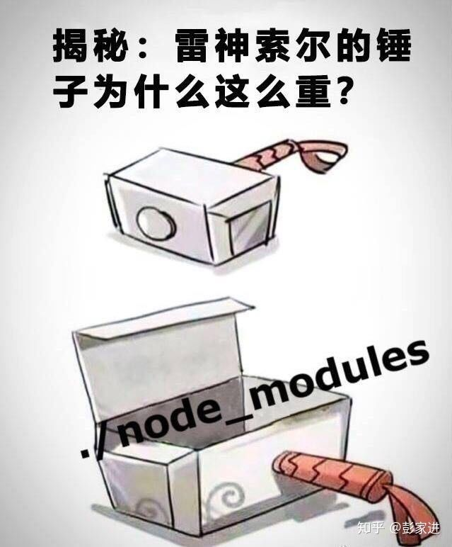
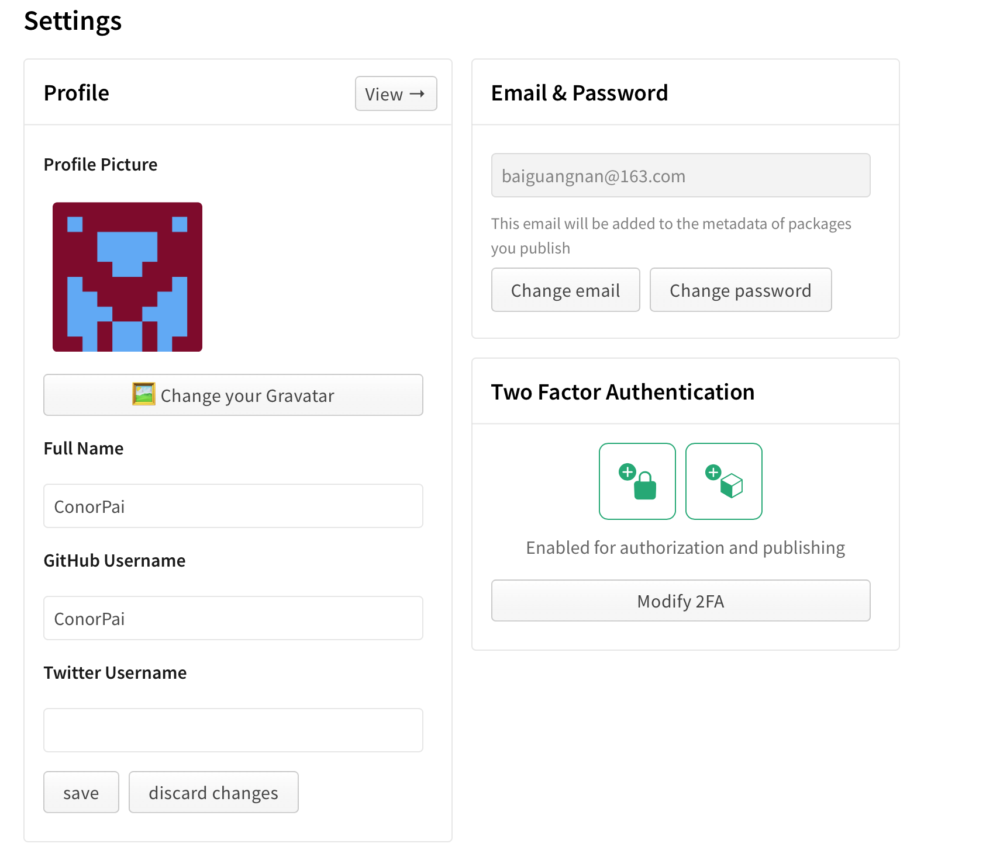
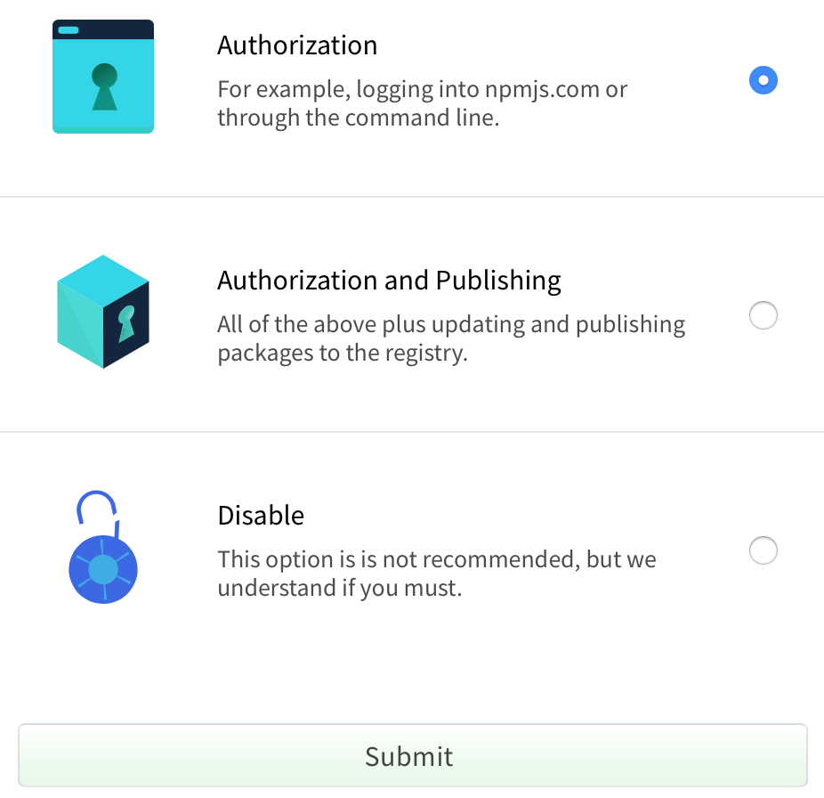
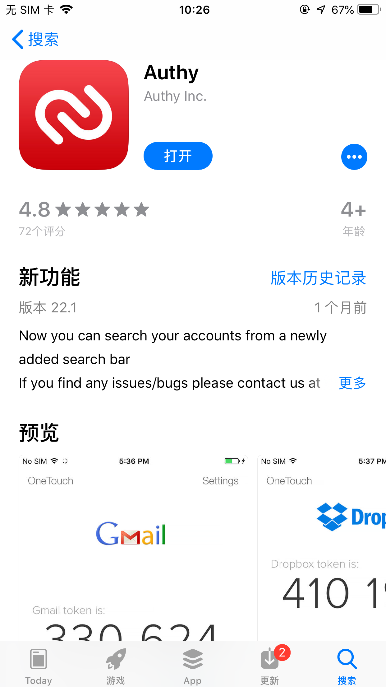
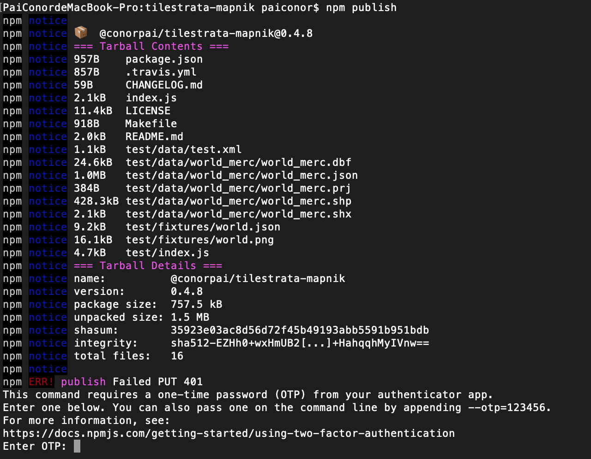
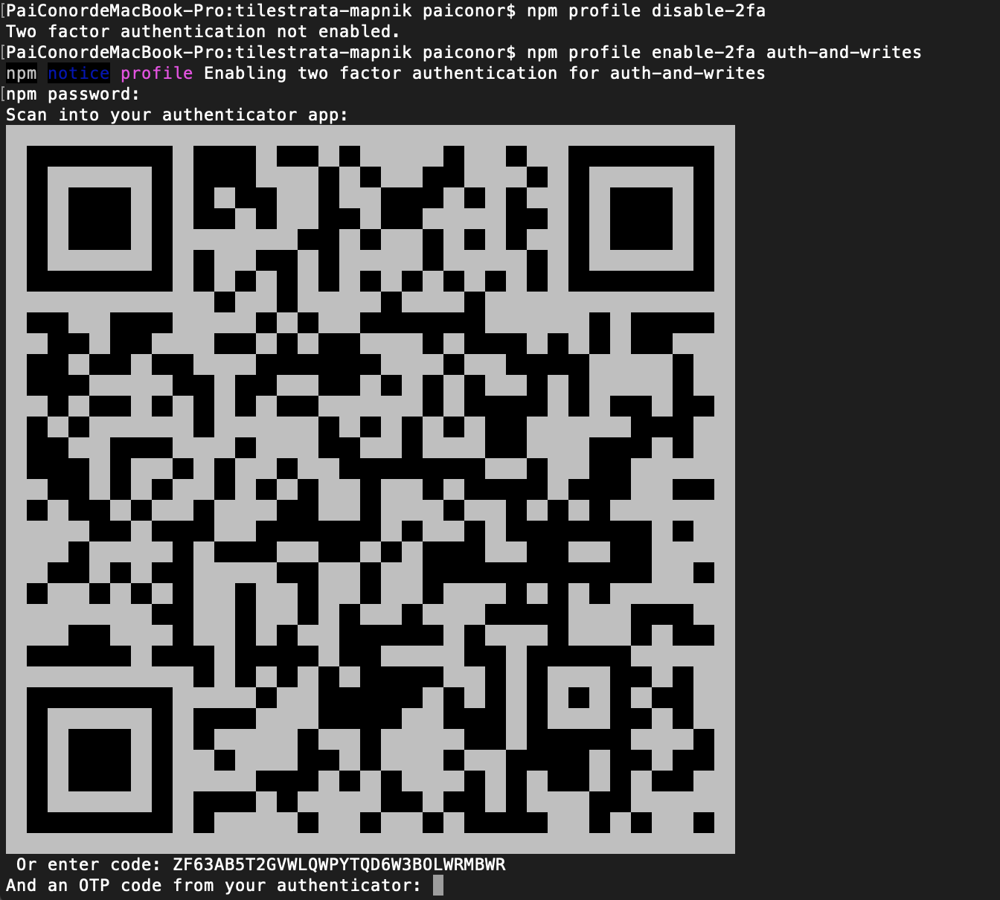
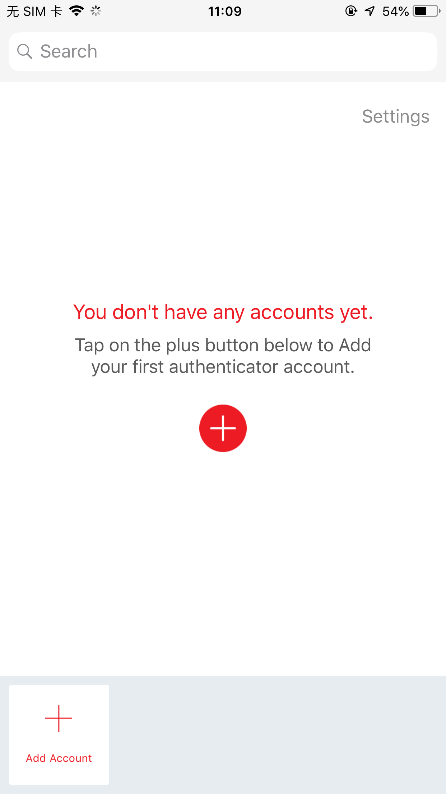
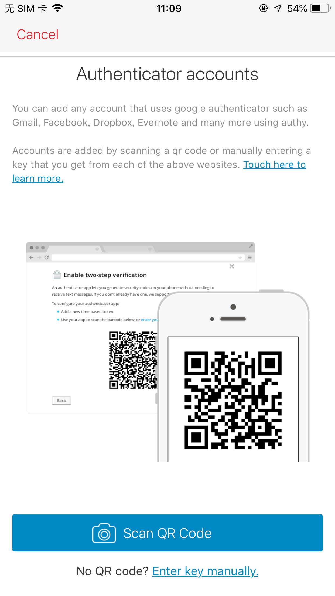
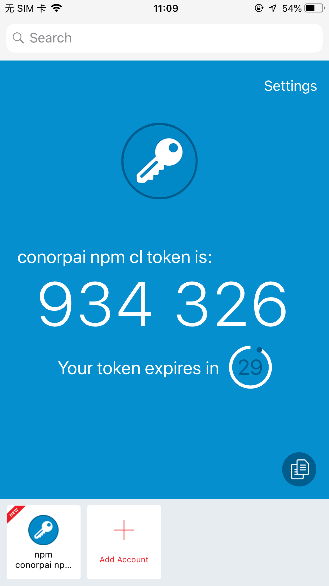
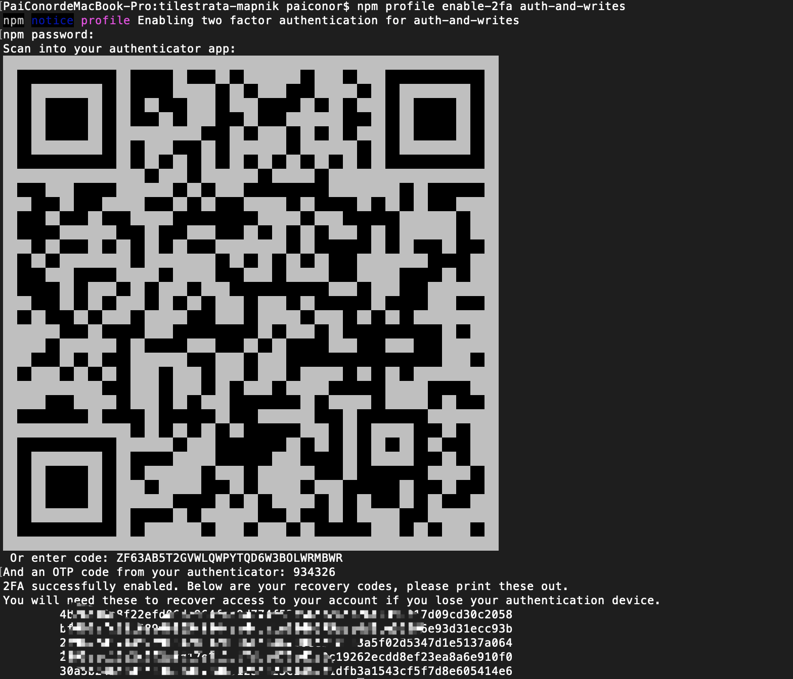

最近NPM模块安全性受到了很多的质疑，具体的可以了解`event-stream`事件和[这篇文章](https://zhuanlan.zhihu.com/p/43514079)。

NPM在近两个月支持了两步验证(Two Factor Authentication或2FA)，之前稀里糊涂的开启了两步验证，后来发布NPM包的时候不让发布，就到网上搜了一下详细验证方法，在这里记录一下。

NPM官方的说明文档，看[这里](https://docs.npmjs.com/configuring-two-factor-authentication)。

在NPM的Setting页面里可以看到两步验证的选项：

输入密码后，可以看到两步验证选项，可以支持身份验证时、身份验证及发布包时使用两步验证，或者关闭两步验证：

接下来这个扫二维码让我困惑了很久。。一直不知道用什么扫，后来才查到用哪个APP。苹果App Store里搜`Authy`安装即可：

如果设置为发布包时使用身份验证，在`npm publish`时，会提示输入OTP(One-Time Password):

所以在输入之前，需要开启两步验证。
首先，输入`npm profile enable-2fa auth-and-writes`命令：

然后打开Authy APP，进行添加：

使用扫码：

扫码完成：

这里显示的数字，就是OTP，然后将APP里显示的OTP输入到命令行中：

然后就可以正常使用了。在npm publish的时候，输入这里的数字就可以发布了。