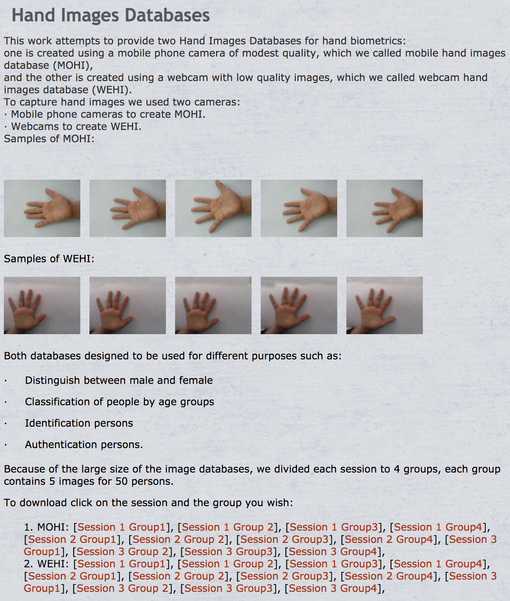
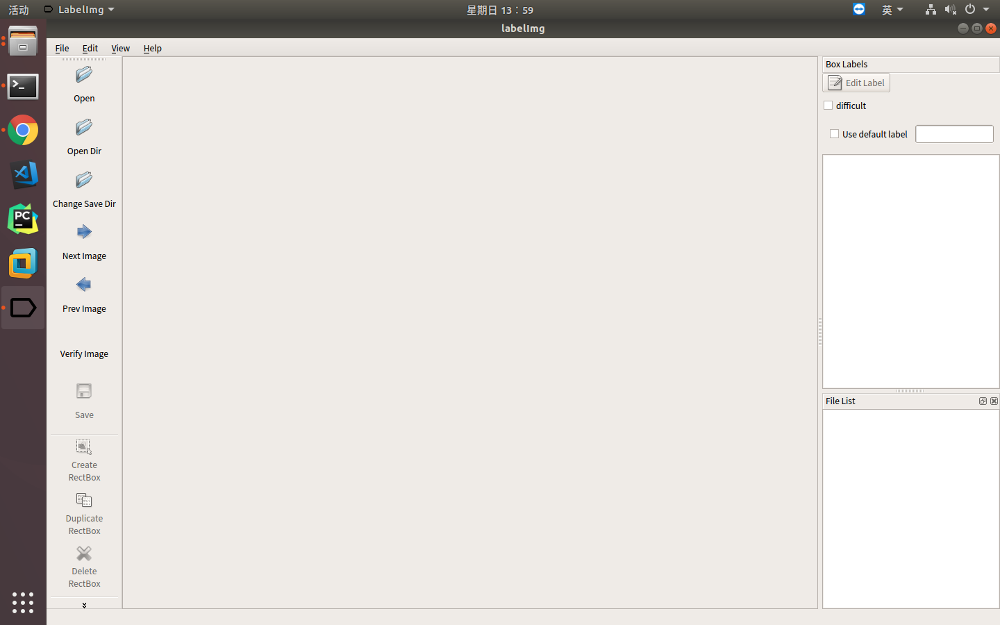
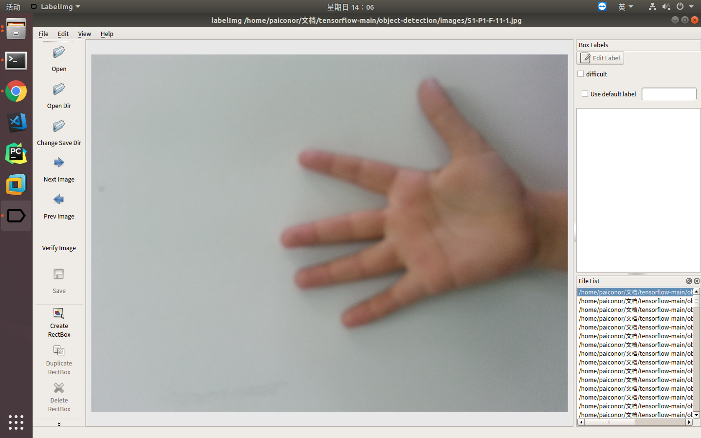
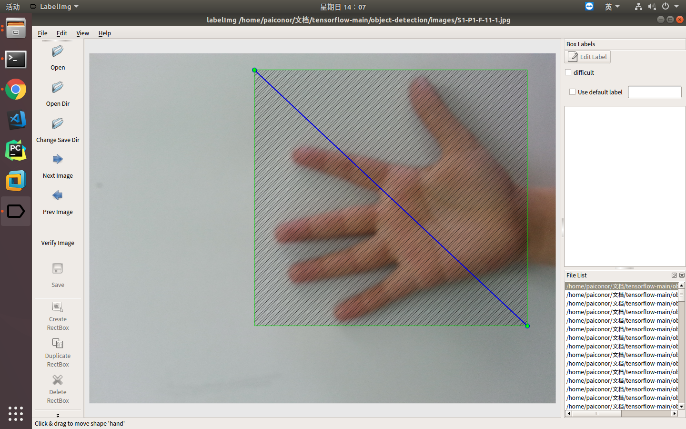
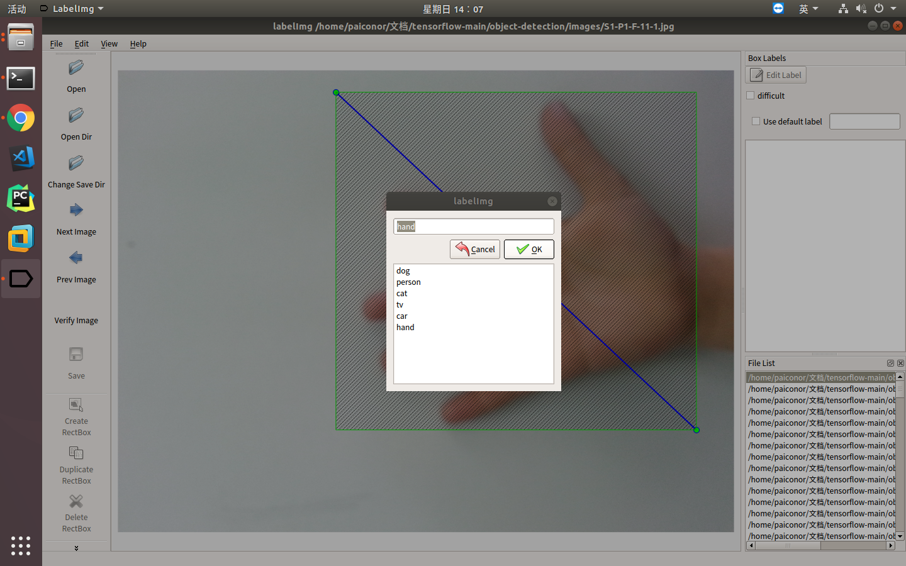
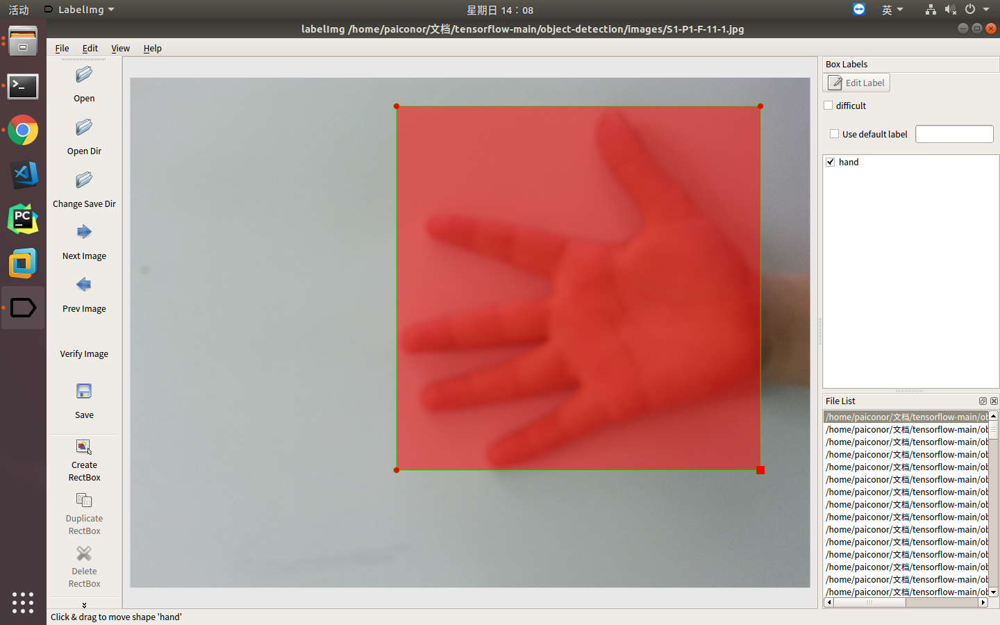
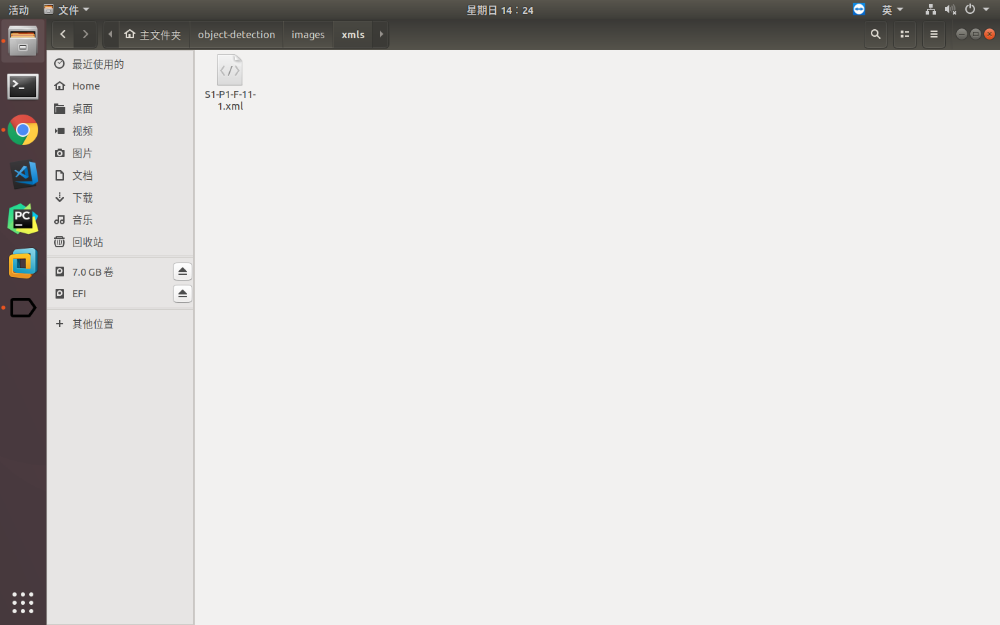

最近支付宝集福卡活动和抖音小年抢红包活动都是应用了手掌识别技术，所以我也想使用TensorFlow的object detection实现一个自己的手掌识别。


1.下载手掌图片
从[Hand Images Databases](https://www.mutah.edu.jo/biometrix/hand-images-databases.html)中下载手掌图片。

这里面有两种手掌图片，一种是mobile hand images database (MOHI)，即通过手机摄像头拍摄的图片，清晰度比较高，图片大小比较大；另一种是webcam hand images database (WEHI)，即通过网络摄 像头拍摄的图片，清晰度一般，图片大小比较小。

因为总的图片比较多，所以这里进行了拆分，两类图片都有3个Session，每个Session有4个Group，每个Group里面有50个人的手掌图片，每个人有5张图片。

将下载后的图片解压到Images目录下。
2.数据集标注
因为TensorFlow的object detection训练使用的数据集为TFRecord格式，需要对数据集进行标注及处理。
首先使用[LabelImg](https://github.com/tzutalin/labelImg)工具对图片中手掌的具体位置进行标注。下载Linux版LabelImg标注工具，解压、赋权限后直接运行labelImg可执行文件。

打开Images目录。

使用Create RectBox功能拉框标注手掌所在区域。

编辑标注。

如果对框选区域不满意还可以进行编辑。

将标注结果xml保存到Images/xmls目录下，注意保存路径中不能包含中文，否则保存不成功。


3.转换成TFRecord格式
根据[Datitran](https://github.com/datitran/raccoon_dataset)提供的方法进行格式转换。

首先安装pandas模块
```bash
pip install pandas
```

然后修改xml_to_csv.py代码
```python
import os
import glob
import pandas as pd
import xml.etree.ElementTree as ET


def xml_to_csv():
    xml_list = []
    for xml_file in glob.glob('*.xml'):
        tree = ET.parse(xml_file)
        root = tree.getroot()
        for member in root.findall('object'):
            value = (root.find('filename').text,
                     int(root.find('size')[0].text),
                     int(root.find('size')[1].text),
                     member[0].text,
                     int(member[4][0].text),
                     int(member[4][1].text),
                     int(member[4][2].text),
                     int(member[4][3].text)
                     )
            xml_list.append(value)
    column_name = ['filename', 'width', 'height', 'class', 'xmin', 'ymin', 'xmax', 'ymax']
    xml_df = pd.DataFrame(xml_list, columns=column_name)
    return xml_df


def main():
    xml_df = xml_to_csv()
    xml_df.to_csv('hand.csv', index=None)
    print('Successfully converted xml to csv.')


main()
```

在Images/xmls目录下执行该python脚本，即可生成hand.csv。

接下来的脚本需要tensorflow环境和object_detection_api，这些环境配置将在[下一节](www.baiguangnan.com/2018/02/11/objectdetection2/)介绍。
调用generate_tfrecord.py(也可以修改代码)，注意要指定--csv_input与--output_path这两个参数。执行下面命令即可生成TFRecord文件：
```bash
python generate_tfrecord.py --csv_input=Images/xmls/hand.csv --output_path=hand.record
```
注意一下这个脚本里有两个写死的地方，一个是90行的那个path，即图片所在目录，代码里写死会在当前目录下images文件夹中查找，如果图片目录有变化这里要进行修改；另一个是class_text_to_int方法，这里会把目标类型文本转成数字，本例中需要将raccon改为hand，如果是多目标需要在里面加分支。

再仿照models/research/object_detection/data/pet_label_map.pbtxt创建hand.pbtxt。
```text
item {
  id: 1
  name: 'sunglasses'
}
```

准备的成果是hand.pbtxt和hand.record。