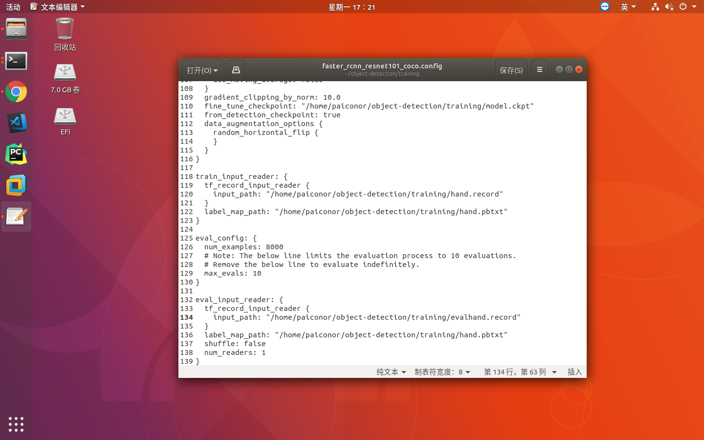

经过上一节数据准备之后，开始进行配置训练和目标识别

1.配置object detection模型
下载[Models源码](https://github.com/tensorflow/models)
根据[object detection安装指引](https://github.com/tensorflow/models/blob/master/research/object_detection/g3doc/installation.md)进行配置安装

2.下载并配置COCO数据集预训练模型
下载[官方文档](https://github.com/tensorflow/models/blob/master/research/object_detection/g3doc/running_pets.md)中提到的[COCO-pretrained Faster R-CNN with Resnet-101 model](http://storage.googleapis.com/download.tensorflow.org/models/object_detection/faster_rcnn_resnet101_coco_11_06_2017.tar.gz)模型，解压之后，将model.ckpt开头的三个文件拷贝到训练目录下。
拷贝models/research/object_detection/samples/configs/faster_rcnn_resnet101_coco.config文件到训练目录下。
修改faster_rcnn_resnet101_coco.config文件：
1）将num_classes改为1，本例中只有一个分类
2）将所有PATH_TO_BE_CONFIGURED改为本机路径，共5处


然后执行脚本进行训练
```bash
python object_detection/train.py \
--logtostderr \
--pipeline_config_path=/home/paiconor/object-detection/training/faster_rcnn_resnet101_coco.config \
--train_dir=/home/paiconor/object-detection/training/trainingresult
```

实践证明不能用MOHI做训练。。16G内存不够霍霍的。。


训练过程中可以使用TensorBoard进行监控，指令如下：
```bash
tensorboard --logdir=/home/paiconor/object-detection/training/trainingresult
```
