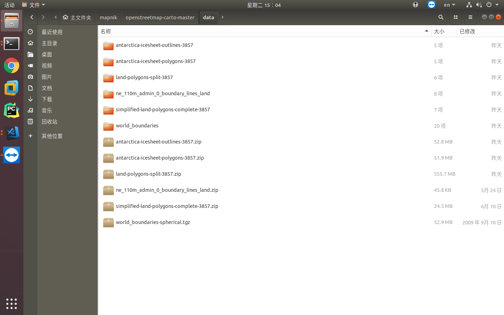
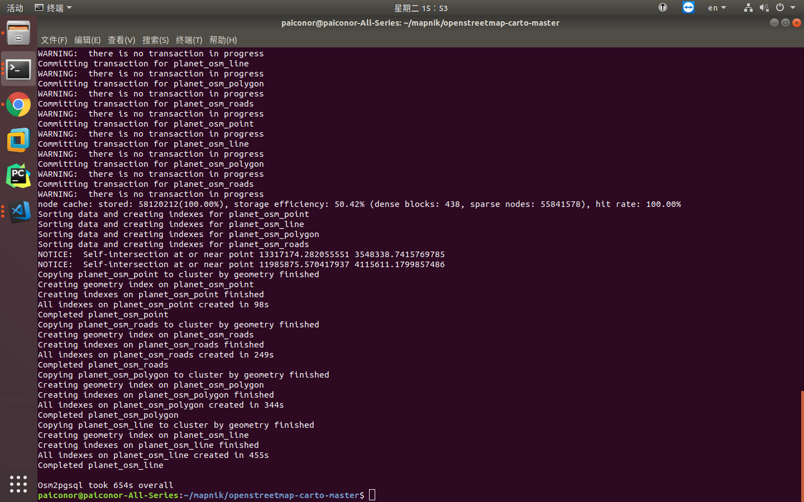
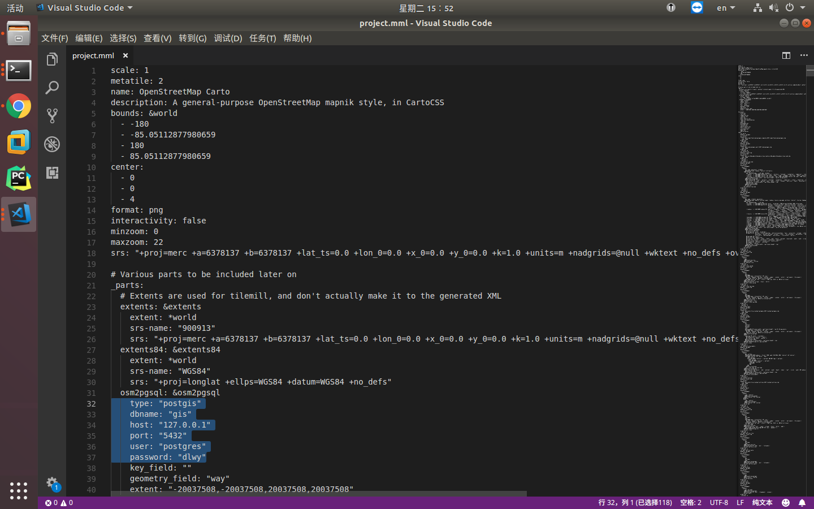
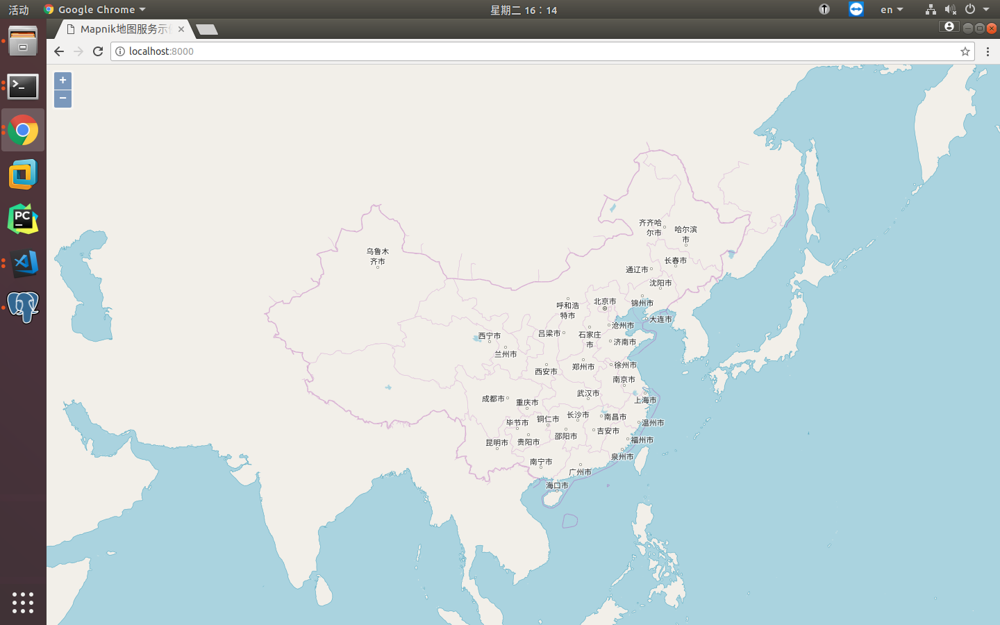

[OpenStreetMap Carto](https://github.com/gravitystorm/openstreetmap-carto)是[OpenStreetMap](https://www.openstreetmap.org)的开源配图样式，可以转换成Mapnik的XML配图文件，进而通过node-mapnik加载并发布在线瓦片地图服务。

下面通过几个方面介绍如何实现地图发布：
1.代码准备
2.数据准备
3.字体准备
4.转换Mapnik XML
5.发布地图服务及前端查看
6.发布高清地图服务


#### 1.代码准备
从[Github](https://github.com/gravitystorm/openstreetmap-carto)上下载最新的OpenStreetCarto代码，解压。下文中所有`代码目录`都特指解压后的目录位置。

接下来的准备工作可以参考官方提供的[安装文档](https://github.com/gravitystorm/openstreetmap-carto/blob/master/INSTALL.md)。

#### 2.数据准备
数据准备工作可以分为两种：一种是小比例尺下全球的大陆、国家等点、线、面、标注信息，shapefile格式；另一种是详细的基础数据，需要导入到postgresql数据库中使用。

##### 2.1 shapefile数据准备
执行代码目录下`scripts/get-shapefile.py`脚本可以下载shapefile数据，但是下载可能比较慢，这里提供了百度网盘分享(链接：https://pan.baidu.com/s/1mvKCdjHPsU-hZZ1xTFhu1w 密码：l2vf)，如果离数据日期(2018年7月10日)不是太远，可以使用，差的太久还是用脚本下载吧。

下载完成之后解压到代码目录下data文件夹中。


##### 2.2 postgresql数据准备
postgresql数据处理流程是先下载osm格式数据，准备数据库，再通过osm2pgsql工具将其导入到postgresql中。

###### 下载OSM数据
首选到[这里](https://download.geofabrik.de/asia/china.html)下载OSM数据(china-latest.osm.pbf)到代码目录。
本例中使用的是中国大陆地区的数据，如果有兴趣可以下载其它区域数据。

###### 准备数据库
postgresql数据库安装完成(安装过程参考：[这里](http://www.baiguangnan.com/2018/01/31/postgis/))之后，使用如下命令创建名为gis的数据库：
```bash
sudo -u postgres createdb gis
```

为gis数据库安装postgis和hstore扩展：
```bash
sudo -u postgres psql -d gis -c 'CREATE EXTENSION postgis; CREATE EXTENSION hstore;'
```

###### 安装osm2pgsql工具
Ubuntu下使用如下命令安装：
```bash
sudo apt-get install osm2pgsql
```

###### 导入postgresql
在代码目录下使用如下命令：
```bash
sudo -u postgres osm2pgsql -G --hstore --style openstreetmap-carto.style --tag-transform-script openstreetmap-carto.lua -d gis china-latest.osm.pbf
```
在我的机器上会报错，提示`Node cache size is too small to fit all nodes. Please increase cache size`，需要在命令中加入`--cache 1600`，即可正常导入，完整命令如下：
```bash
sudo -u postgres osm2pgsql -G --hstore --style openstreetmap-carto.style --tag-transform-script openstreetmap-carto.lua -d gis china-latest.osm.pbf --cache 1600
```
导入完成：


###### 创建索引
创建索引不是必须的，但是可以加快渲染速度，在代码目录下执行如下命令：
```bash
sudo -u postgres psql -d gis -f indexes.sql
```

#### 3.字体准备
根据[安装文档](https://github.com/gravitystorm/openstreetmap-carto/blob/master/INSTALL.md)，执行如下命令安装字体：
```bash
sudo apt-get install fonts-noto-cjk fonts-noto-hinted fonts-noto-unhinted fonts-hanazono ttf-unifont
```

#### 4.转换Mapnik XML
OpenStreetMap Carto是使用TileMill工具配置的，其项目文件是project.mml，我们需要将这个工程转成Mapnik的XML配置文件。

这里使用的转换工具是node模块carto，使用如下命令全局安装carto模块：
```bash
sudo npm install -g carto
```

转换之前需要将project.mml中postgresql连接参数修改为本机数据库参数：


然后就可以在代码目录下使用如下命令将project.mml转为mapnik.xml：
```bash
carto project.mml > mapnik.xml
```
转换完成之后，可以使用node-mapnik提供的[例子](https://github.com/mapnik/node-mapnik)测试xml配置文件是否正常，如果正常则会生成如下图片：


#### 5.发布地图服务及前端查看
可以参考[这里](http://www.baiguangnan.com/2018/06/25/nodemapniktest/)，发布瓦片服务及前端查看。


#### 6.发布高清地图服务
待续

此篇博文参考[think8848的博客](https://www.cnblogs.com/think8848/p/6241836.html)，特此感谢！