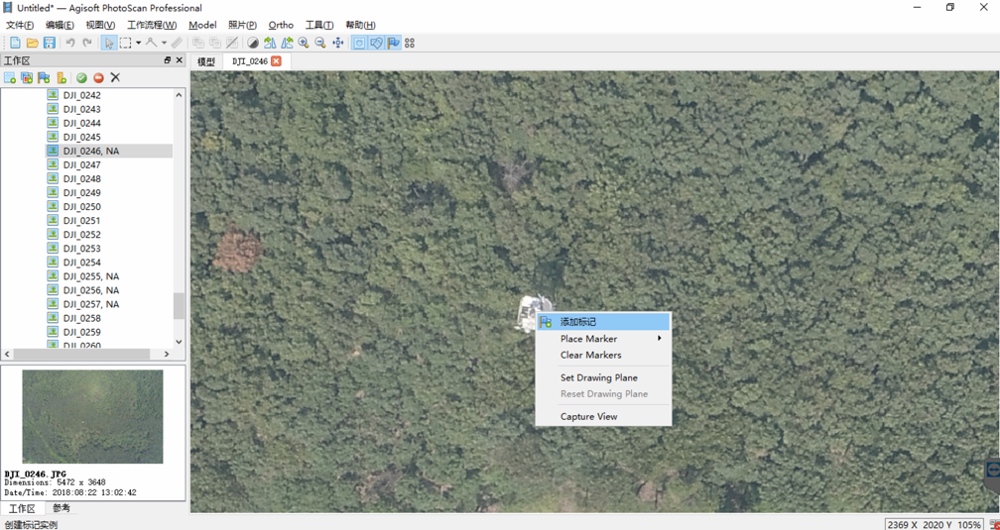
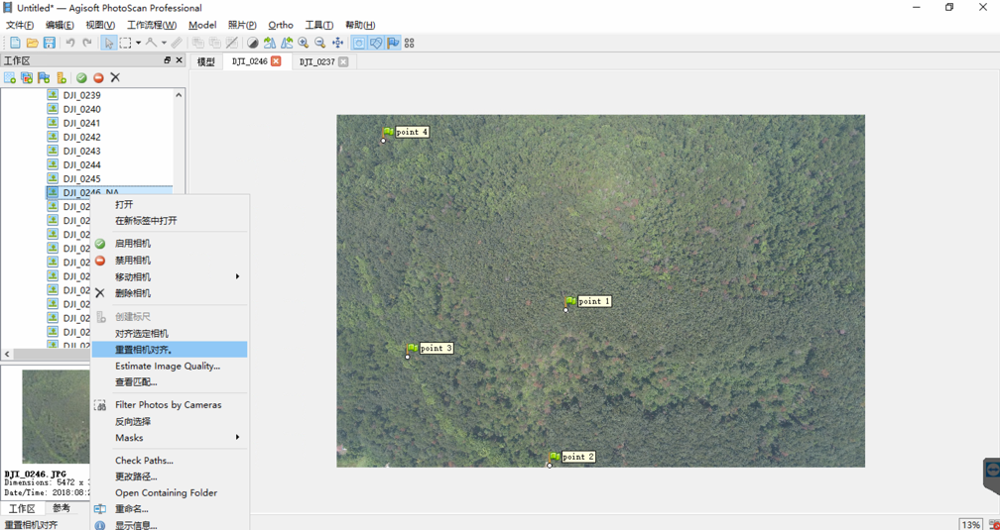

无人机飞回来的照片，拼接正射影像图，需要有一步对齐照片的工作，但是有的时候自动对齐会有一些照片因为找不到重叠匹配点而成为失效照片(Not Aligned，简称NA)，这些的失效照片无法参与到拼接工作中，导致正射影像图空洞，不是我们想要的结果。

所以我到网上查了一下资料，了解了如何通过添加标记的方式，手动对齐照片。参考文档是PhotoScan的用户手册([http://www.agisoft.com/pdf/photoscan-pro_1_4_en.pdf](http://www.agisoft.com/pdf/photoscan-pro_1_4_en.pdf))。

手动对齐照片，需要在未对齐照片上添加四个及以上标记，并在已对齐照片中相应位置上放置这些标记，然后重新对齐照片即可。

##### 具体操作步骤：

1.在未对齐的照片上，找到明显的地面物体，右键并添加标记。

2.在周围已对齐的照片上，找到相应地面物体，右键并放置标记。

3.在未对齐照片上找到至少4个标记，并在周围已对齐照片上进行放置。

4.在未对齐照片上右键，使用“重置相机对齐”功能，进行重置。

5.在未对齐照片上右键，使用“对齐选定相机”功能，进行手动对齐。

6.如果照片后面的NA标识被去掉了，证明手动对齐成功。

7.在模型中查看该照片，已经可以正常显示了。

至此，一张照片的手动对齐工作已完成，其它的照片也做类似操作即可。

