1.打开QGIS，使用菜单中的添加图层功能，添加PostGIS图层
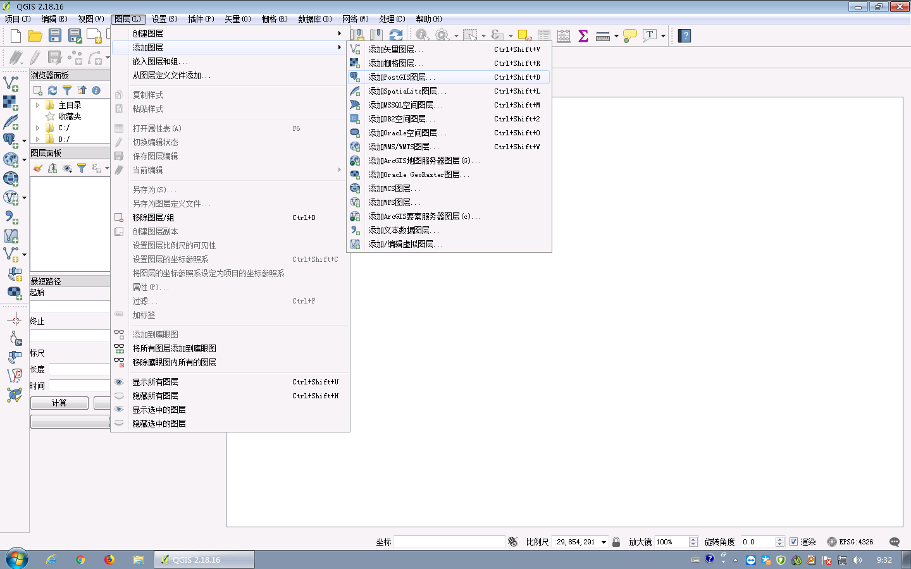
2.创建PostGIS连接
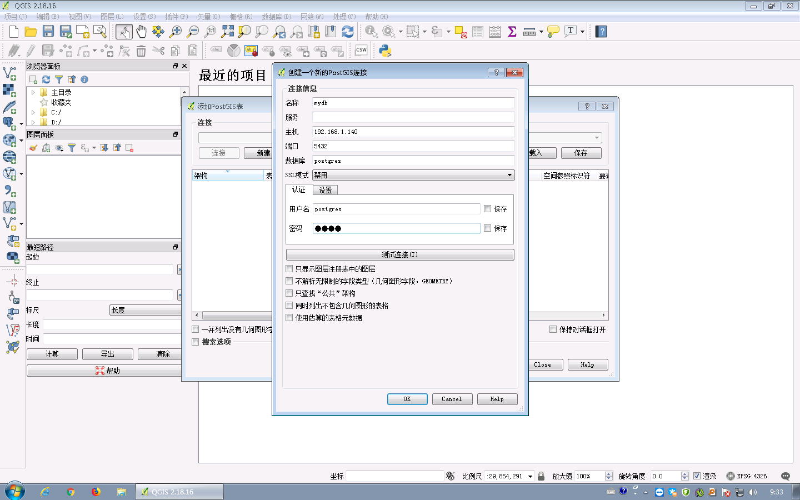
3.测试连接是否正常
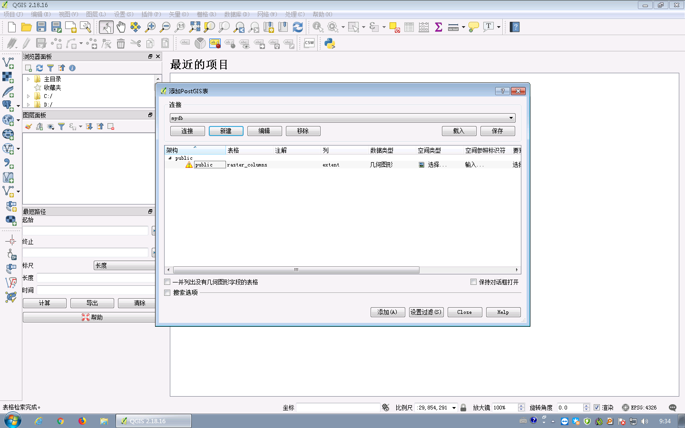
4.使用数据库管理功能向PostGIS数据库中导入Shapefile数据
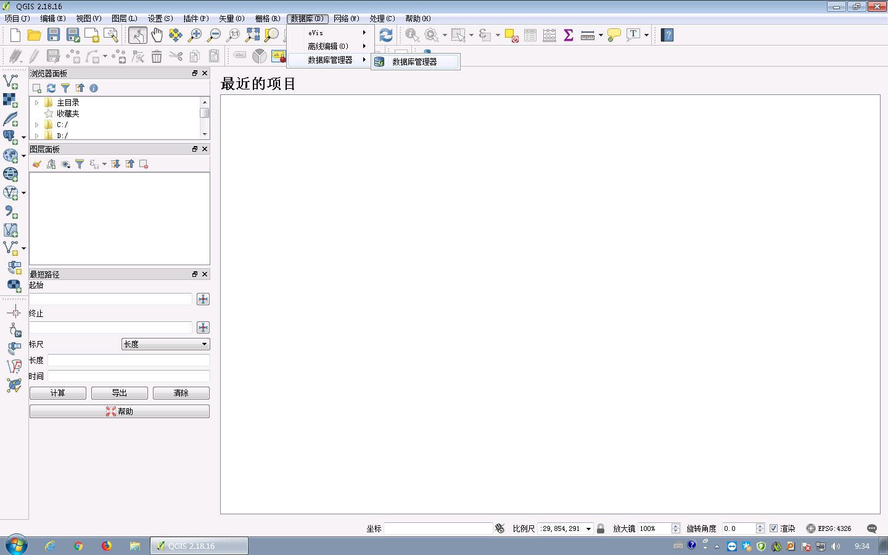
5.找到刚刚添加的PostGIS连接

6.使用导入功能
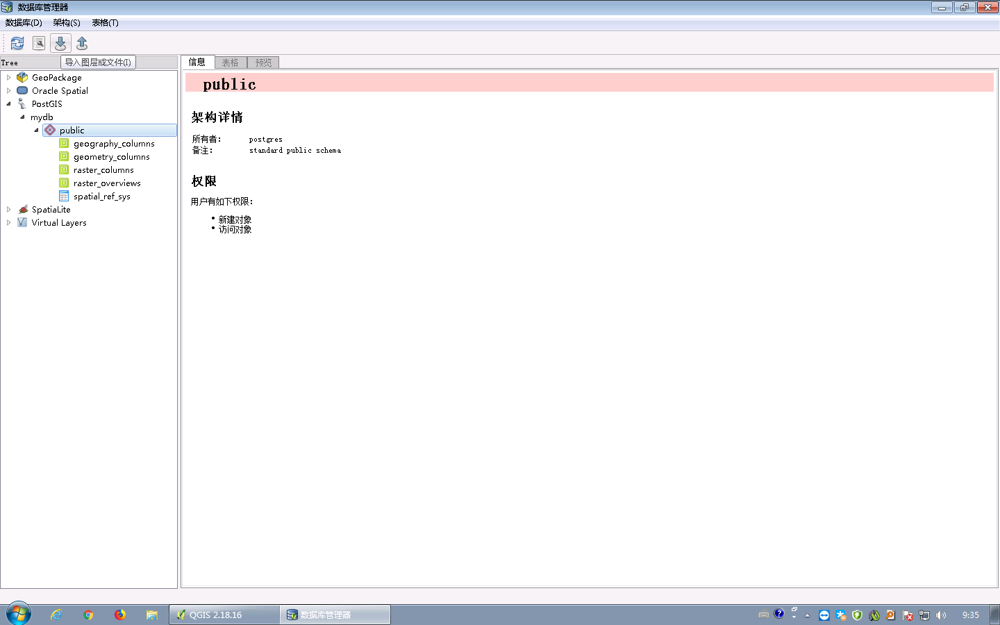
7.导入Shapefile数据
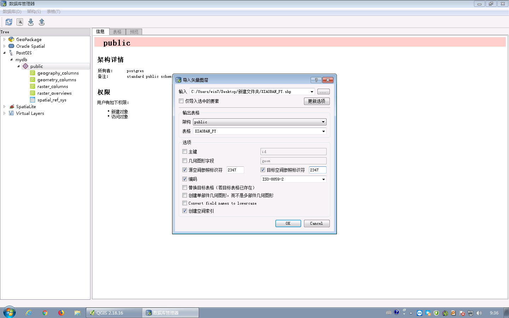
8.导入成功
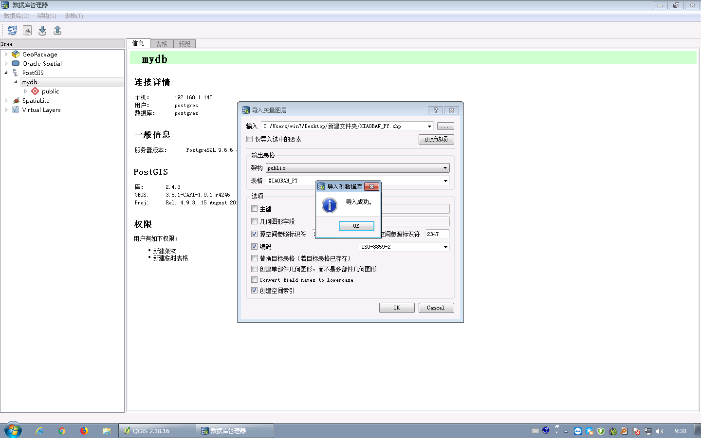
9.刷新PostGIS连接，查看导入数据
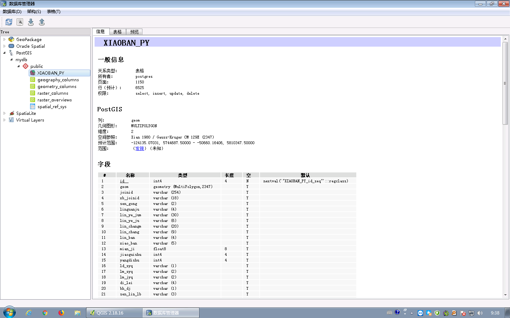
10.使用pgAdmin查看导入数据
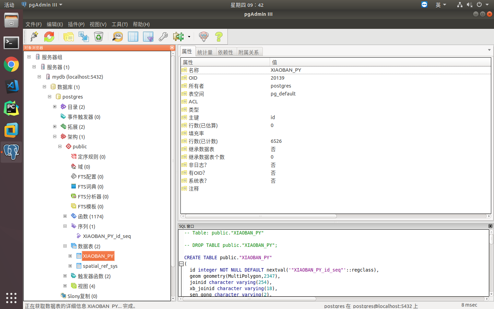
11.再次使用添加PostGIS图层功能
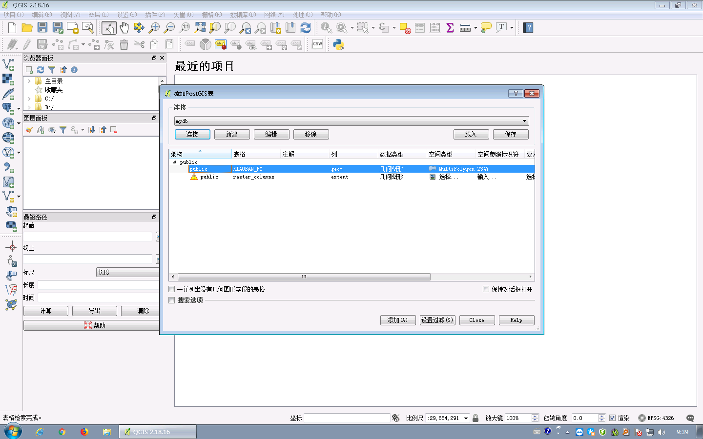
12.添加完成
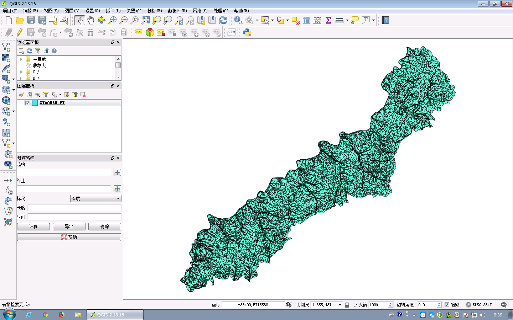
13.采编数据
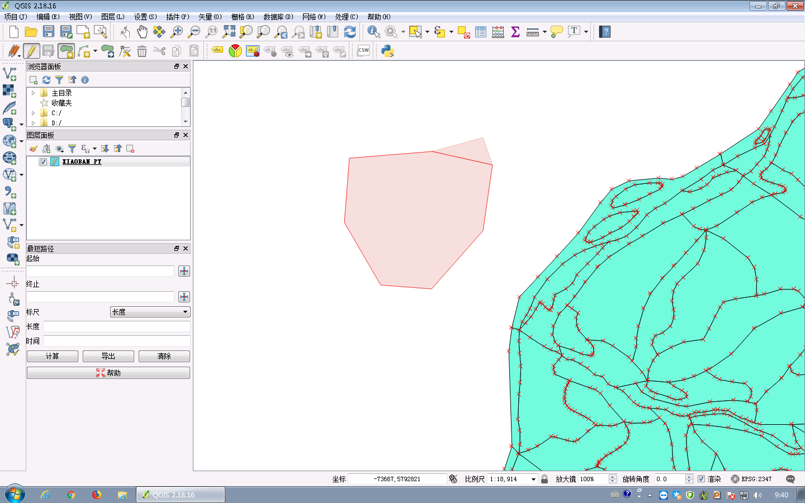
14.录入属性
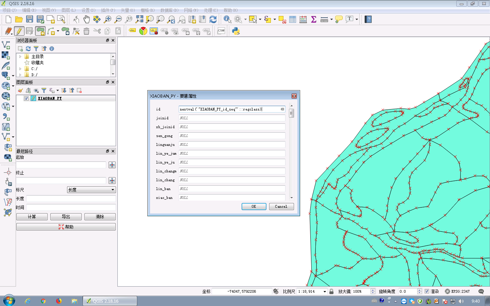
