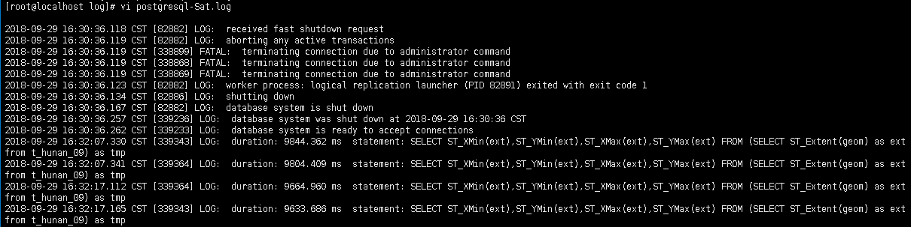
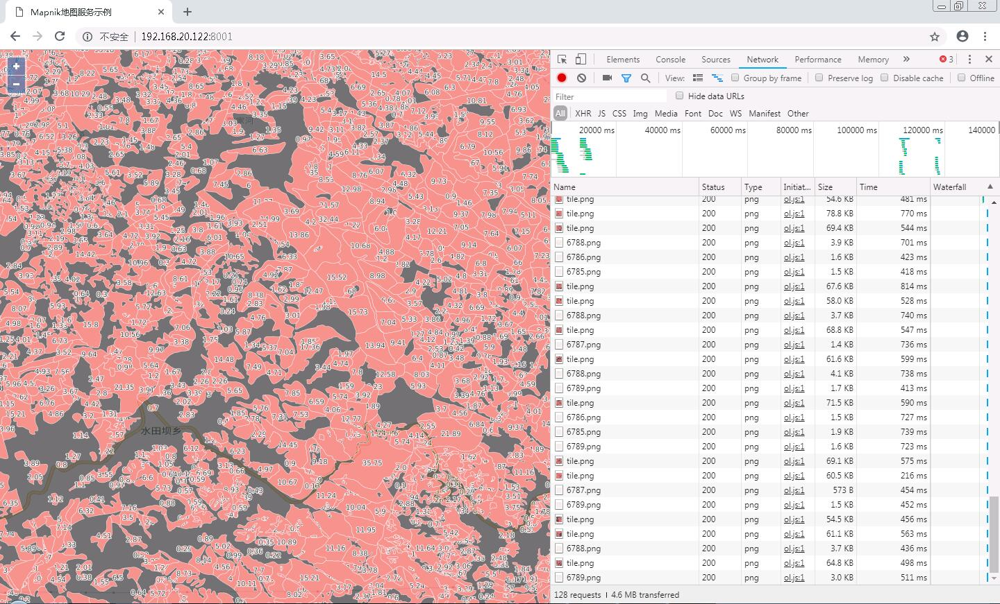

之前一直在研究使用Mapnik发布动态瓦片服务，最近想用真实数据做一次测试，看实际效果如何。

##### 服务器环境
协调到一台CentOS系统服务器，有两个12核CPU，最终模拟成48核，数据是500万左右的面状小班，已入到PostGIS数据库中，空间索引已建好。

##### 数据入库

因为是测试，所以将生产环境中的数据导到测试数据库中，这里使用的是GDAL提供的ogr2ogr工具，导入命令如下：
```bash
ogr2ogr -f "PostgreSQL" PG:"host=192.168.1.122 port=5432 dbname=lindi user=postgres password=1234" PG:"host=192.168.1.123 port=5432 dbname=lindi user=postgres password=1234" "t_hunan_09" -progress
```

这样就把生产数据库中的`t_hunan_09`导入到测试数据库中。

##### 启动瓦片服务

配置好mapnik的配图XML，使用tilestrata-balancer做负载均衡，启动了48个node进程进行测试，然而现实是残酷的，每张瓦片的请求时间是10秒左右。

然后就去参考OpenStreetMap的PostGIS数据库和配图方案，并没有什么特别的，gist空间索引也重建了，还是没有效果。

##### 试用数据库连接池

测试使用pgbouncer数据库连接池，也没有效果。

##### 单进程竟然比多进程快？

后来关闭了tilestrata-balancer负载均衡和48个node进程，只启动一个进程进行出图，然后神奇的事情来了，请求时间非常快，只有几百毫秒。这又是为何？

基于这种情况用了一段时间发现了规律，每次重启服务后，第一次请求瓦片，需要10秒时间，后面再用就很快了。但是用过一段时间之后，又会有一次10秒的卡顿，时间不规律。

这样的话之前的现象是可以解释的了，由于做了负载均衡，所以一屏的瓦片都相当于启动服务后初次请求，所以都很慢，把48个进程都用完需要一段时间，所以就造成了一直卡顿的问题。

但是初次启动服务为10几秒是在做什么呢？

##### 初期卡顿到底在做什么

我对比了有瓦片缓存和无瓦片缓存的情况，有瓦片缓存很快，无瓦片缓存有卡顿，说明这个卡顿是在瓦片绘制环节，瓦片绘制环节主要是数据库查询了。

后来在网上找了一些PostgreSQL数据库优化的贴子，其中有一个说PostgreSQL有一个机制，可以记录查询时间比较长的SQL，我就试着做了一下。

首先找到postgresql.conf文件，将`log_min_duration_statement`注释去掉，并设置为1000毫秒，重启数据库之后，启动瓦片服务，再到postgresql.conf同级的log文件夹下查看日志。


发现有将近10秒的时间在做数据的范围统计，忽然想起来在配置mapnik的XML时，没有设置数据范围，导致这里实时计算500万数据的范围，造成卡顿。。

重新配置mapnik的XML后，验证效果：


果然不卡了，效果杠杠的。

##### 是否需要数据库连接池
之前使用了pgbouncer数据库连接池，但是实际使用效果不是特别理想，启动多个node进程后总会出现事务互斥的问题，导致有些瓦片加载特别慢，后来不用数据库连接池，直连数据库就正常了，可能对数据库连接池用的不到位吧。

##### 开启负载均衡，丝般流畅

重新开启tilestrata-balancer负载均衡和48个node进程，地图加载流畅，去掉了缓存机制在14级别也能轻松应对。

最后上图镇楼：

