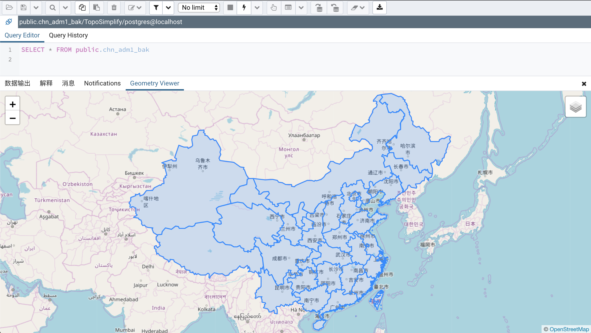

抽稀，是指减少图形的节点密度。有些图形例如国界、省界、市界等节点数能达到几万个，这样的图形在渲染和空间关系判断等环节中效率会很慢，所以在一些要求不是很严格的情况下，可以使用抽稀方法减少图形的节点密度，加快处理效率。

对于抽稀的要求，最重要的是要基本保持原图形的形状，这个大部分抽稀算法都可以达到。今天我们说的是进一步的要求，就是相邻图形抽稀之后不能出现重叠和缝隙。

下面是使用PostGIS的ST_Simplify方法对要素进行抽稀的结果，可以看到比较多的重叠和缝隙：


接下来介绍的拓扑抽稀方法就可以解决这个问题。

#### 1.创建PostgreSQL数据库
如果数据已经入库，则可以跳过该操作。


#### 2.创建PostGIS和Topology扩展
```sql
CREATE EXTENSION postgis;
CREATE EXTENSION postgis_topology;
```

#### 3.导入数据
如果处理的PostgreSQL数据库中已有数据，则跳过该操作。

这里使用GDAL提供的ogr2ogr命令行工具来做数据导入Shapefile格式的省界数据：
```bash
ogr2ogr -f "PostgreSQL" PG:"host=localhost port=5432 dbname=TopoSimplify user=postgres password=dlwy" /Users/paiconor/Downloads/拓扑抽稀效果/原始数据/CHN_adm1.shp -lco GEOMETRY_NAME=geom -lco FID=pk_uid -nlt PROMOTE_TO_MULTI -progress
```


#### 4.复制数据
由于处理过程中将会给数据添加字段，为了不破坏数据，将会复制一份数据进行拓扑抽稀操作。
```sql
create table chn_adm1_bak as select * from chn_adm1
```

#### 5.创建拓扑
创建拓扑需要传入拓扑模式名称和数据的SRID，拓扑模式名称使用的是数据名称后面加上“_topo”标识，数据的SRID通过geometry_columns视图看到是4326。
```sql
SELECT topology.CreateTopology('chn_adm1_topo', 4326);
```
创建拓扑之后，在数据库中生成一个新的模式，用来存储拓扑信息：

geometry_columns中添加了相应的拓扑表信息：


#### 6.为数据添加拓扑几何字段
添加拓扑几何字段需要传入的参数是：拓扑模式名称、数据所在模式名称、数据名称、拓扑几何字段名称和几何类型。这里将拓扑几何字段添加到复制的表(chn_adm1_bak)上。
```sql
SELECT topology.AddTopoGeometryColumn('chn_adm1_topo', 'public', 'chn_adm1_bak', 'topo_geom', 'MULTIPOLYGON');
```


#### 7.使用原始图形构建拓扑
构建拓扑传入的参数是：普通几何字段名称、拓扑模式名称、layer_id(暂时不清楚这个参数的作用，默认传入1)、数据容差(经纬度数据使用默认容差0.000000008983153，平面数据使用0.001)：
```sql
UPDATE chn_adm1_bak SET topo_geom = topology.toTopoGeom(geom, 'chn_adm1_topo', 1, 0.000000008983153);
```
这个处理过程和图形有关，由于我使用的是全国省界，节点非常密集，时间也比较久，处理完成之后：


#### 8.拓扑弧段抽稀
接下来使用[Sandro Santilli](http://strk.kbt.io/blog/2012/04/13/simplifying-a-map-layer-using-postgis-topology/)提供的[SimplifyEdgeGeom](https://gist.github.com/leplatrem/5729022)函数进行拓扑弧段抽稀。
首先将SimplifyEdgeGeom函数添加到数据库中：

然后调用SimplifyEdgeGeom函数进行拓扑弧段抽稀，传入的参数是：拓扑模式名称、弧段ID字段名称(固定是edge_id)、抽稀容差：
```sql
SELECT SimplifyEdgeGeom('chn_adm1_topo', edge_id, 0.1) FROM chn_adm1_topo.edge;
```

#### 9.将抽稀结果更新普通几何字段中
```sql
UPDATE chn_adm1_bak SET geom = topo_geom::geometry;
```

#### 10.抽稀结果检查
通过SQL查询抽稀之前后甘肃省界的节点数：
```sql
select ST_NumPoints(ST_ExteriorRing(ST_GeometryN(geom,1))) from chn_adm1 where name_1 = 'Gansu'
```

```sql
select ST_NumPoints(ST_ExteriorRing(ST_GeometryN(geom,1))) from chn_adm1_bak where name_1 = 'Gansu'
```


通过工具查看抽稀后省界间是否存在重叠和缝隙：


通过工具查看抽稀后的图形形状是否有比较大的变化：


#### 11.后续工作
如果需要将抽稀后的几何更新到原始表中，可以使用如下SQL进行更新：
```sql
update chn_adm1 a set geom = (select b.geom from chn_adm1_bak b where a.pk_uid = b.pk_uid);
```

如果需要将抽稀后的结果导出，可以继续使用ogr2ogr工具进行导出。
