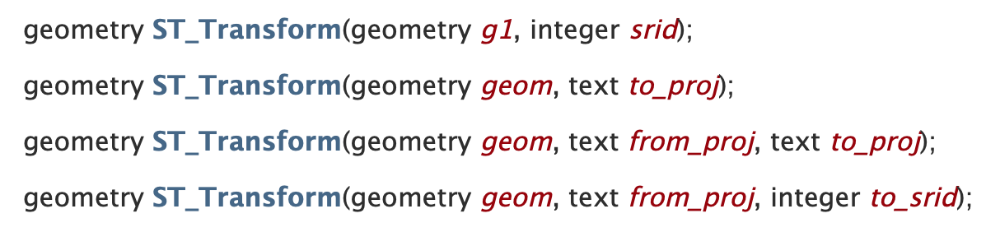
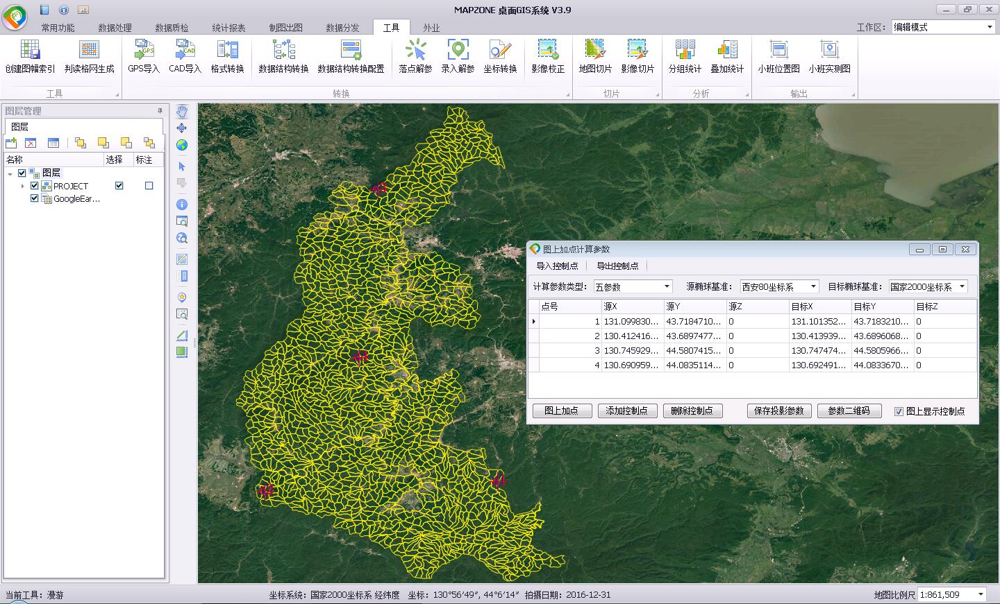
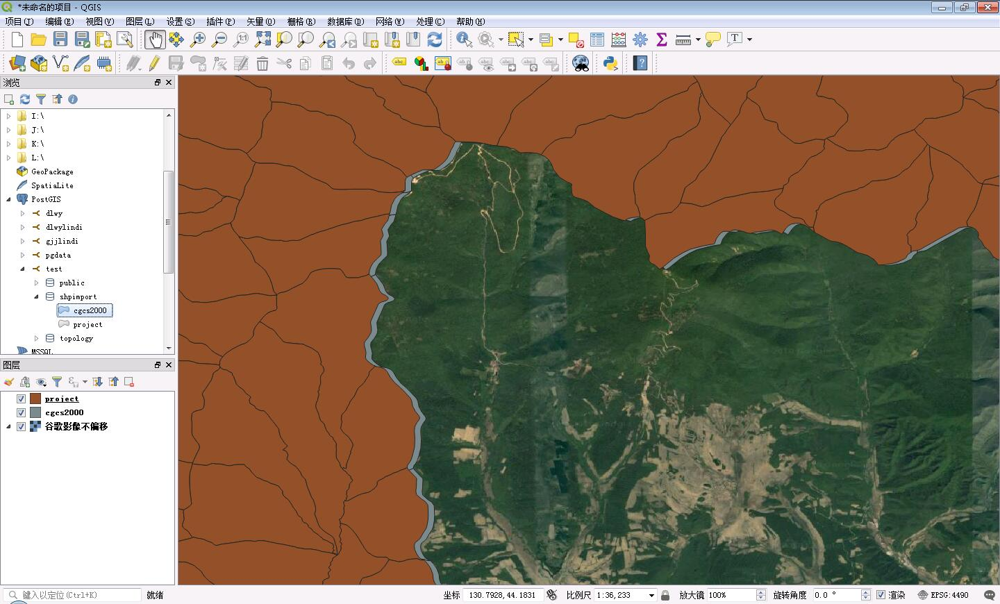
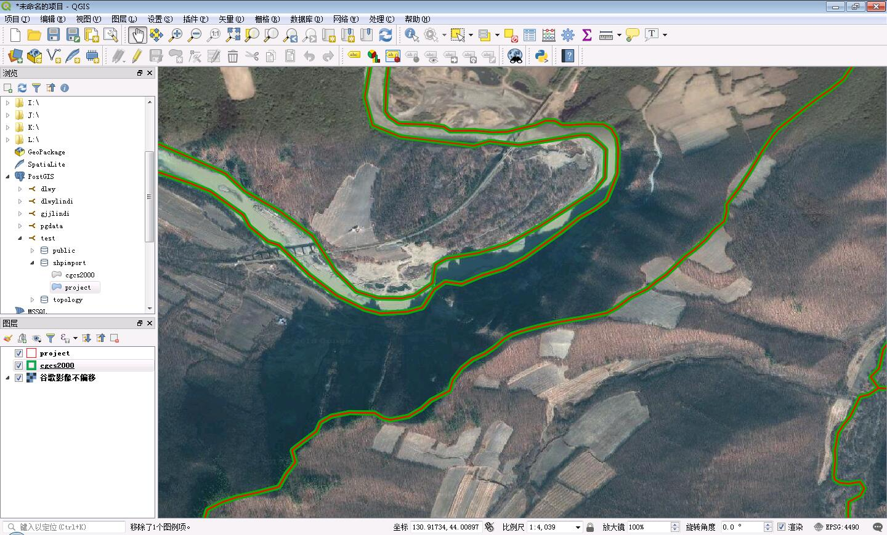

最近需要对PostGIS数据进行带参数坐标变换，所以找了一些资料，PostGIS提供的函数只有[ST_Transform](https://postgis.net/docs/ST_Transform.html)。



好在这个函数支持传入proj4字符串，之前也了解过proj4字符串中可以加入+towgs84参数，但是一直没用过，所以想试一下能否通过这个参数实现带参数投影变换。

首先通过MAPZONE 桌面GIS创建实验数据，解算转换参数，将原始数据和通过参数转换之后的CGCS2000经纬度数据导入到PostgreSQL数据库中。



在QGIS中查看：



经过反复测试发现，+towgs84参数只对目标是WGS84空间参考才能生效，转CGCS2000不起作用。

完整的整表带参数坐标变换SQL：

```sql
ALTER TABLE shpimport.project ALTER COLUMN geom TYPE geometry (MULTIPOLYGON, 4490) USING ST_SetSRID (
	ST_Transform (
		geom,
		'+proj=tmerc +lat_0=0 +lon_0=129 +k=1 +x_0=500000 +y_0=0 +a=6378140 +b=6356755.288157528 +units=m +no_defs +towgs84=-98.8822695494164,-73.2299413849444,-13.6750870406007,0,0,0,0',
		'+proj=longlat +datum=WGS84 +no_defs'
	),
	4490
);
```

后来同事又发现，坐标变换目标空间参考proj4字符串中如果加入+towgs84=0,0,0,0,0,0,0，也可以实现带参数空间参考变换，不必强制转换到WGS84。

```sql
ALTER TABLE shpimport.project ALTER COLUMN geom TYPE geometry (MULTIPOLYGON, 4490) USING ST_SetSRID (
    ST_Transform (
        geom,
        '+proj=tmerc +lat_0=0 +lon_0=129 +k=1 +x_0=500000 +y_0=0 +a=6378140 +b=6356755.288157528 +units=m +no_defs +towgs84=-98.8822695494164,-73.2299413849444,-13.6750870406007,0,0,0,0',
        '+proj=longlat +ellps=GRS80 +no_defs +towgs84=0,0,0,0,0,0,0'
    ),
    4490
);
```
带参数坐标变换之后的效果：
