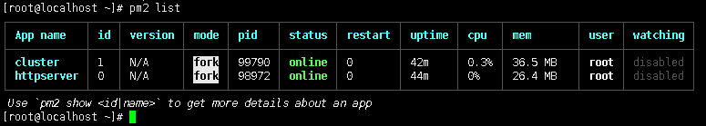
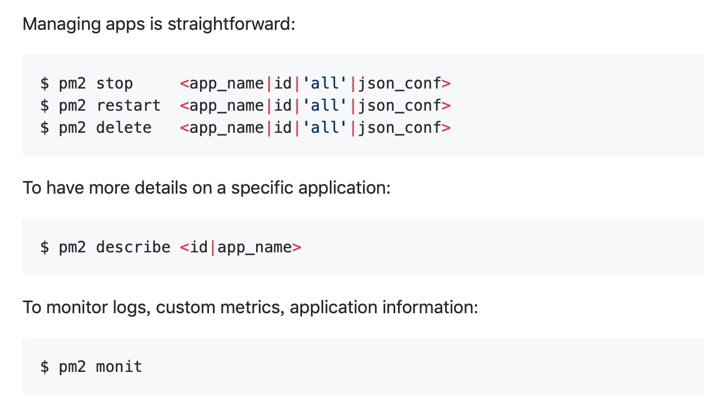
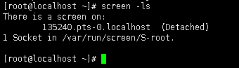
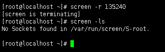

最近使用xshell连CentOS服务器，启动瓦片服务之后，xshell不能关闭，否则服务就会被关闭，所以想尝试解决这个问题。

接下来介绍的方法可能不是很正规，如果有更好的方法麻烦告知，感谢！

启动瓦片服务需要三个命令：
1.tilestrata-balancer负载均衡命令
2.瓦片服务集群
3.Demo网页服务

#### NODE.JS进程

这里的瓦片服务集群和Demo网页服务，都是node.js命令，在网上查到这类可以使用[pm2](https://github.com/Unitech/pm2)来进行管理。

首先全局安装pm2：

```bash
npm install -g pm2
```

然后可以使用`pm2 start`启动：

```bash
pm2 start cluster.js
pm2 start httpserver.js
```

可以使用`pm2 list`进行查看：


还有一些其它的命令，感兴趣可以到官网上了解：


#### 命令行

我在网上查到有说用nohup命令的，但是尝试没有成功，后来选择了screen，详细介绍看[这里](https://www.ibm.com/developerworks/cn/linux/l-cn-screen/)。

首先，安装screen：
```bash
yum install -y screen
```

安装完成之后，输入screen后回车，就可以进入到一个新的窗口中，在这个窗口里，输入tilestrata-balancer命令，启动负载均衡服务，然后使用快捷键`Ctrl + A + D`就可以退出当前屏幕。

此时关闭xshell之后，瓦片服务仍可以正常访问。

如果需要重新回到之前的屏幕中，使用`screen -ls`命令可以查看当前有哪些屏幕：


使用`screen -r [id]`就可以回到该屏幕中，上边的例子中列出来的屏幕ID是135240。
```bash
screen -r 135240
```

关闭屏幕只需要在屏幕命令行中输入`exit`即可。
