最近看一些论文，[eCognition](http://www.ecognition.com)经常被提及，而且作为影像分类提取的标杆进行结果对比，所以想试用一下效果。

首先到官网上下载试用版本，并进行安装。eCognition最新版本是9.3，但下载比较慢，我上传了一份儿在百度网盘(`https://pan.baidu.com/s/1YhkYPqAoYWVAR5dcaE4oGg 密码：q8hw`)。

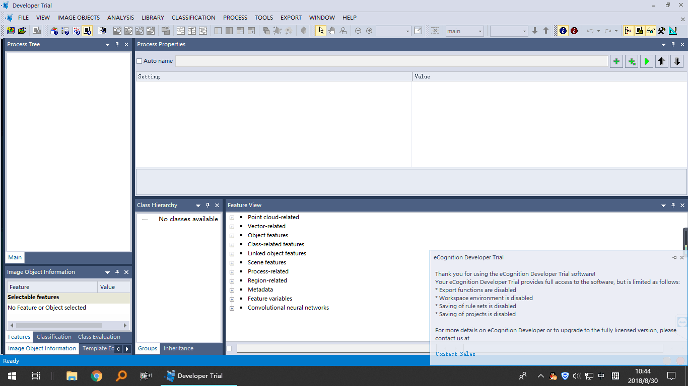
首次打开软件界面是这样子的，后面在照着网上的教程来做蒙蔽了好一阵子，后来才发现用来显示影像的小窗口被藏在一个小角落，不细心还发现不了。。
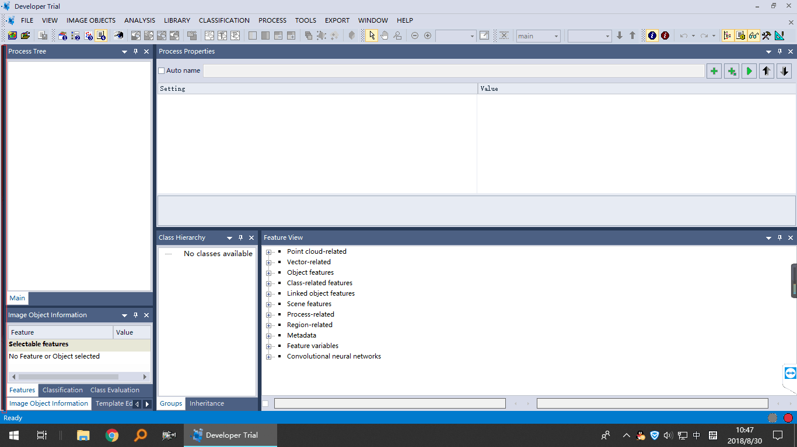
拉出来就好了。
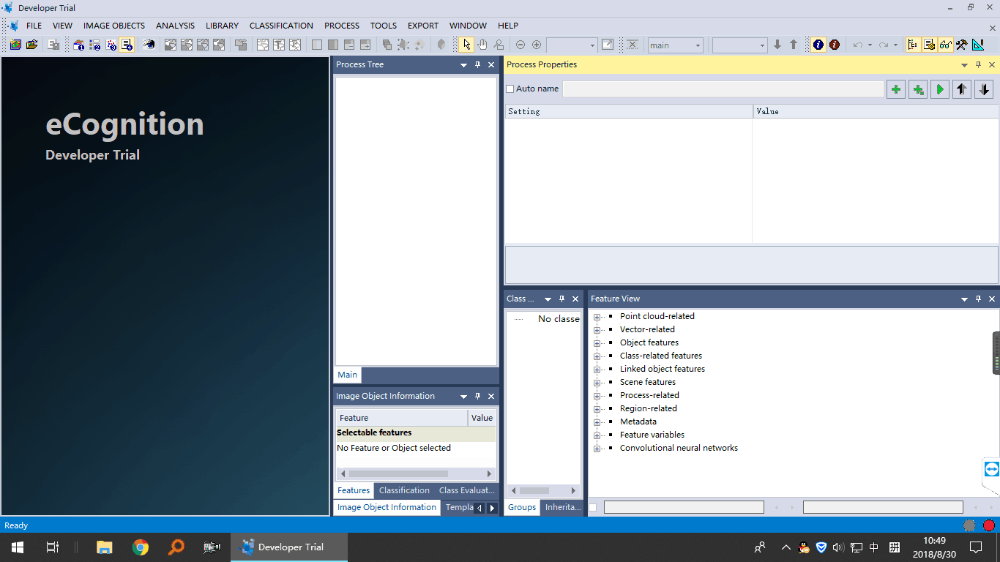

然后新建工程，将影像加载进来，使用菜单"FILE->New Project"，并选择要处理的影像。
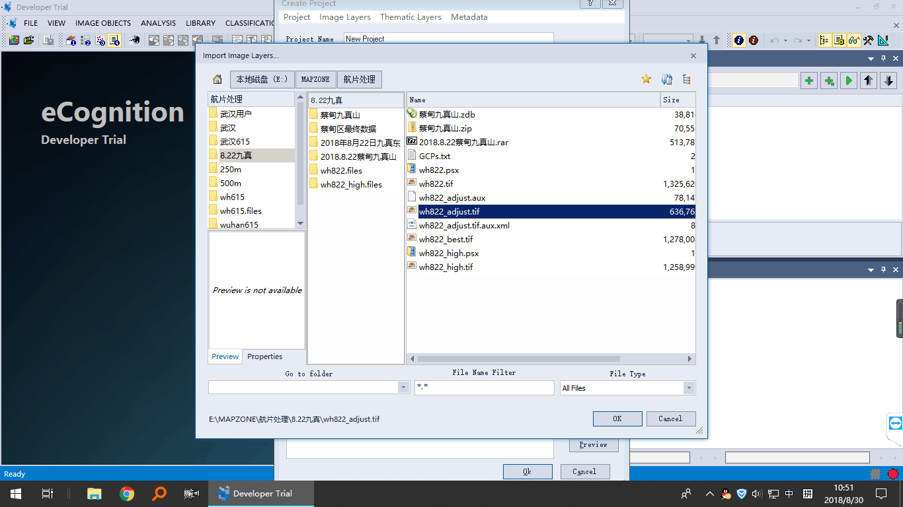
如果影像过大，可以使用"Subset Selection"功能，指定作业区域。目前还没有用到很高级的功能，添加影像后就直接创建工程即可。
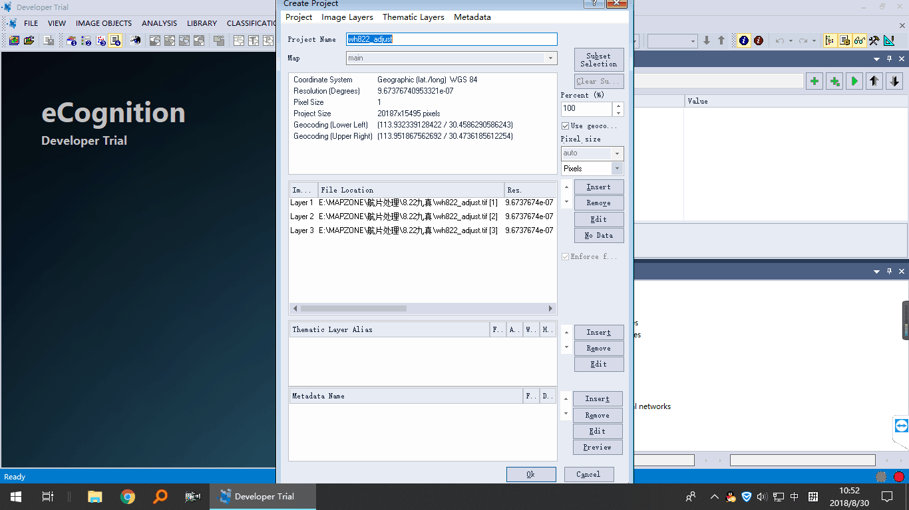
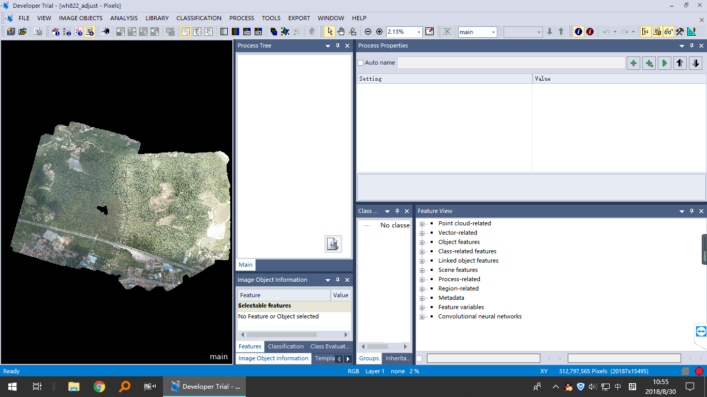

接下来进行多尺度分割工作，找到Process Tree窗口，右键使用"Append New"功能创建工作流。
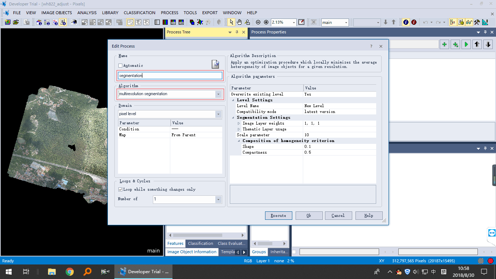
对工作流重新命名，并选择处理类型为"multiresolution segmentation"，具体的参数可以在后期调整，这里点"ok"即可，最小化其它窗口，方便查看参数的应用效果。
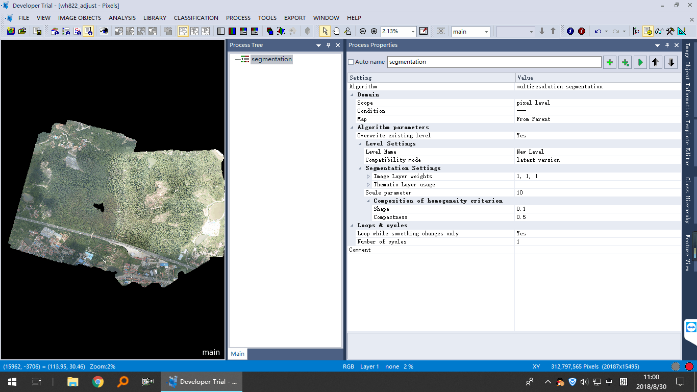
在"Process Properties"窗口中使用执行命令，就可以执行多尺度分割了，最后分割结果显示在主窗口中。
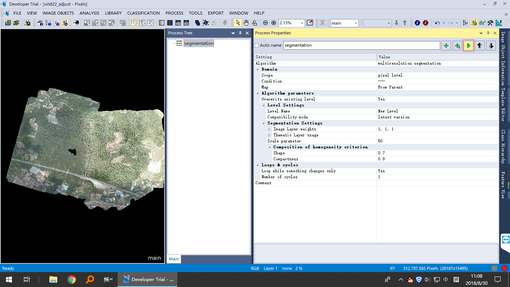
分割完成：
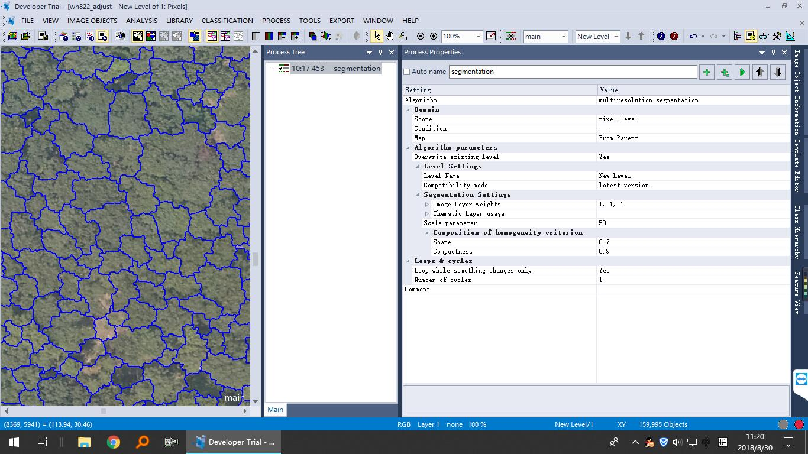
可以使用工具栏上的"Show or Hide Outlines"功能显示、隐藏分割结果。
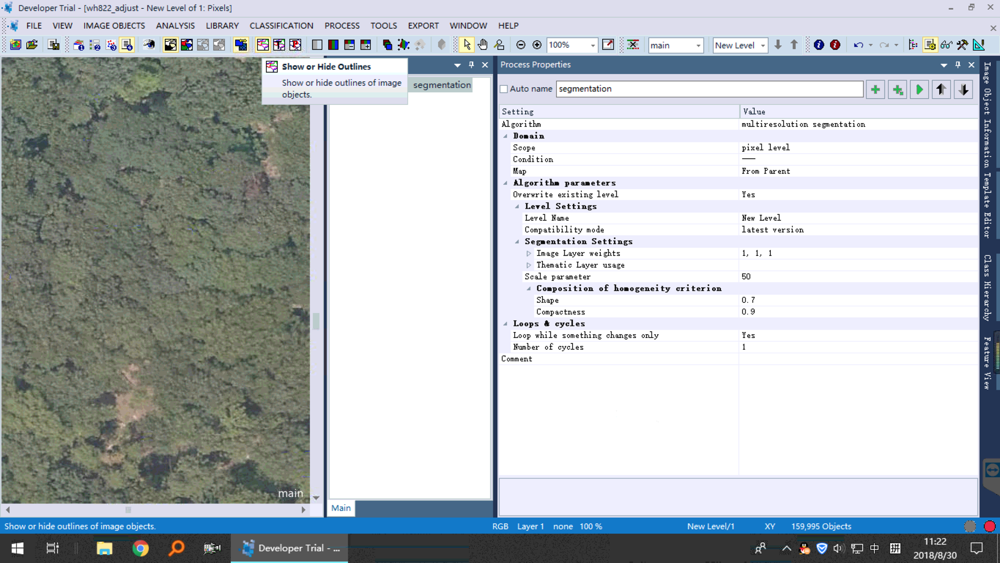

多尺度分割主要有三个参数，一个是`Scale parameter(尺度参数)`，Composition of homogeneity criterion中的两个参数：`Shape(形状参数)`和`Compactness(紧凑度)`。

`Scale parameter(尺度参数)`：数值越小，提取出来的斑块越细碎。
`Shape(形状参数)`：数值越大，提取出来的斑块面积越大。
`Compactness(紧凑度)`：数值越大，则提取出来的斑块越紧密，且较接近规则形状。

三个参数我分别设置：55，0.8，0.9，提取效果还可以。

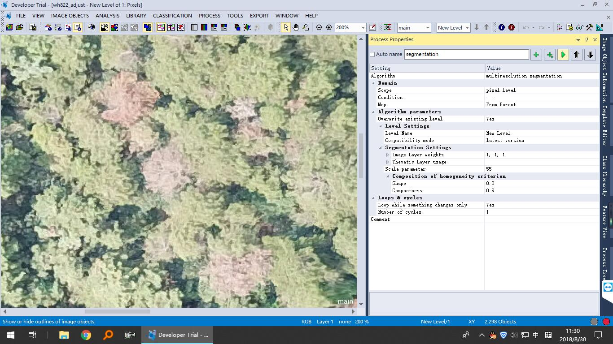
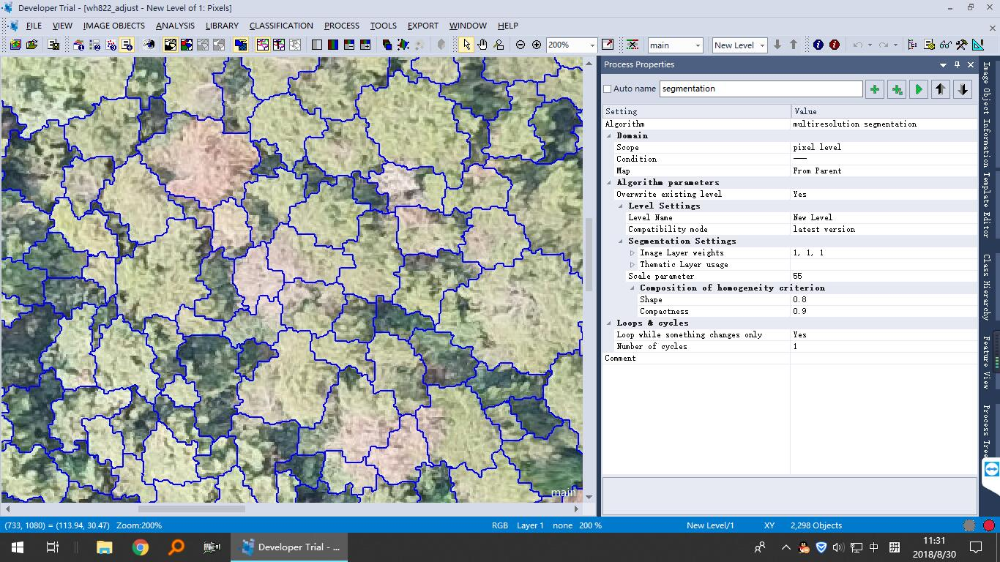

目前对eCognition还不是很熟悉，使用的功能比较浅，以后随着深入了解，提取效果可能会更好。