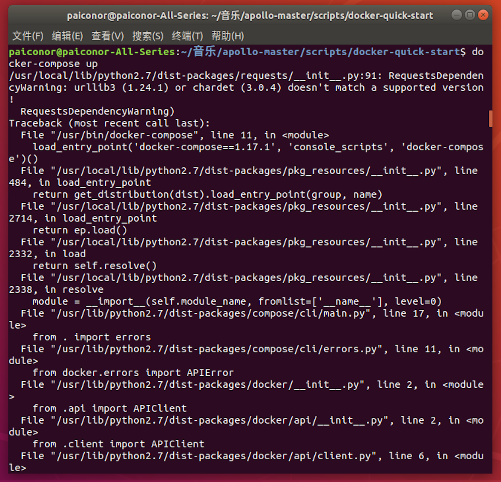
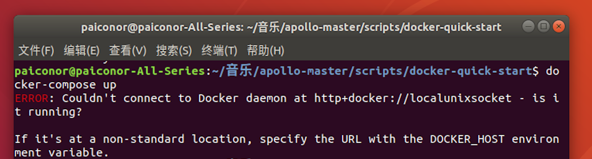
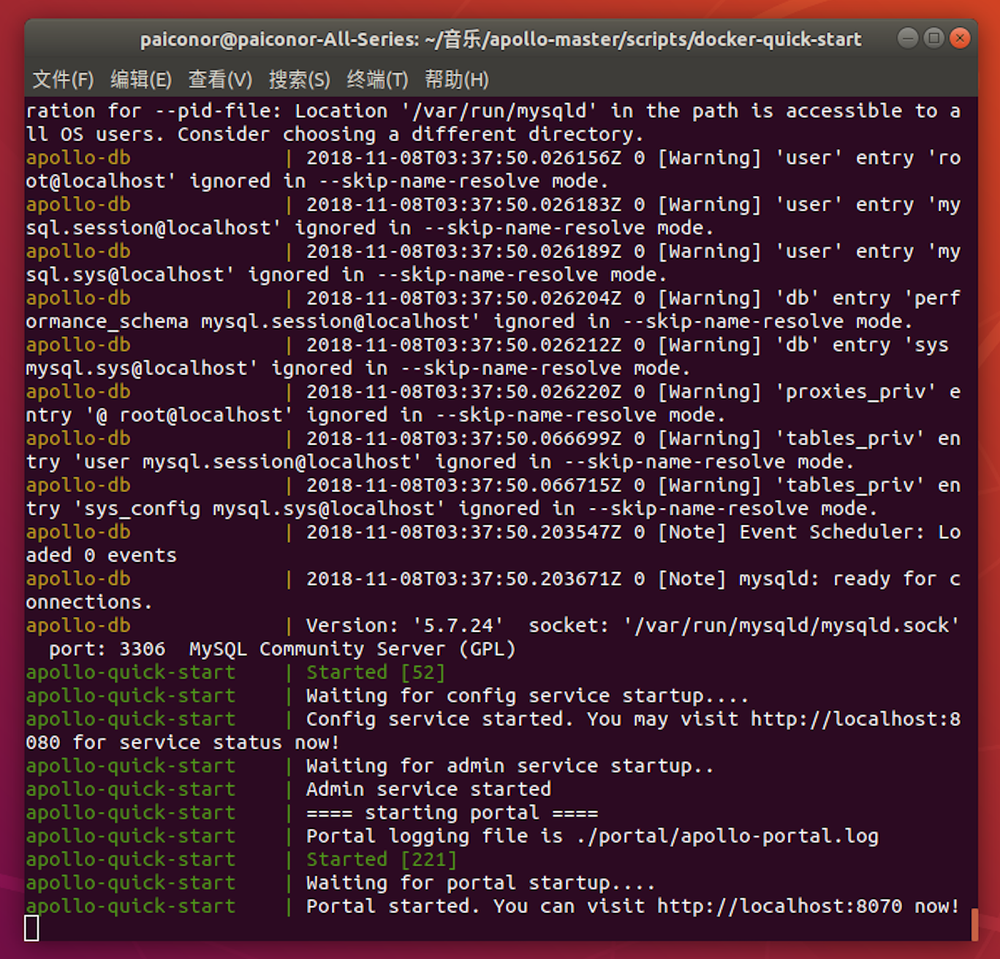
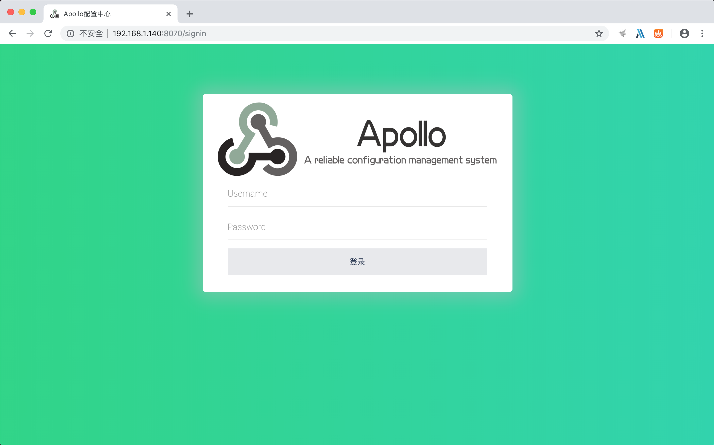
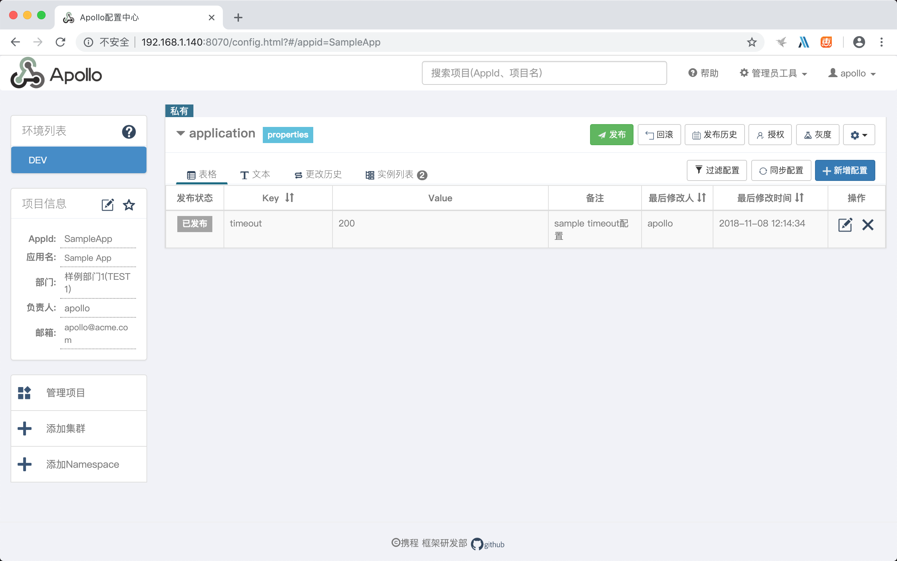
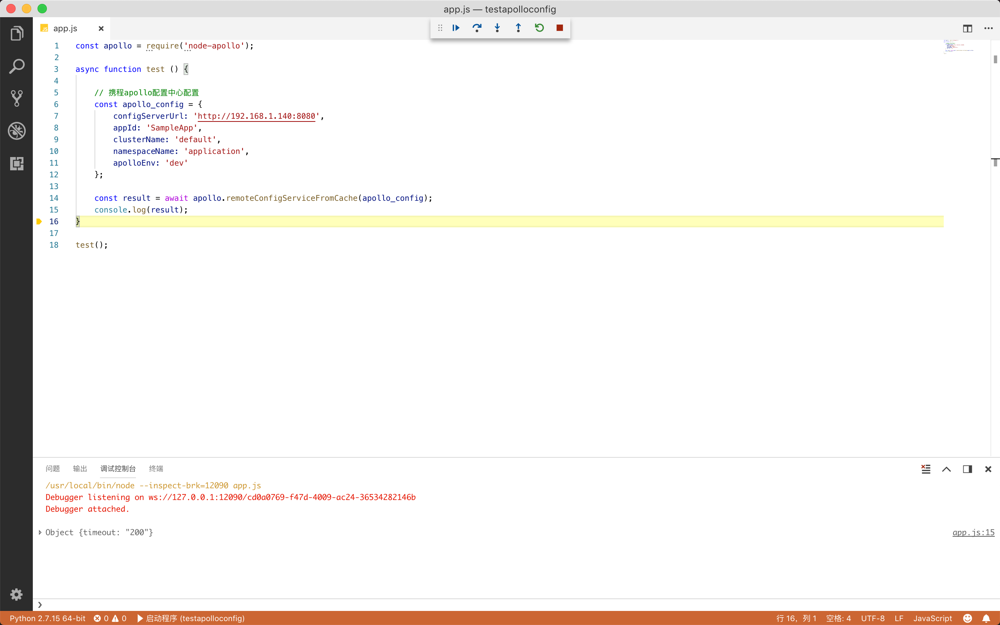
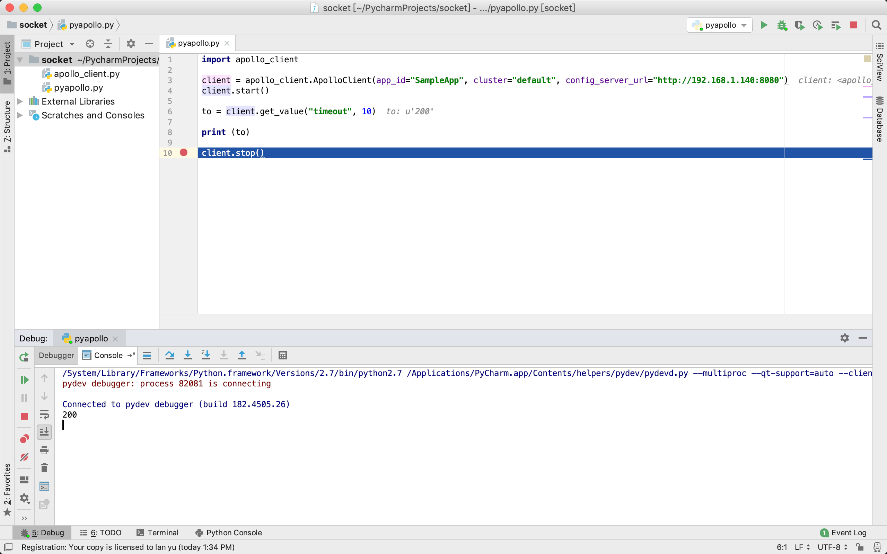

因为最近要开发几个服务，对于服务部署心有余悸，为了减少配置上的难题，经过考察，准备引入配置中心。
因为我们开发服务用到了Node.js、Python之类的语言，所以选择了携程Apollo配置中心。

#### 部署Apollo配置中心

根据Apollo的Wiki，使用Docker的方式进行部署，文档[在此](https://github.com/ctripcorp/apollo/wiki/Apollo-Quick-Start-Docker部署)。

1.首先下载Apollo源码

2.进入到`apollo/scripts/docker-quick-start/`目录下执行`docker-compose up`，这里遇到了两个问题：
1）提示urllib3模块版本不匹配，可能我的机器上环境比较复杂，所以尝试删除urllib3模块，删除后正常。

2）提示`Couldn't connect to Docker daemon at http+docker://localunixsocket - is it running?`，在网上找到了[解决方案](https://blog.csdn.net/xiojing825/article/details/79494408)即可解决。

然后Apollo配置中心就可以正常启动了。


#### 进入Apollo配置中心进行配置
使用`http://localhost:8070`进入配置中心，使用`apollo/admin`进行登陆。

配置中心内置了一个样例项目。

具体的配置就不在这里说了，接下来介绍如何使用Node.js和Python连接配置中心获取配置。

#### Node.js和Python客户端获取配置

[官方文档](https://github.com/ctripcorp/apollo/wiki/Go、Python、NodeJS、PHP等客户端使用指南)介绍了小众客户端如何连接配置中心获取配置，这里试用Node.js和Python客户端。

1.[Node.js](https://github.com/Quinton/node-apollo)
用NPM安装node-apollo，建立测试工程，编写测试代码如下：
```javascript
const apollo = require('node-apollo');

async function test () {
    
    // 携程apollo配置中心配置
    const apollo_config = {
        configServerUrl: 'http://192.168.1.140:8080',
        appId: 'SampleApp',
        clusterName: 'default',
        namespaceName: 'application',
        apolloEnv: 'dev'
    };
    
    const result = await apollo.remoteConfigServiceFromCache(apollo_config);
    console.log(result);
}

test();
```


2.[Python](https://github.com/filamoon/pyapollo)
Python客户端好像有些单薄，也有一些其它fork在维护，这里目前先使用原始作者的版本。下载github中的apollo_client.py到python目录下，并编写如下代码：
```python
import apollo_client

client = apollo_client.ApolloClient(app_id="SampleApp", cluster="default", config_server_url="http://192.168.1.140:8080")
client.start()

to = client.get_value("timeout", 10)

print (to)

client.stop()
```



这里用的还比较初级，如果想运用在生产环境中，还需要再做深入研究。