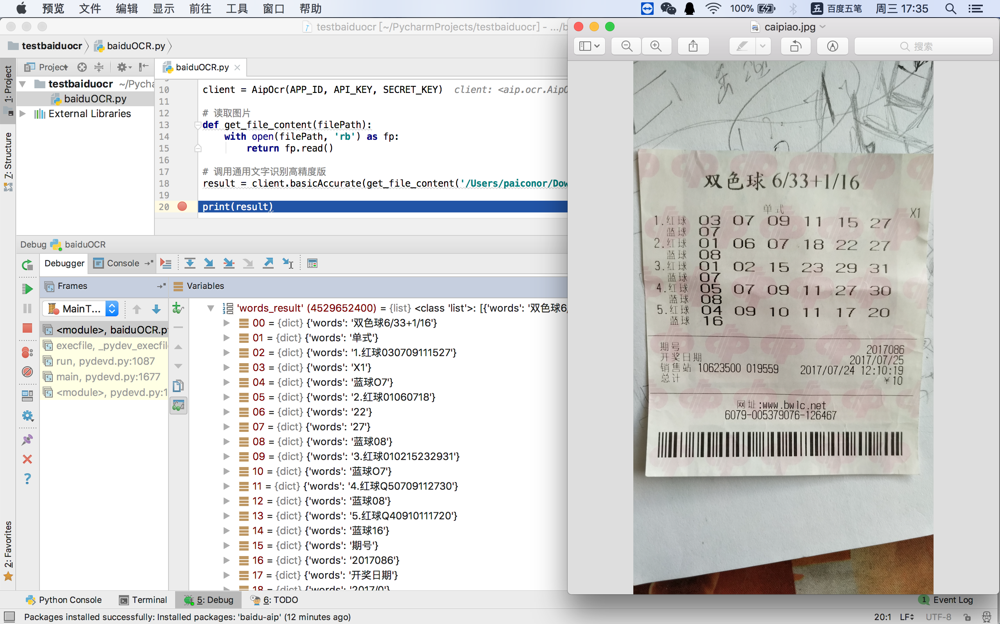
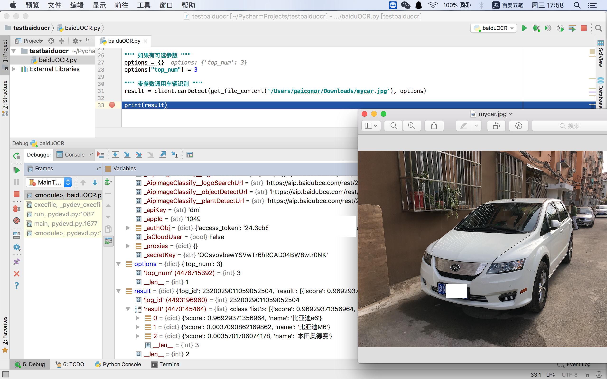
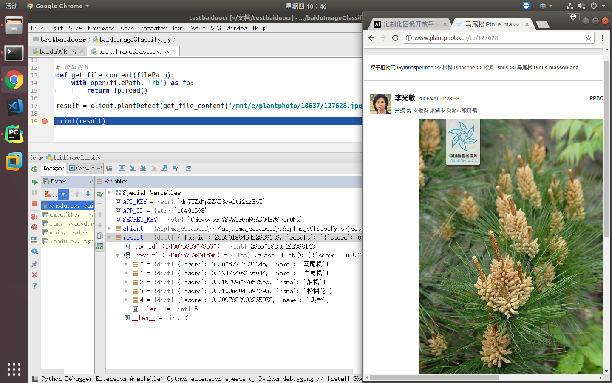
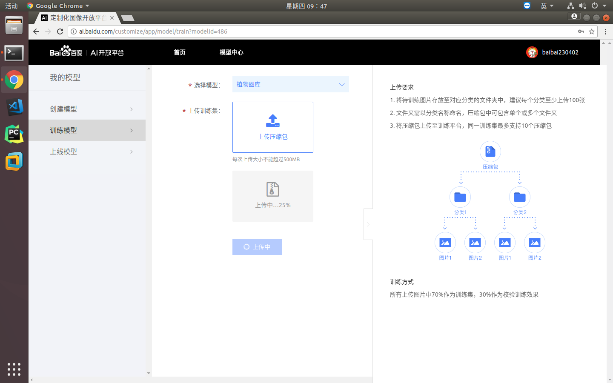

最近了解到百度AI做的不错，就试用了一下，效果很好。
废话不多说，上图

1.文字识别（[技术文档](http://ai.baidu.com/docs#/OCR-API/top)）

2.图像识别（[技术文档](http://ai.baidu.com/docs#/ImageClassify-API/top)）
车型识别

植物识别

3.定制化图像识别（[网址](http://ai.baidu.com/customize/)）
这个服务支持上传自己的分类图片进行训练，然后使用接口调用识别图像分类。但是目前还没审核通过，具体效果后续更新

等待审核

