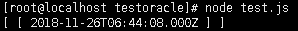

最近项目要求使用Node.js连接Oracle数据库，用Node.js连接Oracle是比较麻烦的，不像使用mysql，Mogondb，redis等有相当丰富的库。就连官方提供的oracledb也在linux上安装的时候屡屡失败。我根据网上的文档做了部署和验证，最终走通，下面把在CentOS系统上的配置过程记录一下。

#### 1.安装Oracle客户端
首先使用`yum update`进行系统更新，然后使用`yum install libaio libaio-devel`安装依赖库。

然后到[Oracle Instant Clinet](https://www.oracle.com/technetwork/database/database-technologies/instant-client/downloads/index.html)官方下载页面下载客户端。我这里下载的是`Instant Client for Linux x86-64`，使用的版本是12.2.0.1.0。

需要下载两个文件：`instantclient-basic-linux.x64-12.2.0.1.0.zip`和`instantclient-sdk-linux.x64-12.2.0.1.0.zip`。

创建目录`/usr/local/oracle`，并将下载的两个文件解压到这个目录下。

进入解压目录`instantclient_12_2`，并为`libclntsh.so`创建软连接：
```bash
ln -s libclntsh.so.12.1 libclntsh.so
```

添加环境变量：
```bash
vi /etc/profile
```

将如下命令拷贝到文件底部，并保存：
```bash
export LD_LIBRARY_PATH=/usr/local/oracle/instantclient_12_2:$LD_LIBRARY_PATH
export OCI_LIB_DIR=/usr/local/oracle/instantclient_12_2
export OCI_INC_DIR=/usr/local/oracle/instantclient_12_2/sdk/include
export NLS_LANG=AMERICAN_AMERICA.UTF8
```

应用环境变量：
```bash
source /etc/profile
```

#### 2.安装node-oracledb，及测试
执行`npm install oracledb`进行安装，然后编辑下面的脚本，执行查看结果：
```javascript
var oracledb = require('oracledb');
oracledb.getConnection({
  user          : "user",
  password      : "password",
  connectString : "(DESCRIPTION=(ADDRESS=(PROTOCOL=TCP)(HOST=192.168.0.100)(PORT=1521))(CONNECT_DATA=(SERVER=DEDICATED)(SERVICE_NAME=orcl)))"
},
function(err,connection){
  if(err){
    console.error(err.message);
    return;
  }
  connection.execute(
    "select sysdate from dual",[],function(err,result){
       if(err){
         console.error(err.message);
         return;
       }
       console.log(result.rows);
     });
});
```

如果打印出当前时间，则表示环境配置正常。
