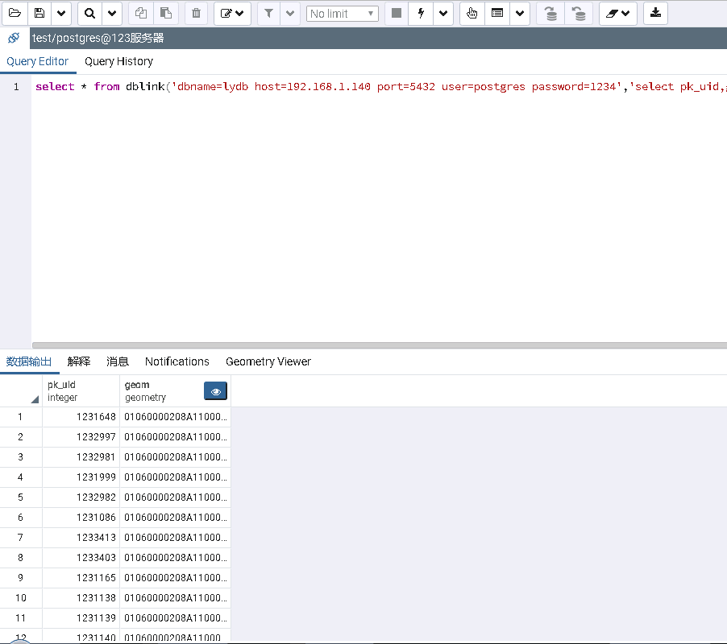
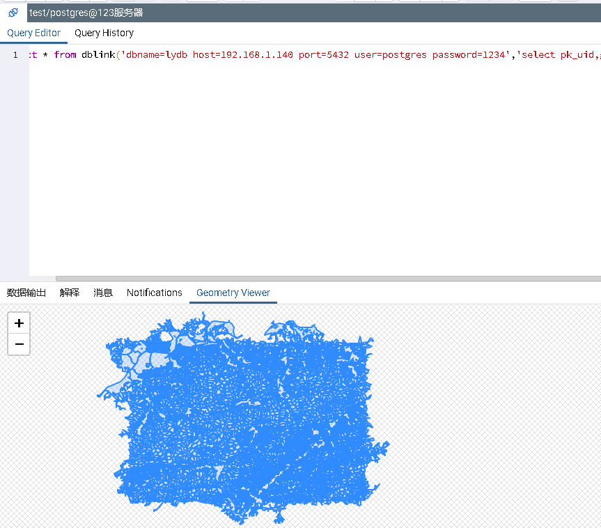
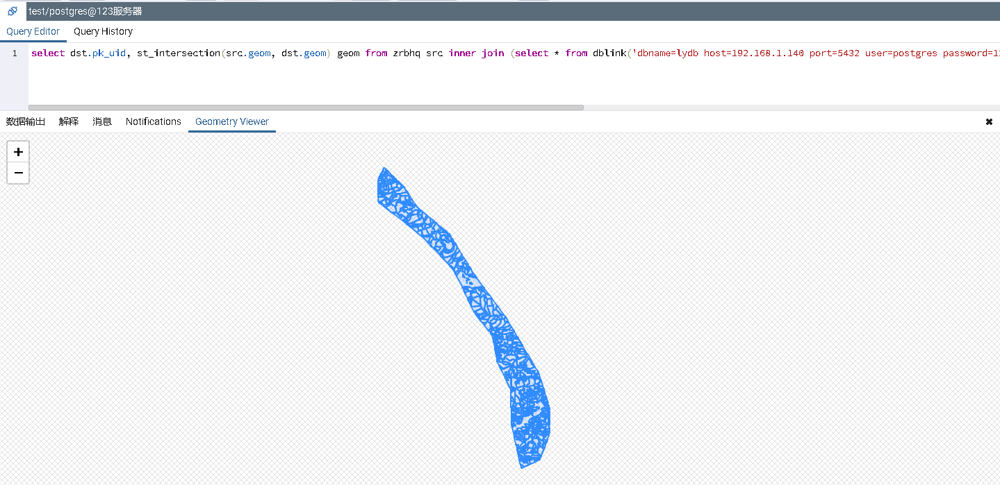

最近接到个需求，如果两种数据分别存储于不同服务器的不同PostgreSQL数据库上，能否进行跨库叠加分析。上网搜了一些资料只说了使用DBLink扩展可以达到跨度查询和更新的目的，所以就验证一下。

手头上两台服务器，两个数据分别在123、140服务器中，验证方式是先在123中使用DBLink查询140服务器中的数据，如果可行，再测试叠加分析。

#### 安装DBLink扩展
在123服务器上的PostgreSQL数据库中，安装DBLink扩展：
```sql
create extension dblink
```

#### 使用DBLink进行跨库查询

```sql
select * from dblink('dbname=lydb host=192.168.1.140 port=5432 user=postgres password=1234','select pk_uid,geom from ldgx_36_jiangxi.ldgx2016_p') t (pk_uid integer, geom geometry)
```




可以看到，跨库查询可以正常进行，那跨库叠加分析是否可行呢？

#### 使用DBLink进行跨库叠加分析

```sql
select dst.pk_uid, st_intersection(src.geom, dst.geom) geom from zrbhq src inner join (select * from dblink('dbname=lydb host=192.168.1.140 port=5432 user=postgres password=1234','select pk_uid,geom from ldgx_36_jiangxi.ldgx2016_p') as t(pk_uid integer, geom GEOMETRY)) dst on st_intersects(src.geom, dst.geom)
```



证明跨库叠加分析是可以实现的，但是效率可能不高，遇到大数据量的叠加分析会比较耗时，建议避免这种情况出现。