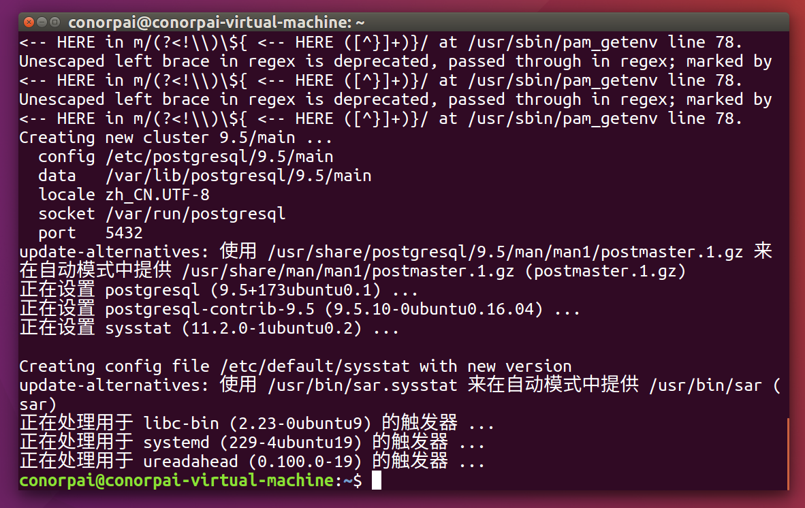
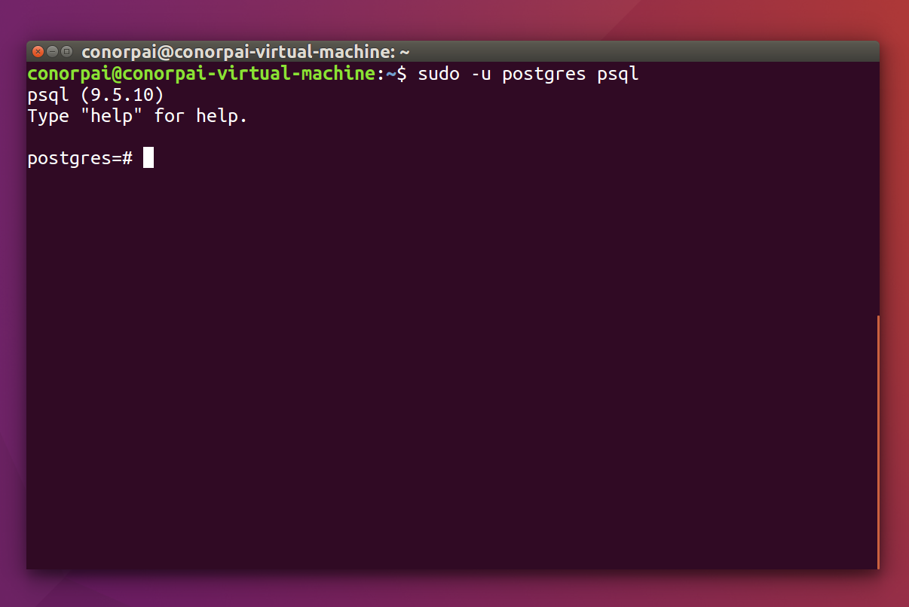
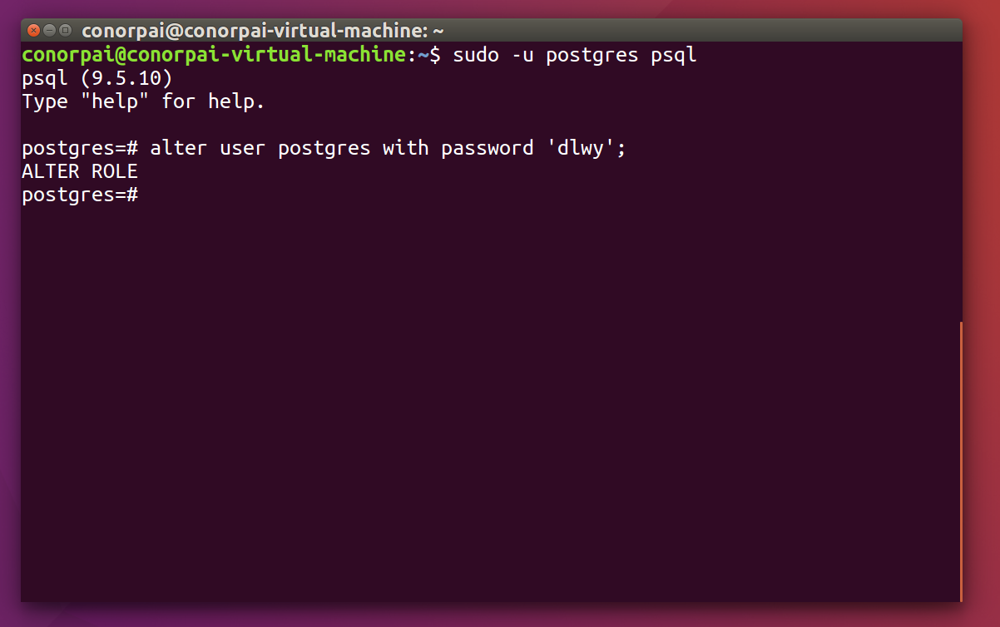
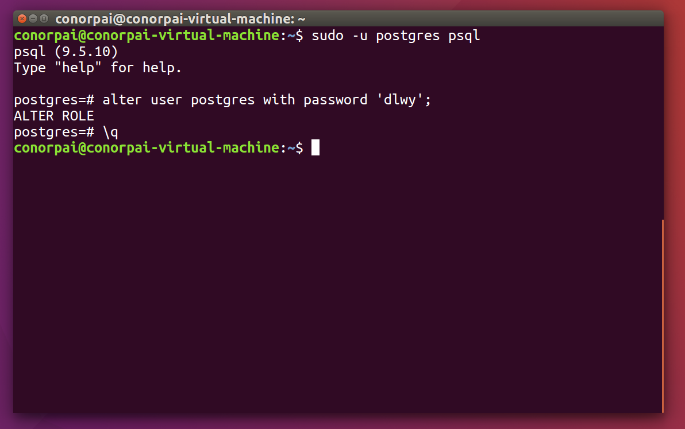
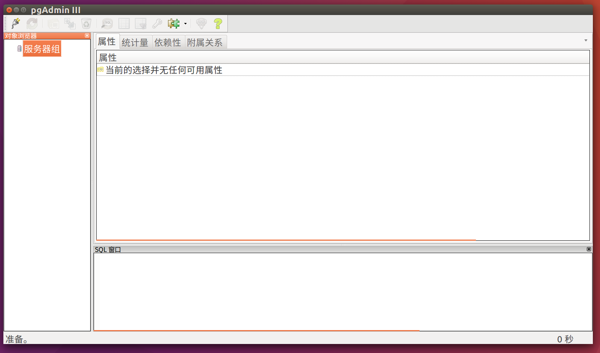
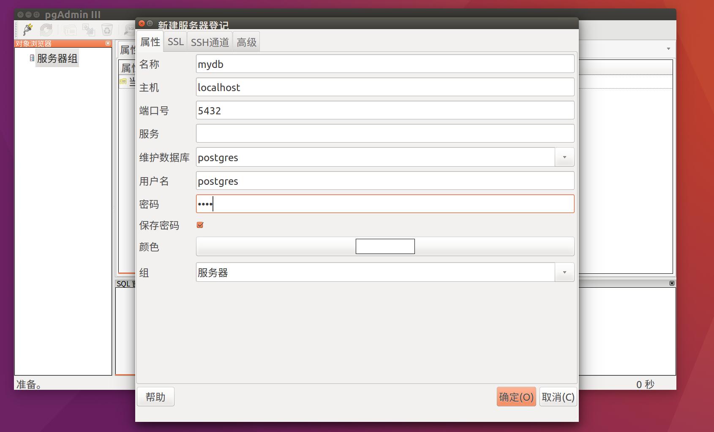
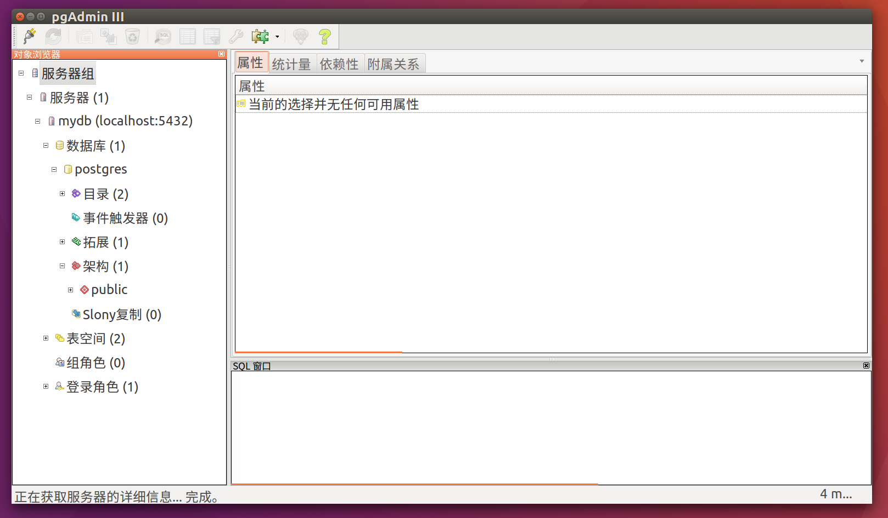
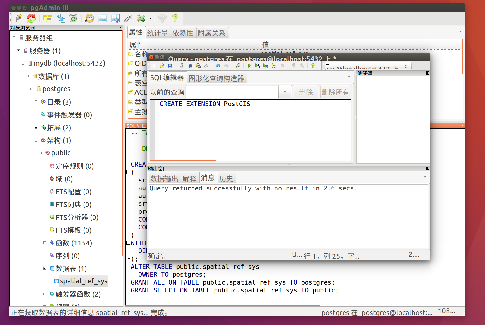

###1.安装Postgresql
使用如下命令，会自动安装最新版，这里为9.5
```bash
sudo apt-get install postgresql
```

安装完成后，默认会：
（1）创建名为"postgres"的Linux用户
（2）创建名为"postgres"、不带密码的默认数据库账号作为数据库管理员
（3）创建名为"postgres"的表

安装完成后的一些默认信息如下：
config /etc/postgresql/9.5/main
data /var/lib/postgresql/9.5/main
locale en_US.UTF-8
socket /var/run/postgresql
port 5432
###2.修改数据库默认帐号的密码
安装完后会有PostgreSQL的客户端psql，通过 sudo -u postgres psql 进入

执行密码更新语句，注意语句后边的分号，不带分号执行不成功
```bash
postgres=# alter user postgres with password '新密码';
```

输入“\q”命令退出psql客户端

###3.配置数据库以允许远程连接访问
安装完成后，默认只能本地才能连接数据库，其他机子访问不了，需要进行配置。

1)修改监听地址
```bash
sudo gedit /etc/postgresql/9.5/main/postgresql.conf
```
将 #listen_addresses = 'localhost' 的注释去掉并改为 listen_addresses = '*'

2)修改可访问用户的IP段
```bash
sudo gedit /etc/postgresql/9.5/main/pg_hba.conf
```
在文件末尾添加： host all all 0.0.0.0 0.0.0.0 md5 ，表示运行任何IP连接

3)重启数据库
```bash
sudo /etc/init.d/postgresql restart
```
###4.安装图形管理界面
```bash
sudo apt-get install pgadmin3
```
安装完成后启动程序

添加服务器


###5.安装PostGIS
首先使用如下命令添加UbuntuGIS的PPA用于安装PostGIS扩展
```bash
sudo add-apt-repository ppa:ubuntugis/ppa
sudo apt-get update
```
然后使用如下命令安装PostGIS
```bash
sudo apt-get install postgis
```
###6.数据库扩展PostGIS
执行命令
```sql
CREATE EXTENSION PostGIS
```
成功后刷新，数据表中会出现spatial_ref_sys，说明扩展成功


###下一篇将介绍使用QGIS向Postgresql中导入以及显示Shapefile数据