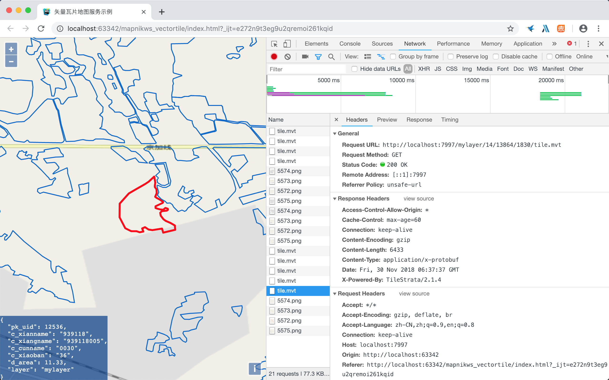

之前试用过TileStrata-vtile插件，但是使用过程中发现其空间参考只支持Web墨卡托坐标系，而我们主要用的坐标系是经纬度，如果要支持这种模式，需要改动node-mapnik的c++代码，比较麻烦。幸好TileStrata提供了另外一个矢量瓦片的插件：[PostGISMVT插件](https://github.com/Stezii/tilestrata-postgismvt)。

接下来记录一下试过用过程遇到的坑：

#### 1.找不到ST_AsMVT函数

大概看了一下PostGISMVT源码，其实现主要是通过PostGIS2.4版本以上提供的ST_AsMVT函数和ST_AsMVTGeom实现的，而我竟然发现我们装的PostGIS在函数列表里找不到ST_AsMVT函数。。

在网上找了一些资料发现原来ST_AsMVT函数需要依赖ProtoBuf库，所以安装了下面几个库：

ubuntu：
```bash
sudo apt-get install libprotobuf-c1 libprotobuf-c-dev libprotobuf-dev protobuf-compiler protobuf-c-compiler
```

安装完成之后ST_AsMVT调用不再报错，然而还是在函数列表里找不到。

#### 2.找不到TileBBox函数

这个在官方Readme中引用了[TileBBox.sql](https://github.com/mapbox/postgis-vt-util/blob/master/src/TileBBox.sql)进行扩展。执行即可。

这里的TileBBox函数默认还是Web墨卡托坐标系，虽然支持传入SRID，但是通过代码逻辑可以知道，传入的XYZ必须得提Web墨卡托标准计算的行列号，Openlayers经纬度空间参考数据传过来的XYZ是经纬度标准计算的，所以这个函数用不了，得进行修改。

修改后：
```sql
/******************************************************************************
### TileBBox ###
Given a Web Mercator tile ID as (z, x, y), returns a bounding-box
geometry of the area covered by that tile.
__Parameters:__
- `integer` z - A tile zoom level.
- `integer` x - A tile x-position.
- `integer` y - A tile y-position.
- `integer` srid - SRID of the desired target projection of the bounding
  box. Defaults to 3857 (Web Mercator).
__Returns:__ `geometry(polygon)`
******************************************************************************/
create or replace function TileBBox (z int, x int, y int, srid int = 4490)
    returns geometry
    language plpgsql immutable as
$func$
declare
    orix numeric := -180;
    oriy numeric := 90;
    res numeric := 1.40625 * 256 / (2^z);
    bbox geometry;
begin
    bbox := ST_MakeEnvelope(
        orix + (x * res),
        oriy - (y * res) - res,
        orix + (x * res) + res,
        oriy - (y * res),
        4490
    );
    if srid = 4490 then
        return bbox;
    else
        return ST_Transform(bbox, srid);
    end if;
end;
$func$;
```

#### 3.数据支持了经纬度，但出图还是Web墨卡托

在深入了解TileStrara-PostGISMVT源码过程中发现，虽然支持数据源是经纬度的，但是最终出图结果还是Web墨卡托的，这点可以通过[官方源码](https://github.com/Stezii/tilestrata-postgismvt/blob/master/index.js)中写死的3857进行确认。

这里我临时修改了代码，将写死3857的地方使用${lyr.srid}进行修改，这样出图结果就是经纬度的了。修改结果已经上传到npm库，名称是`@conorpai/tilestrata-postgismvt`。

#### 4.发布地图服务

根据官方的文档，写了如下代码进行矢量瓦片服务发布：
```javascript
var tilestrata = require('@conorpai/tilestrata');
var headers = require('tilestrata-headers');
var postgismvt = require('@conorpai/tilestrata-postgismvt');
var server = tilestrata();

server.layer('mylayer').route('tile.mvt')
  .use(headers({
      'Access-Control-Allow-Origin': '*'
  }))
  .use(postgismvt({
    lyr: {
      table: 'zyjg_bhtb',
      geometry: 'geom',
      srid: 4490,
      minZoom: 0,
      maxZoom: 22,
      buffer: 0,
      fields: 'pk_uid c_xianname c_xiangname c_cunname c_xiaoban d_area',
      resolution: 4096,
    },
    pgConfig: {
      host: '192.168.1.140',
      user: 'postgres',
      password: 'dlwy',
      database: 'pgdata',
      port: '5432'
    }}));

server.listen(7997);
```

#### 5.前端加载显示
以下代码使用Openlayers显示MVT矢量瓦片，并支持选择和显示属性。

```html
<!Doctype html>
<html xmlns=http://www.w3.org/1999/xhtml>
<head>
    <meta http-equiv=Content-Type content="text/html;charset=utf-8">
    <meta http-equiv=X-UA-Compatible content="IE=edge,chrome=1">
    <meta content=always name=referrer>
    <title>矢量瓦片地图服务示例</title>

    <!--Let browser know website is optimized for mobile-->
    <meta name="viewport" content="width=device-width, user-scalable=no, initial-scale=1.0"/>

    <link href="ol.css" rel="stylesheet" type="text/css" />
    <link href="index.css" rel="stylesheet" type="text/css" />
    <script type="text/javascript" src="ol-debug.js" charset="utf-8"></script>
</head>
<body>
<main class="bodymain">
    <div id="map" class="map">
        <pre id="info"/>
    </div>
</main>
<script>

    var selection = {};
    var idProp = 'pk_uid';

    var vtLayer = new ol.layer.VectorTile({
            source: new ol.source.VectorTile({
                format: new ol.format.MVT(),
                projection: 'EPSG:4326',
                url: 'http://localhost:7997/mylayer/{z}/{x}/{y}/tile.mvt'
            }),
            style: function (feature, resolution) {
                var selected = !!selection[feature.get(idProp)];
                return new ol.style.Style({
                    stroke: new ol.style.Stroke({
                        color: selected ? 'rgb(255, 0, 0)' : 'rgb(0, 102, 204)',
                        width: selected ? 4 : 2
                    })
                })
            }
        });

    var map = new ol.Map({
        target: 'map',
        view: new ol.View({
            center: [0, 0],
            projection: 'EPSG:4326',
            zoom: 1
        }),
        layers: [
            new ol.layer.Tile({
                title: "OSM",
                source: new ol.source.OSM({
                    attributions: []
                })
            }),
            vtLayer
        ]
    });

    var info = document.getElementById('info');
    map.on('singleclick', showInfo);
    function showInfo(event) {
        selection = {};
        var features = map.getFeaturesAtPixel(event.pixel);
        if (!features) {
            vtLayer.setStyle(vtLayer.getStyle());
            info.innerText = '';
            info.style.opacity = 0;
            return;
        }
        var feature = features[0];
        var fid = feature.get(idProp);
        selection[fid] = feature;
        vtLayer.setStyle(vtLayer.getStyle());
        var properties = feature.getProperties();
        info.innerText = JSON.stringify(properties, null, 2);
        info.style.opacity = 1;
    }
</script>
</body>
</html>
```

最后上图镇楼：
