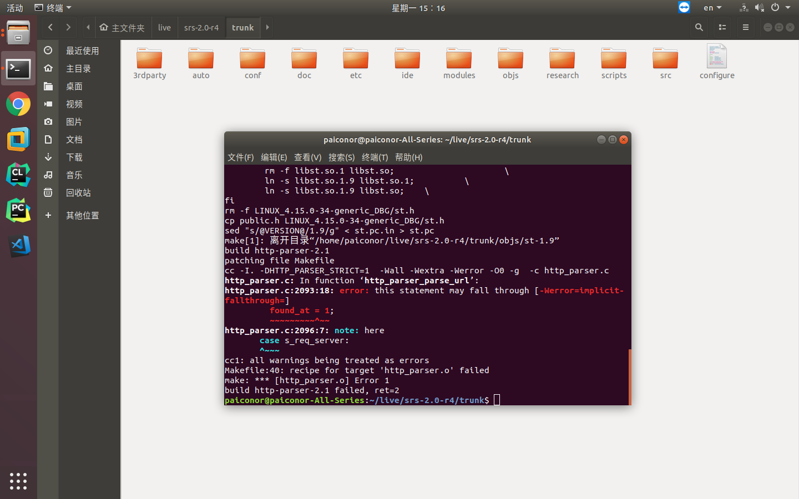
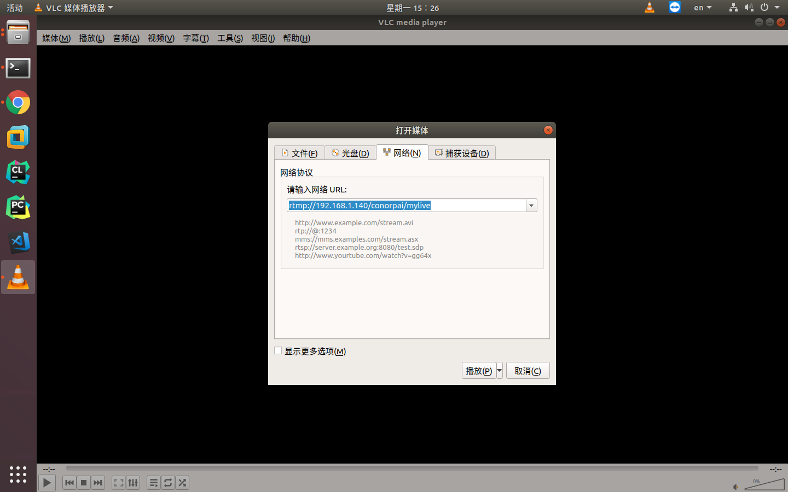
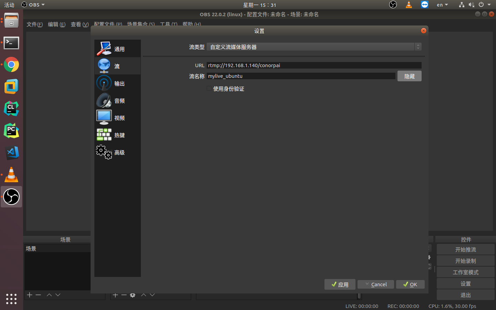
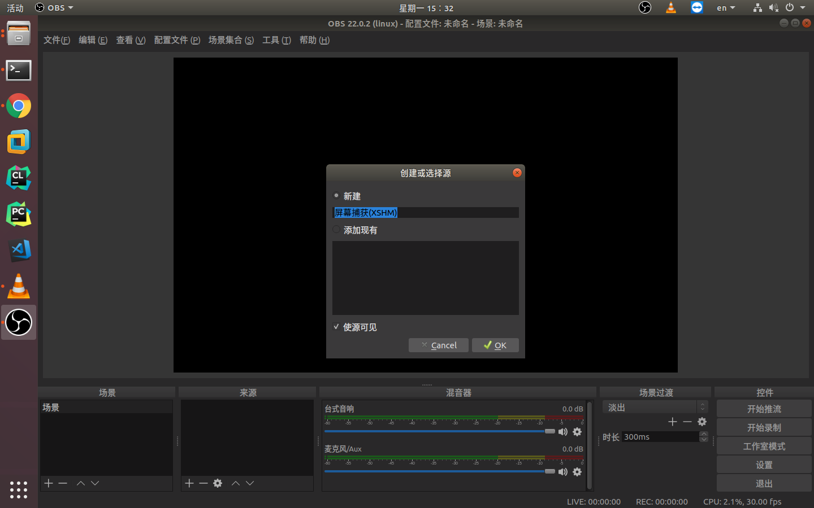
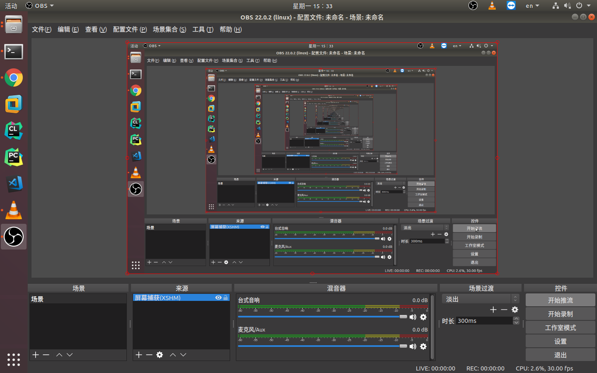
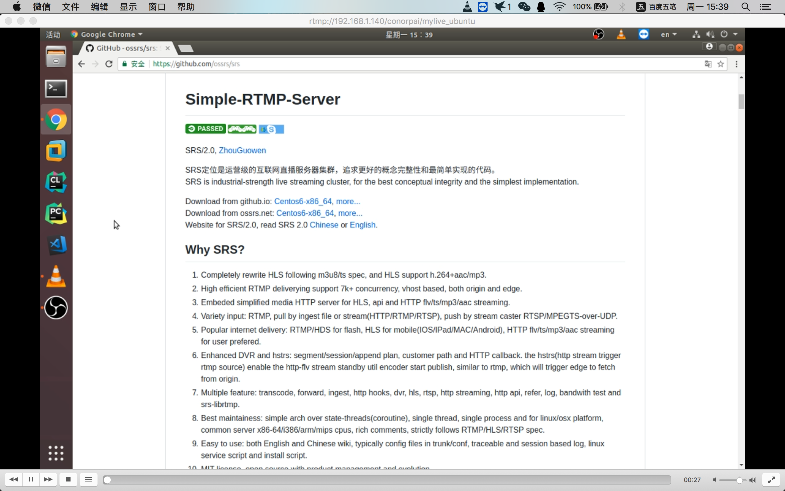
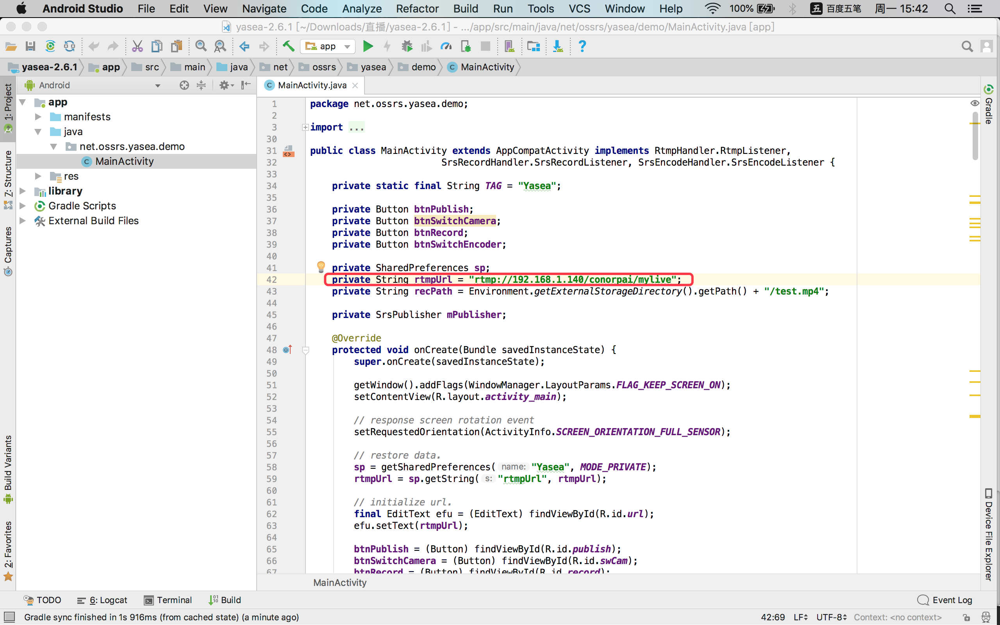
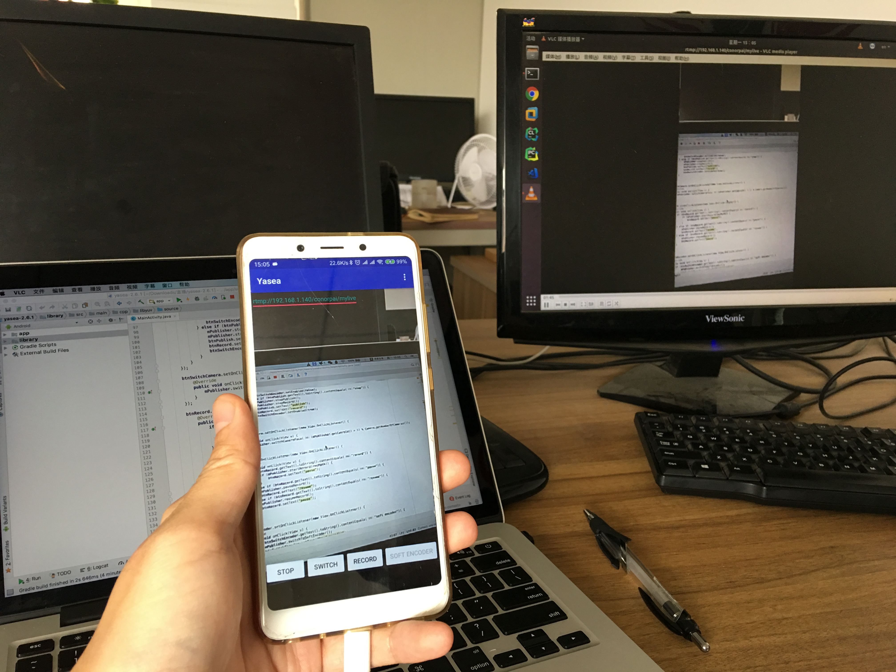

周末和陈同学就行业形式进行了深入探(xian)讨(liao)，他们公司最近使用直播技术，开发了一套外业内容采集(无人机影像、手机视频)，内业查看指挥等一套东西。对于直播技术，之前了解不多，所以也想试试效果。

查了一些资料，比较容易上手的是用[Simple-RTMP-Server(srs)](https://github.com/ossrs/srs)作为服务器，各端使用推流、拉流进行直播和查看，接下来主要介绍这方面的内容。

#### 1.srs部署

查看官方文档，srs部署比较简单，本次选择的系统是Ubuntu 18.04。
首先下载Release源码，解压后进入trunk目录下，执行`./configure`，然后现实是残酷的，报错了。。


到srs上搜issue，找到了[解决方案](https://github.com/ossrs/srs/issues/1065)，解压`3rdparty/http-parser-2.1.zip`，找到`http_parser.c`，修改那个注释，重新压缩，就可以了。

执行`make`进行编译，然后执行`./etc/init.d/srs start`就可以开启服务了。

#### 2.拉流

这里我们介绍使用[VLC](http://www.videolan.org/vlc/)客户端进行拉流，查看直播内容。

ubuntu下安装VLC：
```bash
sudo apt-get install vlc browser-plugin-vlc
```

安装完成之后启动，在媒体菜单中选择打开网络串流，在网络中输入网络URL即可。目前还没有推流，看不到效果，具体效果可以在后面体现。


#### 3.推流

这里介绍两端推流方式，一个是ubuntu使用[OBS](https://obsproject.com/)进行推流，一个是在安卓推流。

##### OBS推流
首先安装OBS：
```bash
sudo add-apt-repository ppa:obsproject/obs-studio
sudo apt-get update
sudo apt-get install obs-studio
```

打开软件之后，首先在右侧设置流服务器，启动srs服务器的IP是192.168.1.140，后边的可以自定义，只要推和拉一致即可。

然后设置来源，这里使用的是屏幕捕获。

都设置好了之后，使用右侧开始推流就可以了。


在VLC中查看：


##### 安卓推流
这里使用的是[yasea](https://github.com/begeekmyfriend/yasea)，下载源码，编译部署即可。
修改代码中的流服务器地址：


最后的效果：


这里介绍的比较粗浅，如果想把这个功能做精，甚至达到陈同学那边上线的样子，可能还需要再下功夫，加油吧，再不疯狂就老了。