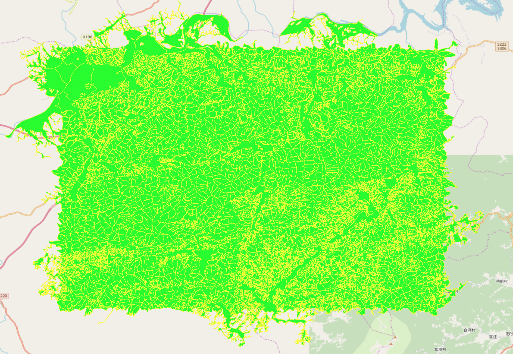
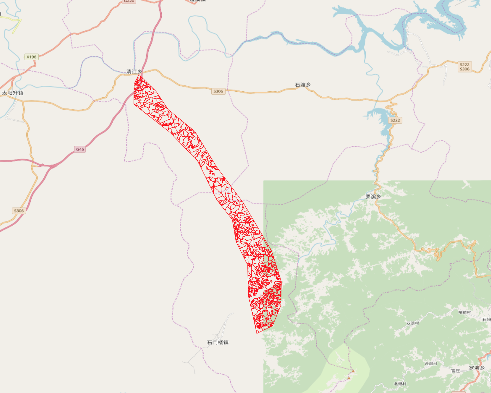
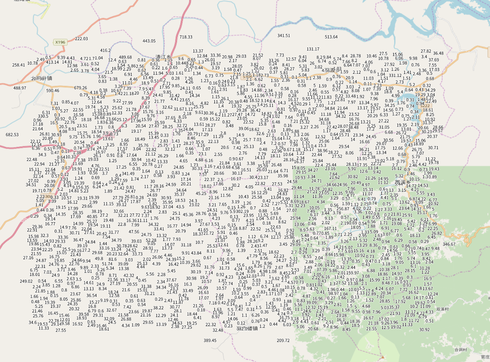
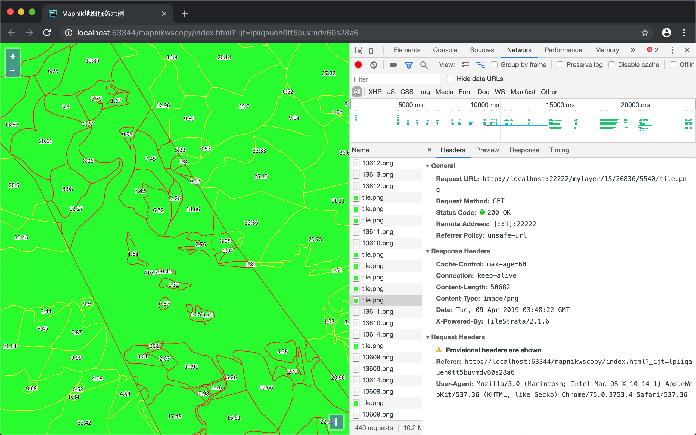
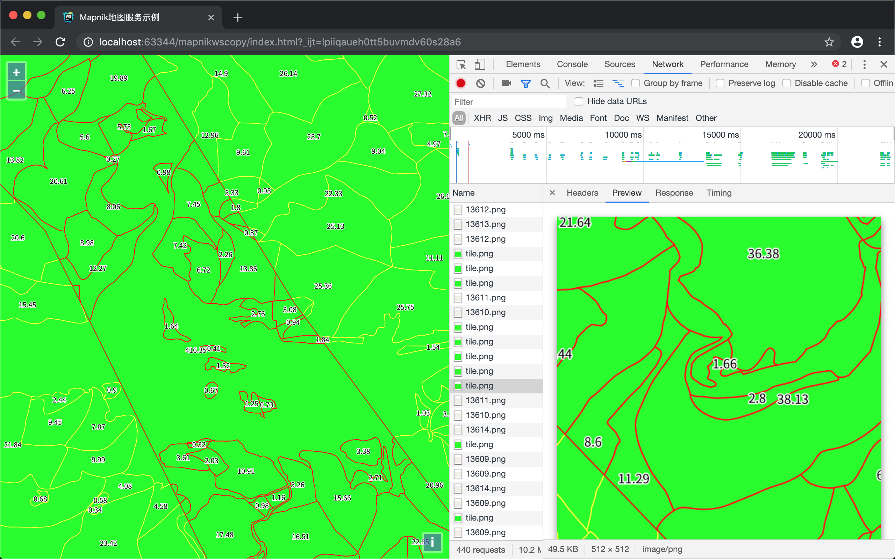

最近经常遇到这样的情况，服务端发布的瓦片服务过多，导致前端加载太多的layer，增加前端网络请求负担，所以我们想某些相似的瓦片服务是否可以组合在一起，对于前端来说就是一个layer，瓦片合并的工作交给服务端进行。今天提到的[TileStrata-blend](https://github.com/naturalatlas/tilestrata-blend)插件就是用来做瓦片服务合并工作的。

首先发布三个瓦片服务，分别是林地小班、叠加分析结果和林地小班标注，配图和效果如下：
林地小班：
```xml
<Map  srs="+proj=longlat +ellps=GRS80 +no_defs">
  <Style name="My Style">
    <Rule>
      <PolygonSymbolizer fill="rgb(0,255,0)" />
      <LineSymbolizer stroke="rgb(255,255,0)" stroke-width="1"/>
    </Rule>
  </Style>

  <Layer name="layer" srs="+proj=longlat +ellps=GRS80 +no_defs ">
    <StyleName>My Style</StyleName>
    <Datasource>
		...
    </Datasource>
  </Layer>
</Map>
```

叠加分析结果：
```xml
<Map  srs="+proj=longlat +ellps=GRS80 +no_defs">
  <Style name="My Style">
    <Rule>
      <LineSymbolizer stroke="rgb(255,0,0)" stroke-width="1"/>
    </Rule>
  </Style>

  <Layer name="layer" srs="+proj=longlat +ellps=GRS80 +no_defs ">
    <StyleName>My Style</StyleName>
    <Datasource>
		...
    </Datasource>
  </Layer>
</Map>
```

林地小班标注：
```xml
<Map  srs="+proj=longlat +ellps=GRS80 +no_defs">
  <Style name="My Style">
    <Rule>
      <TextSymbolizer face-name="Noto Sans CJK SC Regular" size="10" halo-fill="white" halo-radius="1" allow-overlap="false">[mian_ji]</TextSymbolizer>
    </Rule>
  </Style>

  <Layer name="layer" srs="+proj=longlat +ellps=GRS80 +no_defs ">
    <StyleName>My Style</StyleName>
    <Datasource>
		...
    </Datasource>
  </Layer>
</Map>
```


通过如下代码进行瓦片服务合并：
```javascript
var tilestrata = require('@conorpai/tilestrata');
const mapnik = require('@conorpai/tilestrata-mapnik');
const disk = require('tilestrata-disk');
var blend = require('tilestrata-blend');
var strata = tilestrata();

//林地小班
strata.layer('847a30b3-3763-48ee-a754-57b338700d09')
    .route('tile.png')
        .use(disk.cache({dir: '/Users/paiconor/Desktop/server/dir/map/847a30b3-3763-48ee-a754-57b338700d09/cache/'}))
        .use(mapnik({
            pathname: '/Users/paiconor/Desktop/server/dir/map/847a30b3-3763-48ee-a754-57b338700d09/mapnik.xml',
            OriX: -180,
            OriY: 90,
            FirstDPI: 1.40625,
            tileSize: 512,
            scale: 2
        }));

//叠加分析结果
strata.layer('50b6be1f-d2ff-4797-9686-cf525dfde42b')
    .route('tile.png')
        .use(disk.cache({dir: '/Users/paiconor/Desktop/server/dir/map/50b6be1f-d2ff-4797-9686-cf525dfde42b/cache/'}))
        .use(mapnik({
            pathname: '/Users/paiconor/Desktop/server/dir/map/50b6be1f-d2ff-4797-9686-cf525dfde42b/mapnik.xml',
            OriX: -180,
            OriY: 90,
            FirstDPI: 1.40625,
            tileSize: 512,
            scale: 2
        }));

//林地小班标注
strata.layer('54681f08-baf3-45d8-8052-770945f0a3ea')
    .route('tile.png')
        .use(disk.cache({dir: '/Users/paiconor/Desktop/server/dir/map/54681f08-baf3-45d8-8052-770945f0a3ea/cache/'}))
        .use(mapnik({
            pathname: '/Users/paiconor/Desktop/server/dir/map/54681f08-baf3-45d8-8052-770945f0a3ea/mapnik.xml',
            OriX: -180,
            OriY: 90,
            FirstDPI: 1.40625,
            tileSize: 512,
            scale: 2
        }));

//瓦片服务合并
strata.layer('mylayer').route('tile.png')
    .use(blend([
        ['847a30b3-3763-48ee-a754-57b338700d09','tile.png'],
        ['50b6be1f-d2ff-4797-9686-cf525dfde42b','tile.png'],
        ['54681f08-baf3-45d8-8052-770945f0a3ea','tile.png']
    ]));

strata.listen(22222);
```

前端加载合并后的瓦片服务：



TileStrata-blend还有一些选项可以设置，比如给合并结果设置背景色、设置某个瓦片服务的透明度等，这些待实际应用中再仔细研究。