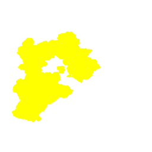
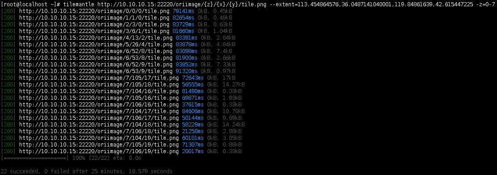
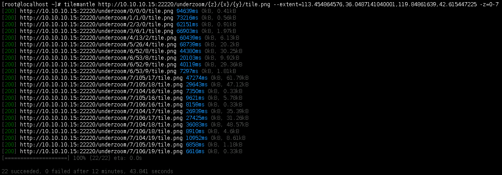

TileStrata真是个神仙宝藏框架，今天试用的是[tilestrata-underzoom](https://github.com/naturalatlas/tilestrata-underzoom)插件，通过介绍能看出这个插件允许使用低级别的瓦片拼成高级别的瓦片，目前我知道的一个用途是能解决绘制高级别瓦片速度慢的问题。

#### 1.编写代码
首先，编写瓦片服务代码：
```javascript
const tilestrata = require('@conorpai/tilestrata');
const mapnik = require('@conorpai/tilestrata-mapnik');
const dependency = require('tilestrata-dependency');
const underzoom = require('tilestrata-underzoom');
const disk = require('tilestrata-disk');

var strata = tilestrata({
    balancer: {
      host: '0.0.0.0:22221'
    }
  });

//原始地图服务
strata.layer('oriimage')
    .route('tile.png')
        //.use(disk.cache({dir: 'oricache'}))
        .use(mapnik({
            pathname: 'mapnik.xml',
            OriX: -180,
            OriY: 90,
            FirstDPI: 1.40625
        }));

//underzoom地图服务
strata.layer('underzoom').route('tile.png')
    //.use(disk.cache({dir: 'underzoomcache'}))
	.use(underzoom({
		source: dependency('oriimage', 'tile.png'),
		size: 256,
		zooms: 6
    }));

var port = process.env['port'];
strata.listen(port);
```

#### 2.验证拼接结果
验证两个瓦片服务绘制出来的瓦片是否相同：

普通瓦片服务：


underzoom瓦片服务：


由于Mapnik的线宽符号单位是像素，所以在比较高级别会因为边线太宽而糊在一起，看的不是很清楚。相比之下，使用underzoom由于是使用低级瓦片拼接而成，图形边界比较明显。

#### 3.验证瓦片绘制效率
接下来使用[tilemantle](https://www.npmjs.com/package/@conorpai/tilemantle)工具进行瓦片请求，获取瓦片加载时间：

普通瓦片服务：


underzoom瓦片服务：


可以看出，使用underzoom拼接绘制效率比普通瓦片效率高，而且如果增加瓦片服务集群，会明显提升并行绘制效率，进而提升underzoom拼接瓦片效率，在以后的实施过程中，如果遇到了高级别瓦片绘制效率瓶颈，可以考虑使用这个方案。