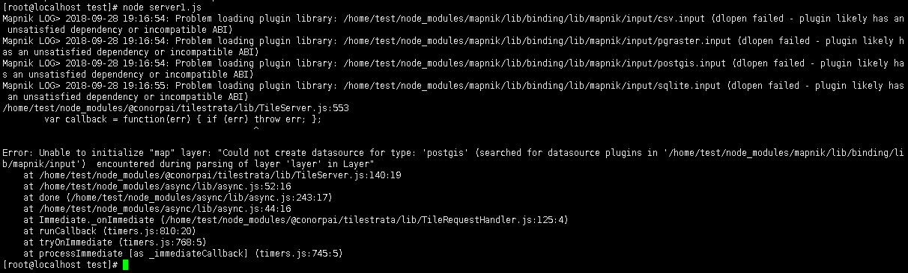
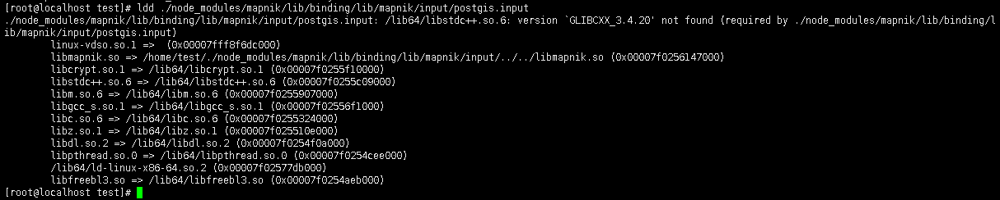
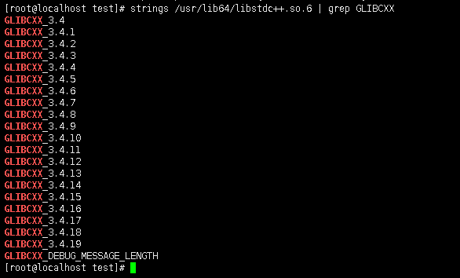
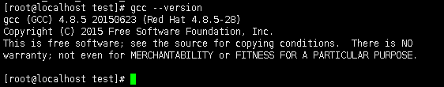
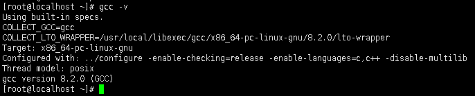
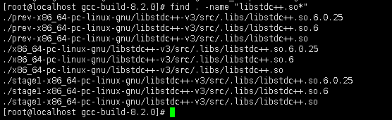
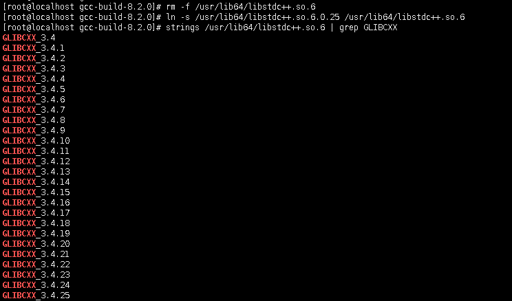
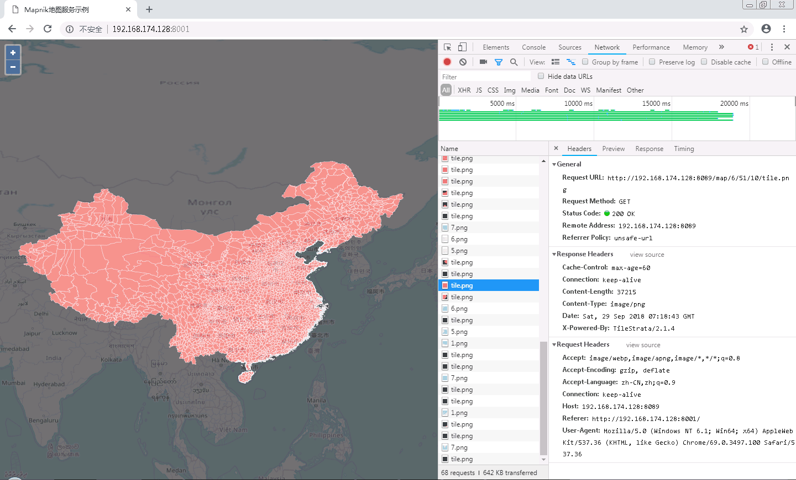

最近在一台干净的CentOS服务器上部署基于Mapnik和PostGIS数据源的瓦片服务，走了很多弯路。后来有时间又装了一台虚拟机重新部署了一下，现在将部署流程记录下来，方便以后查阅。

#### 1 基础环境配置

##### 1.1 解决YUM提示503问题

在CentOS下一般用yum来部署软件，但是刚装好的虚拟机yum提示503，而ping外网能ping通，在网上查了一下需要扩充DNS：
```bash
vi /etc/resolv.conf
```

加入：
```bash
nameserver 8.8.8.8
nameserver 8.8.4.4
nameserver 144.144.144.144
```
保存后重启虚拟机，就可以正常使用yum了，赶紧使用`yum update`更新一下。

##### 1.2 基础软件安装
接下来会使用ifconfig命令查看本机IP，如果找不到则需安装：
```bash
yum install net-tools
```

查到IP之后就可以用xshell进行连接了，使用xshell进行文件传输需要rz/sz命令，如果找不到则需安装：
```bash
yum install lrzsz
```

后期需要使用wget下载文件，如果找不到则需安装：
```bash
yum install wget
```

安装后期需要的解压程序：
```bash
yum install unzip
yum install bzip2
```

安装后期需要的`C++`编译器g++：
```bash
yum install gcc-c++
```


#### 2 PostgreSQL及PostGIS部署

##### 2.1 PostgreSQL安装及配置

首先添加PostgreSQL数据库安装来源：
```bash
yum install https://download.postgresql.org/pub/repos/yum/10/redhat/rhel-7-x86_64/pgdg-redhat10-10-2.noarch.rpm
```

然后就可以安装PostgreSQL服务端和客户端了：
```bash
yum install postgresql10-server postgresql10
```

初始化数据库：
```bash
/usr/pgsql-10/bin/postgresql-10-setup initdb
```

启动数据库服务，并修改为随系统一起启动：
```bash
systemctl start postgresql-10
systemctl enable postgresql-10
```

修改默认用户(postgres)密码：
```bash
sudo -u postgres psql -c "alter user postgres with password '1234';"
```

修改配置文件，允许局域网访问：
```bash
vi /var/lib/pgsql/10/data/postgresql.conf
```

将 #listen_addresses = ‘localhost’ 的注释去掉并改为 listen_addresses = ‘*’，修改max_connections按需求更改，默认最大支持100个连接。修改之后保存并退出。

```bash
vi /var/lib/pgsql/10/data/pg_hba.conf
```

在最后一行添加：
```bash
host	all		all		0.0.0.0/0	md5
```
保存并退出。

重启数据库：
```bash
systemctl restart postgresql-10
```

防火墙需要打开5432端口：
```bash
firewall-cmd --permanent --add-port=5432/tcp
firewall-cmd —reload
```

##### 2.2 PostGIS插件安装及配置
首先安装PostGIS的一个依赖：
```bash
yum install epel-release
```

然后安装PostGIS：
```bash
yum install postgis24_10
```

然后可以验证安装是否成功，先创建一个数据库：
```bash
sudo -u postgres createdb gis
```

为该数据库安装PostGIS插件：
```bash
sudo -u postgres psql -d gis -c 'CREATE EXTENSION postgis;'
```

如果没报错，则可往该数据库导入数据了。

#### 3 安装node-mapnik及瓦片服务组件

##### 3.1 安装Node.js
由于node-mapnik的3.7.2版本只能用LTS的Node.js安装，所以这里添加8.x版本Node.js来源。
```bash
curl --silent --location https://rpm.nodesource.com/setup_8.x | sudo bash -
```

安装Node.js：
```bash
yum -y install nodejs
```

安装之后Node.js版本是8.12.0，npm版本是6.4.1。

##### 3.2 安装node-mapnik及瓦片服务组件

创建部署目录之后，安装node-mapnik：
```bash
npm install mapnik@3.7.2
```

这个过程有些漫长，提示成功后，安装其它的瓦片服务组件。

安装之后把代码上传并启动服务，然而报错：

提示动态库无法加载，应该是缺少依赖，使用ldd命令查看依赖：

发现libstdc++.so.6的GLIBCXX_3.4.20不存在，使用如下命令进行确认：
```bash
strings /usr/lib64/libstdc++.so.6 | grep GLIBCXX
```

确实没有GLIBCXX_3.4.20，接下来确认gcc版本：

确实是gcc版本太旧了，而且还没有找到使用yum升级的方法(或者不用升级gcc，只升级stdc++库版本就可以)，我在这里通过编译最新版本gcc来解决。

##### 3.3 升级gcc

查找最新版本gcc，当前是8.2.0，创建一个独立的gcc编译目录，进入后，使用wget进行下载：
```bash
wget http://ftp.gnu.org/gnu/gcc/gcc-8.2.0/gcc-8.2.0.tar.gz
```

下载之后解压缩，然后进入gcc-8.2.0目录下，使用如下脚本下载、配置、安装依赖库：
```bash
./contrib/download_prerequisites
```

创建一个编译成果目录，并进入：
```bash
mkdir gcc-build-8.2.0
cd gcc-build-8.2.0
```

使用如下命令进行配置：
```bash
../configure -enable-checking=release -enable-languages=c,c++ -disable-multilib
```

完成后使用如下命令进行编译：
```bash
make -j4
```
-j4选项是make对多核处理器的优化，如果不成功请使用make，注意此过程非常耗时。

编译完成之后使用`make install`进行部署。

查看gcc版本：


但此时查看stdc++库发现还是旧的，需要进一步处理。

查找编译成果目录下的stdc++库：
```bash
find . -name "libstdc++.so*"
```


将其拷贝到`/usr/lib64`目录下：
```bash
cp ./stage1-x86_64-pc-linux-gnu/libstdc++-v3/src/.libs/libstdc++.so.6.0.25 /usr/lib64
```

重建`/usr/lib64/libstdc++.so.6`软连接：
```bash
rm -f /usr/lib64/libstdc++.so.6
ln -s /usr/lib64/libstdc++.so.6.0.25 /usr/lib64/libstdc++.so.6
```

再次查看发现要求的GLIBCXX_3.4.20已经包含了，启动瓦片服务器也没有报错。

前端加载验证一切正常，至此部署全部完成。
