使用 Node.js 发布的服务，如果出了问题，除了查看日志之外，还可以使用 VSCode 进行远程调试。

服务端启动服务的时候，需要使用 inspect 参数指定远程调试端口。
```bash
node --inspect=10.10.10.15:9229 app.js
```

其中的 IP 地址需要使用具体的 IP 地址，如果使用127.0.0.1会导致连接不上。端口号需要使用 firewall-cmd 打开。
启动成功后：
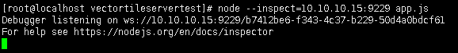

在本地新建一个空文件夹，并使用 VSCode 打开：
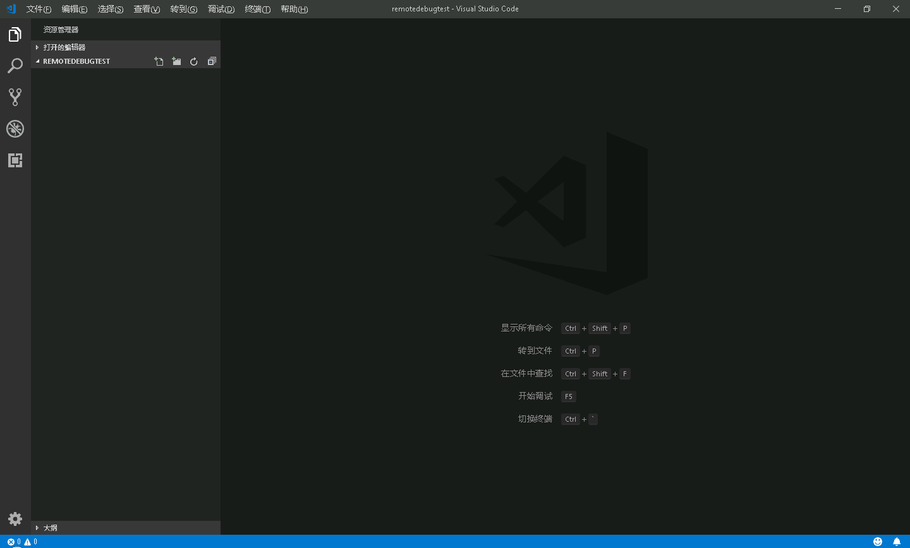
在调试栏中配置 launch.json：
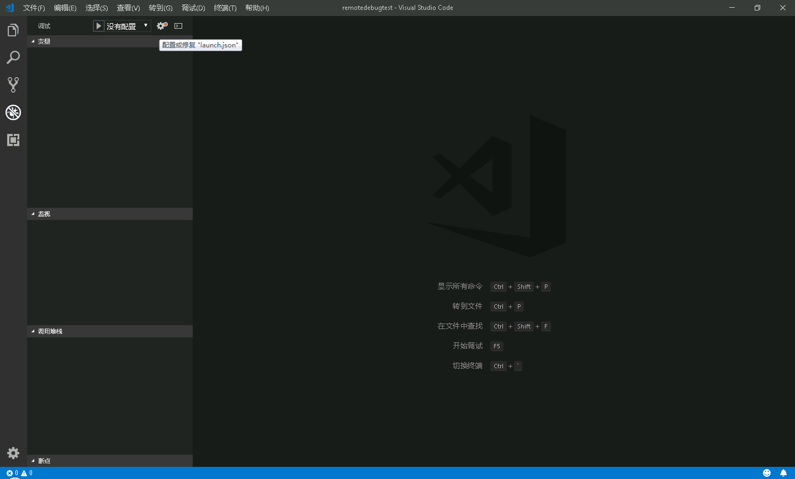
选择环境中使用 Node.js 环境：
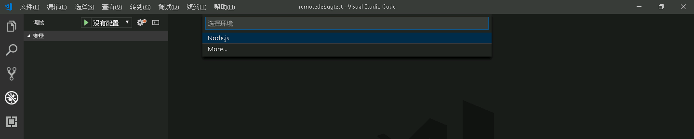
默认配置是本地调试配置，使用右下角添加配置功能，添加附加到远程程序配置
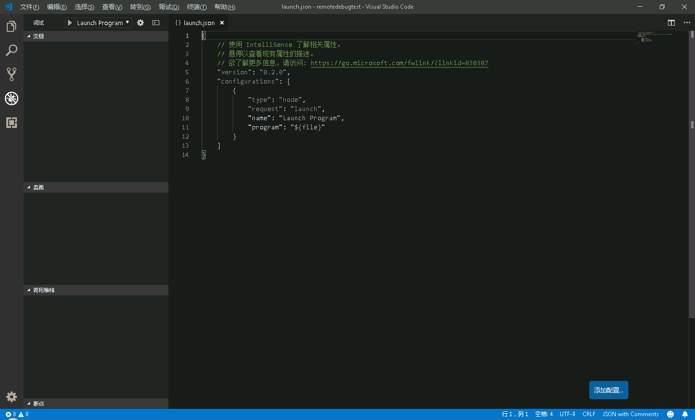
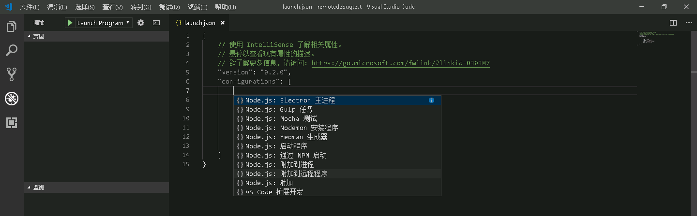
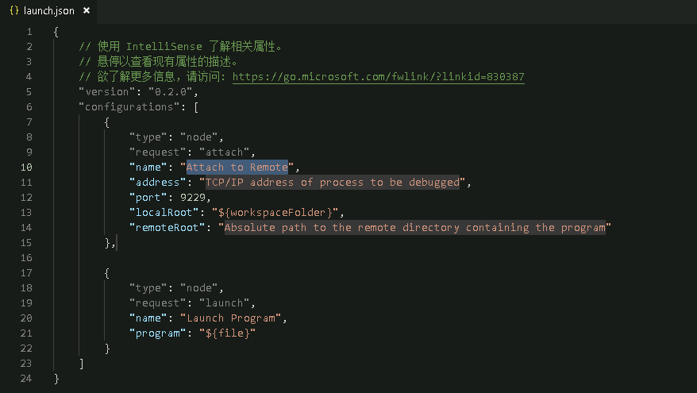
添加远程配置之后，修改其address、port和remoteRoot配置：
address配置修改为远程服务器IP，port配置修改为远程服务器调试端口，remoteRoot配置修改为远程服务器代码所在目录绝对路径。name配置也可以自由修改。
修改后：
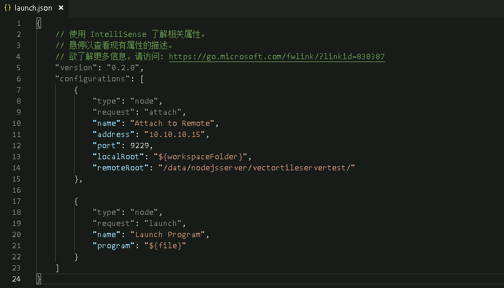
将调试中的配置项，选择远程调试配置，并启动调试：
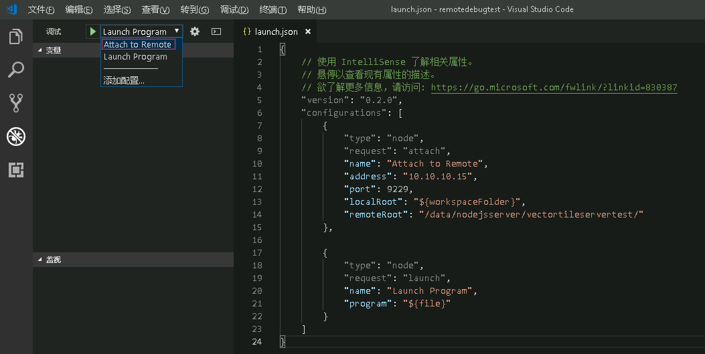
启动调试后，远程服务器会提示Debugger attached，证明连接成功。
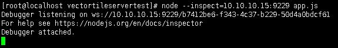

然后需要调试哪个文件，往文件夹里按与服务器相同的目录结构扔文件即可。
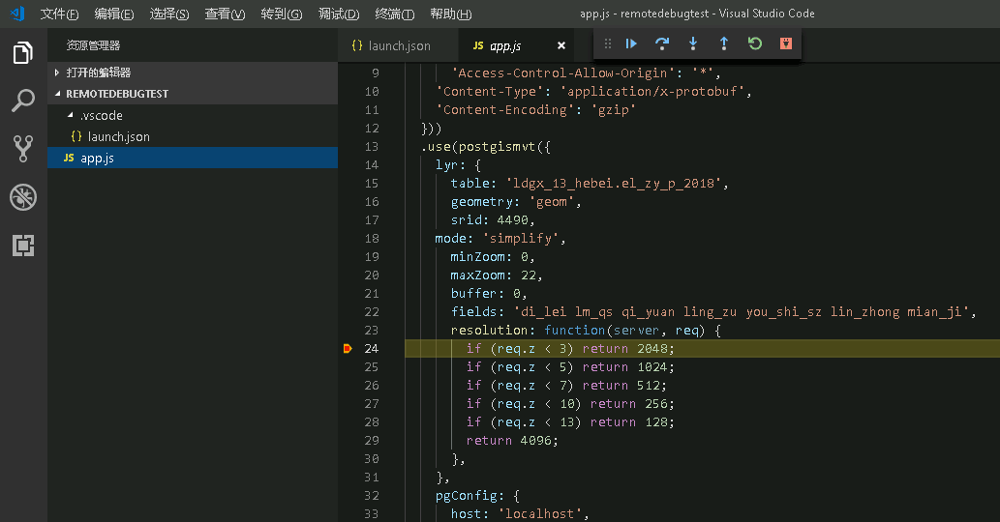

如果找不到文件会提示：
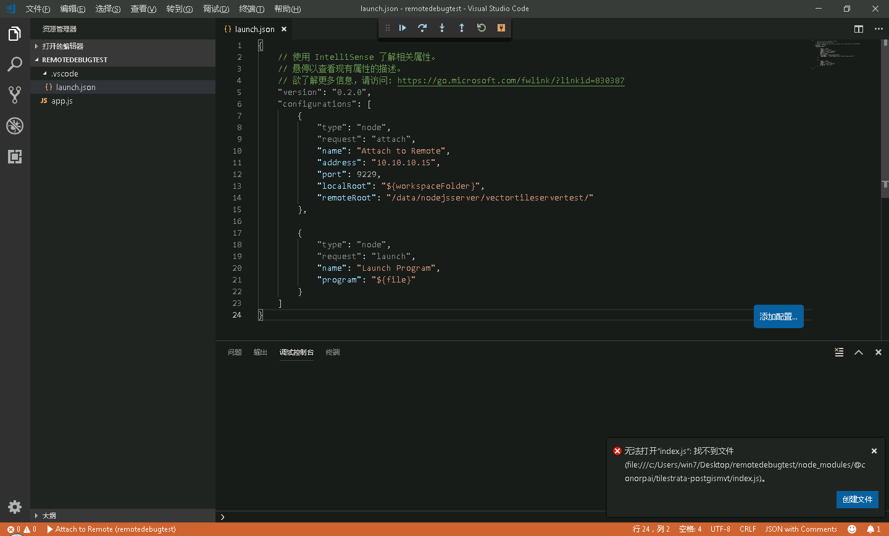

这种调试方法也适用于使用 cluster 模块 fork 子进程的模式。