几天前，微软发布了VS Code Remote，用来做远程开发，可以支持在物理机、容器以及Windows Subsystem for Linux(WSL)上实现无缝远程开发，可以做到：
+ 在部署相同的操作系统上进行开发，或者使用更大或更专业的硬件
+ 把开发环境作为沙箱，以免影响本地计算机配置
+ 让新手轻松上手，让每个人都保持一致的开发环境
+ 使用原本在本地环境不可用的工具或运行时，或者管理它们的多个版本
+ 在WSL里开发Linux应用
+ 从多台不同的计算机访问现有的开发环境
+ 调试在其它位置(比如客户网站或云端)运行的应用程序

本次试用的是通过SSH来连接远程物理机，实现远程开发。

由于我们近期使用的Mapnik没有windows版本，所以之前的开发工作都是在Ubuntu上或者MacOS上进行的，有些不方便，VS Code Remote推出之后，就可以在windows上连接Ubuntu或者MacOS来进行开发和调试工作。

#### 安装VS Code Insiders版本
目前VS Code Remote只能在预览版中使用，到[这里](https://code.visualstudio.com/insiders/)下载、安装预览版，预览版的图标是不可描述的绿。。
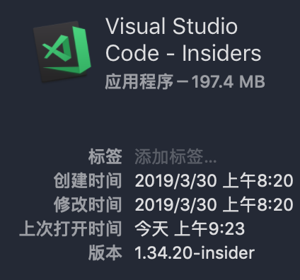

#### 安装Remote Development插件
到扩展商店中搜索remote，安装Remote Development插件，同时会安装Remote - SSH、Remote - Containers和Remote - WSL，用于三种不用的远程登陆方式。
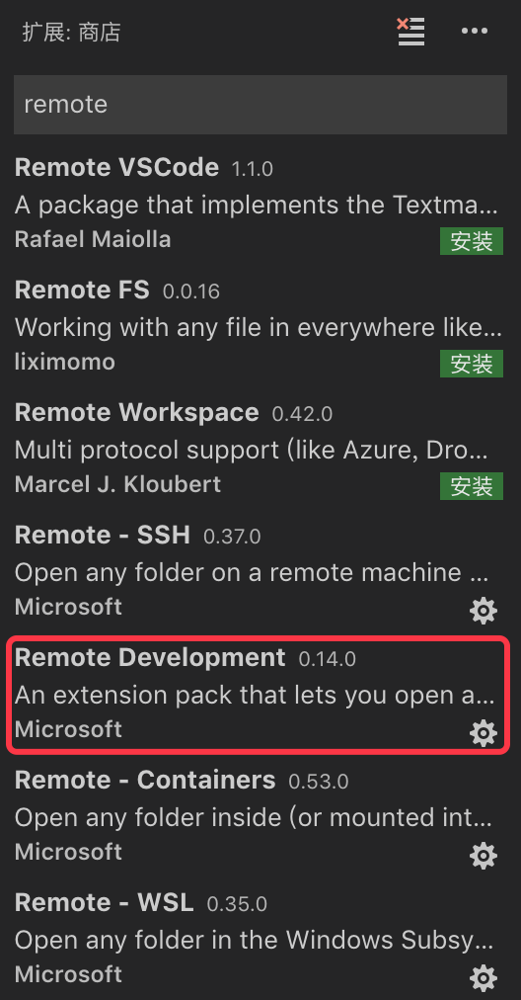

#### 安装、配置SSH
在远程端需要安装ssh-server，本机安装ssh-client。
这次本机是Windows 7操作系统，使用提OpenSSH做为ssh-clinet。到[这里](https://github.com/PowerShell/Win32-OpenSSH/releases)下载最新版本，在本机解压后，将其路径添加到系统环境变量的Path中。
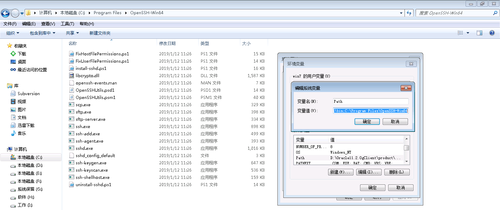
然后使用ssh-keygen生成密钥，然后使用ssh-copy-id将密钥拷贝到远程机器上。由于这步和git配置相同，而且OpenSSH中没有ssh-copy-id命令，所以我用的是git bash做的。
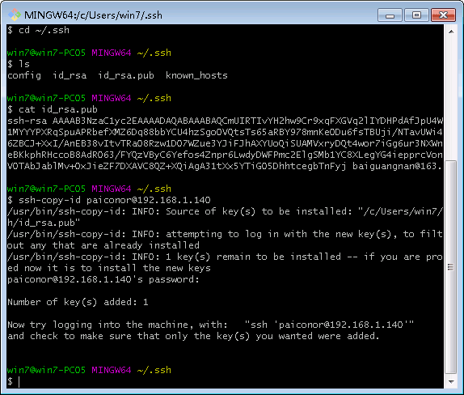

#### 在VS Code中配置远程连接
点击侧边栏中的远程连接图标，并进行配置：
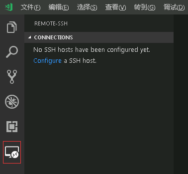
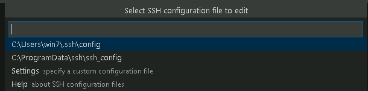
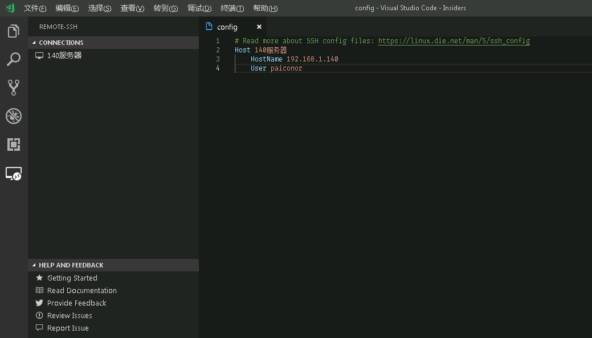

#### 连接远程机器
使用右键进行连接，首次连接会在远程机器上部署远程开发相应环境，连接完成后可以看到左下角显示连接的远程机器名称。
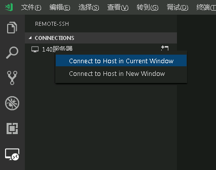
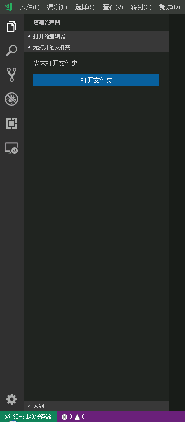

#### 打开远程开发代码
连接远程机器成功之后，点击打开文件夹，就会显示出远程机器上的目录结构，选择代码目录，即可打开远程机器上的代码。
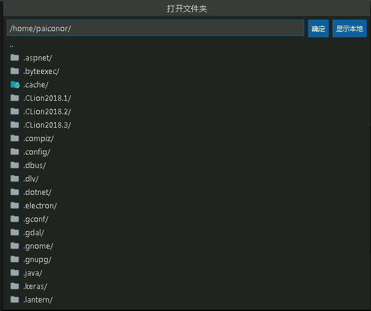
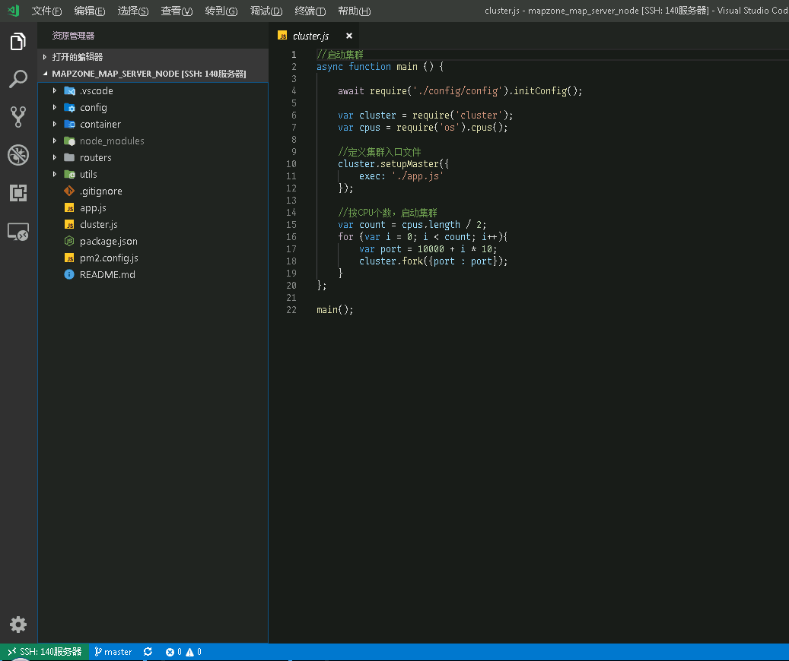

#### 调试
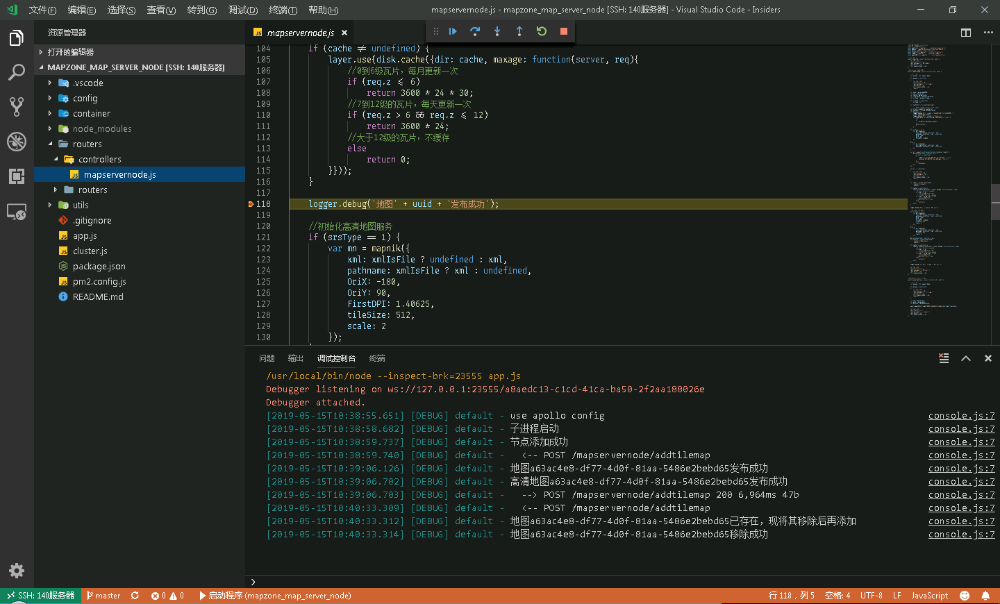
